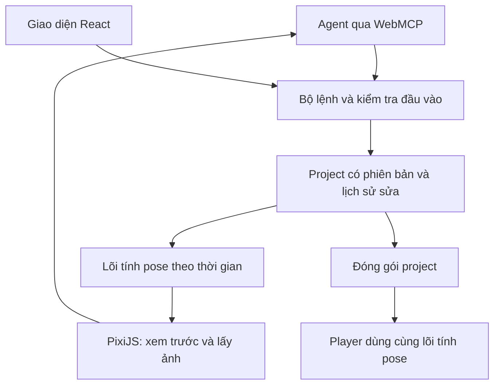

# Kiến trúc và hợp đồng dữ liệu đề xuất

Ngày: 09/09/2026; cập nhật 11/09/2026. Đây là tổng quan thiết kế; hiện trạng triển khai được tách rõ bên dưới. Chi tiết v0 được chốt trong [contracts/README.md](contracts/README.md), [semantics](contracts/semantics.md) và [ADR-001](contracts/ADR-001.md); các ví dụ tên tool bên dưới vẫn là định hướng, không phải danh sách đã đăng ký của sản phẩm.

## Hiện trạng sau Gate 3 PR #66 — 11/09/2026

Gate 3 #21 đã nghiệm thu Đạt/Project Done, PR #66 squash-merged main `fe112ca002513e3767715e9d32ecbfb58dde833a`, accepted head `d6f18420a0651845b95933da36b79b523cfc6bf9`, CI run 34585694942 SUCCESS. #21 đã Closed (completed)/Done; trạng thái đóng được kiểm tra lại trên GitHub. #22 Todo/Ready để chuẩn bị đề xuất quyết định, chủ dự án chưa chốt MVP. #23–#29 và #51/#52 vẫn Deferred; không mở production.

Model tại `platform/src/model/types.ts`, `index.ts`, `project-v1.schema.json`, `mesh.ts` đã hỗ trợ format 0 và 1 bằng schema riêng. V0 giữ strict region-only; v1 yêu cầu `region-v0`, có mesh/deform phải khai báo thêm `mesh-v1`. Migration 0→1 tường minh giữ identity/revision/geometry; không tự nâng cấp, 1→0 bị từ chối. `ik-v1` đã được tích hợp ở PR #55; xem hợp đồng IK bên dưới.

`evaluate(Project, PoseRequest): Result<Pose>` tại `platform/src/engine/index.ts` trả `poseVersion:1`, `bones`, `regions`, `meshes:DrawMesh[]` (rỗng với region-only). DrawMesh gồm `slotId`, `attachmentId`, `assetId`, `vertices`, `uvs`, `triangles`; vertices là world XY sau deform/skinning, chỉ áp world-to-screen, không cộng lại slot-bone/attachment transform. Interleave regions/meshes theo `project.slots` và `slotId`, không vẽ hết regions rồi mới meshes.

Mesh vertices/deform dùng bind-world XY; deform là offset tuyệt đối trước skinning. Weights không tự normalize; tổng cho phép sai lệch 1e-5. Bind matrices rõ ràng và invertible; UV theo ảnh decode, (0,0) góc trên trái; geometry độc lập độ phân giải texture. Arrays Pose là bản sao mới. Fixture `platform/fixtures/mesh/synthetic.ts` có expected setup `[12,20,14,20,12,22]`, end key `[18,20,16,24,15,22]`; metadata synthetic không phải PNG bundle.

Renderer/capture mesh+IK đã được nghiệm thu qua #17/PR #59: `rendererCapabilities` công bố `poseVersions:[1]`, features `region-v0`,`mesh-v1`; renderer nhận geometry sau evaluator và không tự giải IK. `poseGeometry`/`fitCamera` giữ canonical slot order và bao mọi supplied mesh vertex. `ObservationService.renderPose/submit` dùng cùng evaluator/renderer; `animationBounds` có weighted deform/bind inverses và full-turn IK local rotation envelope, có thể dư whitespace nhưng không được crop thành công. `setOverlay({wireframe,weightBoneId})` vẫn là display state renderer; panel Lưới / IK #19 đã nối overlay với lựa chọn UI. Full/half texture, PNG/ZIP observation, pixel order/alpha/UV và resource release có evidence #17. Không suy CPU update/submission 0.1ms thành 16.7ms frame-cadence pass.

IK core đã được nhận: format v1/schema strict hỗ trợ `ik-v1`; `Project.ikConstraints?: TwoBoneIK[]` yêu cầu capability khi field có mặt (mảng rỗng hợp lệ), v0 vẫn region-only. `TwoBoneIK` tại `platform/src/model/ik.ts` có id/type, rootBoneId, childBoneId, targetBoneId, endpoint child-local XY, bend ±1, mix [0,1], order unique nonnegative safe integer. Child là con trực tiếp root; target ở ngoài toàn bộ root subtree. Target lấy world origin của target bone; mix/bend/order tĩnh ở phiên bản này.

`evaluate` giải sampled FK → IK theo order tăng dần → mesh skinning/region transforms; chỉ sửa fresh locals/worlds, rebuild descendants, không mutate setup/bind/channel. `animationId:null` vẫn áp IK vào setup locals; mix 0 giữ FK của constraint đó. Pose vẫn `poseVersion:1`; `Pose.ik?: IKDiagnostic[]` chỉ xuất khi input có `ikConstraints`. Mỗi diagnostic có constraintId/order, target/endpoint world XY, distance Euclidean logic và status. Các tọa độ/distance đo trên pose cuối sau mọi constraint; status là kết quả lúc constraint được áp dụng. Vì vậy `solved` hoặc partial mix không tự chứng minh chân trụ: dùng residual cuối; constraint sau có thể dịch endpoint trước.

Accuracy full-mix reachable áp dụng khi root có |scaleX|=|scaleY| khác 0 và ancestor matrix khả nghịch; reflection/shear ở ancestors và child scale/endpoint lệch trục theo hợp đồng được hỗ trợ. `unsupported-scale`/`singular` giữ FK; unreachable clamp không stretch, degenerate dùng fallback xác định. Nonfinite arithmetic hoặc residual tức thời full-mix reachable >0.5 trả INVALID_INPUT. Chi tiết miền scale, mix, bend/order và final diagnostic theo `platform/src/engine/IK.md`; không suy mọi status là thành công.

Core IK/model/evaluator và renderer/capture/bounds #17 đã được nghiệm thu. Diagnostics module #18 và authoring/tools/UI #19 đã nghiệm thu; canonical v1 writes, capability discovery, UI/Session và roundtrip có evidence #19. Không nhận Gate 2/3 hoặc performance pass từ nghiệm thu module.

[Hợp đồng IK đã merge](../../platform/src/engine/IK.md).

[Hợp đồng đã merge](contracts/mesh-v1.md) · [Handoff](reconciliation/2026-09-11-mesh-core-handoff.md).

## Tách lõi khỏi giao diện và giao thức

React quản lý giao diện; không dùng render của React để tính từng frame. PixiJS nhận pose và dữ liệu hình để vẽ. Lõi TypeScript đã tính transform/nội suy, weights và deform mesh-v1; constraints IK đã được #16 nghiệm thu, không phụ thuộc DOM hoặc WebMCP. Player và editor dùng cùng lõi để tránh khác biệt khi xuất.

WebGL là ứng viên mặc định cho thử nghiệm; đo WebGPU khi có nhu cầu. PixiJS có mesh tùy chỉnh nhưng không thay thế phần tính animation. Web Worker và WASM là phương án tối ưu sau khi đo được điểm nghẽn, không phải yêu cầu ban đầu.

Lưu tại máy trước: autosave trong kho lưu của trình duyệt, kèm xuất/nhập gói project. Autosave không thay thế bản sao tải về. Backend tài khoản, đồng bộ và render nền chỉ bổ sung khi có nhu cầu đã xác nhận.

## Project tối thiểu

| Thành phần | Dữ liệu cần có |
| --- | --- |
| Header | `formatVersion`, `projectId`, `revision`, metadata |
| Assets | ID ổn định, tên, loại, kích thước, hash, file trong gói; vị trí gốc nếu ảnh đã trim |
| Skeleton | Bone ID, parent ID, setup transform; không dùng tên làm khóa liên kết |
| Slots/attachments | Xương gắn, thứ tự vẽ, asset ID, transform; mở rộng mesh sau |
| Mesh | Vertices, UV, triangles, bind pose và weights theo bone ID |
| Constraints | ID, loại, đối tượng liên quan, thông số và thứ tự giải |
| Animations | ID, duration, loop, các kênh keyframe và đường cong |
| Editor state | Selection, camera, timeline; tách khỏi dữ liệu cần cho player |

Quy ước đề xuất: thời gian bằng giây, góc bằng radian, tọa độ logic X sang phải/Y lên trên, đơn vị art ban đầu là pixel. Renderer đổi sang tọa độ màn hình. Mỗi tool phải chỉ rõ world/local; không phụ thuộc chế độ UI đang bật.

Gói project gồm manifest JSON và assets, không chỉ đường dẫn tuyệt đối trên máy. Loader kiểm tra phiên bản, liên kết thiếu, parent cycle và dữ liệu số không hợp lệ. Phiên bản không hỗ trợ phải báo rõ; migration thực hiện trên bản sao. Runtime pose là dữ liệu suy ra, không ghi đè setup pose khi phát.

Thứ tự tính cơ bản: setup + các kênh animation → transform và constraints theo thứ tự đã xác định → biến dạng mesh → vẽ. Khi thêm mixing/physics phải viết rõ thứ tự và test tương ứng. Physics cần bước thời gian cố định, trạng thái khởi đầu rõ, reset và replay khi seek; không lấy frame rate màn hình làm đồng hồ mô phỏng.

## Hợp đồng tools

Tên dưới đây là dự kiến, chưa đăng ký với trình duyệt.

| Nhóm | Ví dụ | Kết quả phải giúp agent làm gì |
| --- | --- | --- |
| Khám phá | `get_capabilities`, `inspect_project`, `list_assets` | Biết tính năng hỗ trợ, revision, ID và dữ liệu liên quan |
| Rig | `create_bones`, `attach_images`, `set_weights` | Sửa có phạm vi, trả ID và tóm tắt thay đổi |
| Animation | `create_animation`, `set_keyframes`, `set_curves` | Đặt nhiều key trong một lần, đơn vị rõ ràng |
| Quan sát | `render_pose`, `render_sequence`, `preview_animation` | Nhận ảnh/tham chiếu media, thời gian, khung hình và revision |
| Chẩn đoán | `validate_project`, `measure_motion` | Nhận lỗi tại đối tượng/thời điểm cụ thể, kèm đơn vị và ngưỡng |
| Lịch sử | `create_checkpoint`, `restore_checkpoint`, `undo` | Quay về một mốc chính xác, biết những gì bị thay đổi |
| Đầu ra | `save_project`, `export_frames`, `get_job_status` | Nhận hiện vật tải được hoặc trạng thái tác vụ rõ ràng |

Quy tắc dùng chung:

- Lệnh sửa mang `expectedRevision` và `requestId`. Nếu project đã đổi, trả xung đột để đọc lại; retry cùng request không tạo bản sao. Phạm vi giữ lịch sử request phải được công bố.
- Một batch hoặc áp dụng đầy đủ, hoặc không sửa gì. Kiểm tra tất cả đầu vào trước khi thay đổi project; undo theo batch.
- Trả `revision`, các ID đã đổi, cảnh báo và mã lỗi có cấu trúc. Tránh gửi toàn bộ hàng nghìn đỉnh mesh khi chỉ cần tóm tắt; hỗ trợ truy vấn vùng/đối tượng.
- Tác vụ dài trả job ID, hỗ trợ hủy và tiến độ; hoàn tất phải gắn với revision đầu vào, không nhận nhầm là bản hiện tại.
- Người dùng sửa trong lúc agent làm việc phải gây xung đột rõ ràng thay vì âm thầm ghi đè.
- Tools chỉ truy cập assets thuộc project/quyền được cấp. Tên layer và metadata từ art là dữ liệu, không phải chỉ dẫn để thực hiện hành động.
- Mọi thao tác ảnh hưởng project phải hiển thị trong lịch sử và có thể dừng/hoàn tác. Không tự xuất bản hay gửi art sang dịch vụ khác qua lệnh nhập ảnh.

Tools nguyên tử và batch là nền. Các recipe như “tạo walk” có thể xây sau, nhưng phải cho phép agent đọc và sửa kết quả chi tiết.

## WebMCP và giới hạn đã biết

Tài liệu Chrome được kiểm tra lại ngày 10/09/2026 nêu origin trial từ Chrome 149 và cơ chế bật cờ cho thử local. Bản đặc tả ngày 09/09/2026 vẫn là Draft Community Group Report, chưa phải chuẩn W3C. Probe #3 có [kết quả trên tổ hợp thực tế](research/webmcp.md); phải khóa phiên bản/API trong bằng chứng và giữ adapter riêng. Không mặc định mọi agent hoặc môi trường headless đều gọi được tools.

Nếu thử nghiệm không tìm được đường gọi WebMCP thật của agent đích, ghi rõ bị chặn ở kết nối. Gọi hàm bằng JavaScript/inspector chỉ chứng minh handler hoạt động. Có thể đánh giá MCP server/cầu nối dùng cùng bộ lệnh; đó là phương án khác cần mô tả đúng, không ghi là WebMCP native đã đạt.

## Nguồn và việc cần nghiên cứu thêm

- [Chrome WebMCP](https://developer.chrome.com/docs/ai/webmcp/): trạng thái, hỗ trợ và giới hạn.
- [Đặc tả WebMCP](https://webmachinelearning.github.io/webmcp/): hợp đồng đăng ký/gọi tools có thể thay đổi.
- [PixiJS Mesh](https://pixijs.com/8.x/guides/components/scene-objects/mesh): nền tảng geometry/UV/shader.
- [Spine Runtimes License](https://esotericsoftware.com/spine-runtimes-license): điều kiện tái sử dụng runtime.

Repo học đang dùng `@esotericsoftware/spine-canvas`; không tự chuyển dependency hay code runtime đó sang sản phẩm. Cần kiểm tra giấy phép của mọi thư viện được chọn, nguồn art và nhu cầu tương thích file. Các tài liệu này không kết luận pháp lý về một sản phẩm chưa được triển khai.

## Authoring đã nghiệm thu sau PR #62

- Canonical Operation tại `platform/src/model/types.ts`, Session `platform/src/commands/index.ts` và write validators đã đồng bộ v1. `migrateProject {targetVersion:1}` dùng model migration tường minh trong atomic candidate; undo trả version/capabilities cũ, lỗi operation sau rollback toàn batch. New editor projects là v1/region-v0; mở ZIP v0 giữ nguyên v0 đến khi người dùng/agent nâng cấp rõ ràng.
- `putMesh`, `setVertexWeights`, `setVertexDeforms`, `putIKConstraint` và remove `ikConstraints` đi cùng revision/requestId/history/dedup. Mesh/deform/IK writes vào v0 trả UNSUPPORTED_VERSION, không nâng ngầm. Required mesh-v1/ik-v1 được thêm trên candidate khi write v1 thành công; runtime Session capabilities công bố mesh-v1/ik-v1/explicit-migration-v1 độc lập format/requirements của project đang mở.
- `setVertexWeights` thay complete influence lists cho các zero-based vertex đã chọn, giữ phần còn lại. `setVertexDeforms {animationId,attachmentId,time,curve,vertices:[{vertex,offset:[x,y]}]}` chỉ sửa offsets đã chọn tại exact key time và thay curve tường minh; key mới có all-zero offsets trước local writes, key cũ giữ offsets không chọn/keys khác. Offset là absolute bind-world XY trước skinning, không delta sau skinning. `putAnimation` vẫn thay toàn animation gồm optional deforms; phải giữ unrelated data nếu dùng đường này.
- Adapter schema/dispatch đã có mesh/IK writes, `inspect_mesh`, `inspect_deforms`, `validate_project`, `measure_motion`; `get_capabilities` thêm diagnostics-v1, giữ giới hạn input/response/session. `inspect_deforms` trả channel/key summaries; thêm attachmentId + keyTime để đọc trang vertex offsets (offset/limit, total/nextOffset, curve), không trả whole large key. Dùng trang này + setVertexDeforms để đọc/sửa local key lớn; regression 8,000 vertices đã được nghiệm thu. Không dump/replace toàn animation chỉ để sửa một vertex.
- Editor `platform/apps/editor/mesh-controls/` là panel Lưới / IK dùng cùng Session với tools: canvas/list chọn vertices, sửa weights/deform và mix/bend/order của constraint hiện có, wireframe/weight overlay. Agent apply_batch tạo mesh/bind/IK; UI tối thiểu chưa phải triangulation/auto-weight hoặc IK rig builder. Runtime newProject/migration và draft revision/session đã nối chung, không có store riêng.
- Renderer/ObservationService/storage/player hiện có được tái dùng. UI→native tool cùng revision, local-only edits/retry/rollback/undo/render/diagnostics và ZIP/editor reload/player scarf/jelly/IK có evidence thật ở #19, gồm chín actual drawn Poses bằng nhau. Đây là nghiệm thu authoring/roundtrip trên fixtures đã ghi, không chứng minh brief Gate 2 hoặc Gate 3 đã đạt.

[Đối chiếu Gate 2](reconciliation/2026-09-11-authoring-gate2.md).

## Diagnostics đã nghiệm thu — #18/PR #60

Reviewer Đạt exact `9d9fbb1483e13b69a9abe350a0b3b9d84ea0861a`; kiểm độc lập 30 diagnostics tests + 6 probes, hai CI pass, xác nhận base #17 không đổi dependency/API. Orchestrator đã merge/đóng #18 tại main `a0dc060d1129ae86fb3cf9b9662ad4e31654ecec` và tại mốc đó giao #19 In Progress/Ready; #19 nay đã Done sau PR #62.

API/types cùng ở `platform/src/diagnostics/index.ts`: `validate_project(unknown,page?)` và `measure_motion(unknown,MotionRequest)`. Model-invalid là Result thành công với report `valid:false`, không evaluate dữ liệu lỗi; request/evaluation failure là Result lỗi. `valid` chỉ structural validity; `passed` xét mọi records bất kể trang trả về. Wrapper phải giữ `total/nextOffset`, project/revision và policy/sampling, không suy trang rỗng thành pass.

MotionRequest chọn animationId, optional explicit anchors (bone-local point, slot/vertex hoặc IK endpoint, fixed-world target và inclusive stance interval), loopPoints, offset/limit. Empty loopPoints chủ ý bỏ loop checks. Foot residual lấy final Pose.ik.distance; anchor với target world cố định còn phát hiện target IK trượt dù residual zero. Sampling/epsilon/threshold đã khóa trong README (60 intervals cộng keys/stance endpoints/key neighbors, h=min(1/600,duration/600), 0.5px và max(0.5px/s,5% sampled peak)); #19 không biến ngưỡng thành tùy chọn để làm pass.

API module thuần đã được #19 bọc bằng validate_project/measure_motion trong adapter; transport vẫn giữ fixed policy và bounded report. Finite sampling và local triangle orientation không chứng minh continuous extrema, self-intersection/tearing, eye-height hoặc artistic quality. [API/policy](../../platform/src/diagnostics/README.md) · [fixtures](../../platform/fixtures/diagnostics/synthetic.ts) · [evidence](../../platform/evidence/issue-18/README.md).

## Giới hạn consumer cần mang sang Gate 3

Default `measure_motion` #18 không tự bao region corners: default points là bone origins, mesh vertices và IK endpoints. Gate 2 bổ sung `platform/tests/e2e/deformation/metrics.ts` dùng public `render.corners(region,asset,Pose.regions.world)` và cùng sampling/h/ngưỡng để đo 12 góc của ba IK regions. Region-corner velocity max 0.000754437px/s; rotation-only negative control giữ origin vẫn làm bốn foot corners fail vị trí dù origin-only diagnostics pass. Đây là supplemental gate measurement, không phải capability region-corner được thêm vào diagnostics/tool.

Future consumers phải nêu coverage points rõ; `passed:true` của tool không chứng minh mọi rendered surface/seam. Giữ supplemental corner check/visual review khi rubric cần nó, không âm thầm advertise diagnostics completeness. Measurements hữu hạn không là continuous proof. Gate 2 dùng browser bridge; không native WebMCP pass. Physics NOT TESTED; performance chỉ tách rAF/draw intervals/CPU submission, không physical presentation hoặc performance pass, không baseline Spine/speedup claim.

[Gate 2 đã nghiệm thu và đầu vào native evaluation](reconciliation/2026-09-11-gate2.md).

## Kết quả ba gate và giới hạn quyết định

- Gate 1: chức năng đã được nhận theo quyết định 11/09/2026; performance vẫn FAIL 17.8/17.5 ms so với 16.7 ms, tách sang Polish #51 → #52 Deferred. Không đổi kết quả đo thành pass.
- Gate 2: nghiệm thu exact fb143ae0afe50b0e2af6c4952f96c2f1f81fd42f, merge 538f939d9c76e29a55bc7680f8e36943095e4326. Authored fixtures/seek/ZIP/playback/eyeROI/anchors đã đạt; physics NOT TESTED, browser bridge không native pass. Region-corners là phép đo supplemental public render.corners, không phải default diagnostics completeness.
- Gate 3: robot 2/3, wave 3/3, scarf 2/3 = 7/9; đủ ngưỡng mỗi brief, không thay lượt. Robot 1 fail browser/session environment trước native invocation; scarf 1 fail missing public observation/outside-native evidence, không chứng minh project fail hoặc rescue. Scarf 1 complete budget/rescue UNKNOWN; giữ 57 native calls + 1 discovery đã quan sát và 193.3775 s, không lấp bằng self-report.

Source/harness/protocol frozen tại 57eed3122782fe1c8b2d5eb536bc1e27a4ebc360 trên production 538f939; evidence/read-only QA thêm sau lock không sửa solution. Tám ZIP đã emit reopen Editor/Player, có native logs/revisions/transactions và media. Giữ wave frozen property-order false cùng structural supplement được reviewer nhận, crop viewport wave 2/scarf 2 cùng later full preview/Player và discrepancy manual 59/audited 57 scarf 3. Sampled visual/playback records không bị diễn giải thành reviewer trực tiếp xem mọi WebM. Không native cancellation, performance, statistical reliability hoặc production-readiness claim.

## Đầu vào #22 và quyền quyết định

#22 Ready chỉ chuẩn bị ĐỀ XUẤT stack/phạm vi/tradeoffs/thứ tự đầu tư, chưa In Progress/Done hoặc MVP approved. Tổng hợp exact reports/aggregate, chọn phương án đề xuất và điều kiện xem lại; chủ dự án quyết định sản phẩm. Cost/token totals, deeper provider version và comparable Spine baseline unavailable; không bịa giá trị hay speedup. Gate 3 feasibility threshold không tự chốt MVP feasible/production-ready, nhất là performance Deferred và coverage/physics/native-cancellation limits còn nguyên. Không tự tạo corrective implementation hoặc mở discovery/production từ kết quả này; chỉ nêu finding có bằng chứng trong đề xuất.

[Đối chiếu và exact inputs](reconciliation/2026-09-11-three-gates.md).
