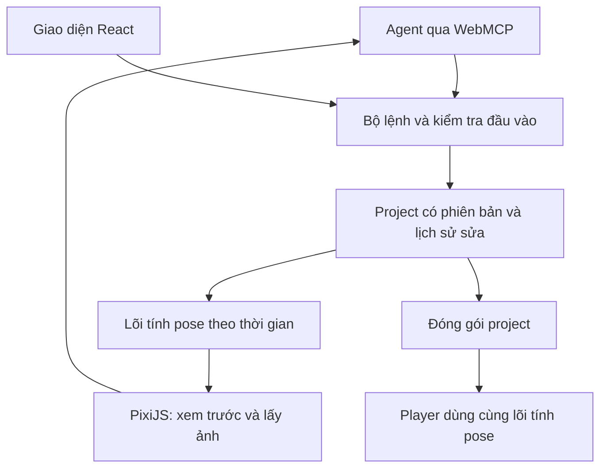

# Kiến trúc và hợp đồng dữ liệu đề xuất

Ngày: 09/09/2026; cập nhật 10/09/2026. Đây là tổng quan thiết kế; hiện trạng triển khai được tách rõ bên dưới. Chi tiết v0 được chốt trong [contracts/README.md](contracts/README.md), [semantics](contracts/semantics.md) và [ADR-001](contracts/ADR-001.md); các ví dụ tên tool bên dưới vẫn là định hướng, không phải danh sách đã đăng ký của sản phẩm.

## Hiện trạng tại main b6577a3 — 11/09/2026

Mốc main `b6577a3b44b8016a9c7ba3ec9f60fbb869419538`; PR #48 đã merge sau nghiệm thu chức năng tại head `13bba23ceeda484aaf6e8b262b7bbceb2fc3c386` (nguồn đo `a91c27cd93541b7b320b9b54c2451894b8fcd018`). Orchestrator đã đóng #14 completed và cho #15/#16 Ready; chỉ chuyển In Progress khi được giao owner triển khai.

- Model đã nằm tại `platform/src/model/types.ts`, `index.ts`, `project-v0.schema.json`; `Project.formatVersion` là 0, `requiredCapabilities` chỉ có `region-v0`, attachments chỉ là Region. Validator/serialize/storage/commands dùng boundary strict này; không thêm mesh/IK bằng trường lạ hay tạo model riêng.
- Evaluator thật ở `platform/src/engine/index.ts`: `evaluate(Project, PoseRequest): Result<Pose>`, validate và clone mỗi sample; helpers ở `transforms.ts`, `timeline.ts`. Pose hiện có `bones` và `regions`, chưa có mesh hoặc hook IK được chốt.
- #15 sở hữu đề xuất extension chung (model types/schema/validation, format/capabilities và Pose) cùng mesh; #16 sở hữu solver IK và types/helper riêng. Hai owner thống nhất một hợp đồng trước tích hợp; common model/evaluator entry được sửa tuần tự theo bàn giao, không hai nhánh tự chọn version không tương thích.
- Chưa chốt số format version/capability mới, migration/compatibility, shape mesh/IK/Pose và thứ tự solve/deform. Người triển khai phải đề xuất và phối hợp nghiệm thu hợp đồng dựa trên v0, không coi API dự kiến đã tồn tại. Giữ regression region-v0, consumer renderer/storage/commands và fixtures hiện có.
- Module README, code hiện có và `platform/README.md` được đối chiếu trong đợt này là đầu vào thực thi; mô tả shell #5 cũ đã được thay bằng hiện trạng module/workflow. [Đối chiếu có ngày](https://github.com/hoangnb24/learn-spine/blob/codex/reconcile-gate1-polish/docs/product/reconciliation/2026-09-11-gate1.md).

## Tách lõi khỏi giao diện và giao thức

React quản lý giao diện; không dùng render của React để tính từng frame. PixiJS nhận pose và dữ liệu hình để vẽ. Lõi TypeScript hiện tính transform/nội suy region-v0; weights và constraints là phần #15/#16 chưa triển khai, không phụ thuộc DOM hoặc WebMCP. Player và editor dùng cùng lõi để tránh khác biệt khi xuất.

WebGL là ứng viên mặc định cho thử nghiệm; đo WebGPU khi có nhu cầu. PixiJS có mesh tùy chỉnh nhưng không thay thế phần tính animation. Web Worker và WASM là phương án tối ưu sau khi đo được điểm nghẽn, không phải yêu cầu ban đầu.

Lưu tại máy trước: autosave trong kho lưu của trình duyệt, kèm xuất/nhập gói project. Autosave không thay thế bản sao tải về. Backend tài khoản, đồng bộ và render nền chỉ bổ sung khi có nhu cầu đã xác nhận.

## Project tối thiểu

| Thành phần | Dữ liệu cần có |
| --- | --- |
| Header | `formatVersion`, `projectId`, `revision`, metadata |
| Assets | ID ổn định, tên, loại, kích thước, hash, file trong gói; vị trí gốc nếu ảnh đã trim |
| Skeleton | Bone ID, parent ID, setup transform; không dùng tên làm khóa liên kết |
| Slots/attachments | Xương gắn, thứ tự vẽ, asset ID, transform; mở rộng mesh sau |
| Mesh | Vertices, UV, triangles, bind pose và weights theo bone ID |
| Constraints | ID, loại, đối tượng liên quan, thông số và thứ tự giải |
| Animations | ID, duration, loop, các kênh keyframe và đường cong |
| Editor state | Selection, camera, timeline; tách khỏi dữ liệu cần cho player |

Quy ước đề xuất: thời gian bằng giây, góc bằng radian, tọa độ logic X sang phải/Y lên trên, đơn vị art ban đầu là pixel. Renderer đổi sang tọa độ màn hình. Mỗi tool phải chỉ rõ world/local; không phụ thuộc chế độ UI đang bật.

Gói project gồm manifest JSON và assets, không chỉ đường dẫn tuyệt đối trên máy. Loader kiểm tra phiên bản, liên kết thiếu, parent cycle và dữ liệu số không hợp lệ. Phiên bản không hỗ trợ phải báo rõ; migration thực hiện trên bản sao. Runtime pose là dữ liệu suy ra, không ghi đè setup pose khi phát.

Thứ tự tính cơ bản: setup + các kênh animation → transform và constraints theo thứ tự đã xác định → biến dạng mesh → vẽ. Khi thêm mixing/physics phải viết rõ thứ tự và test tương ứng. Physics cần bước thời gian cố định, trạng thái khởi đầu rõ, reset và replay khi seek; không lấy frame rate màn hình làm đồng hồ mô phỏng.

## Hợp đồng tools

Tên dưới đây là dự kiến, chưa đăng ký với trình duyệt.

| Nhóm | Ví dụ | Kết quả phải giúp agent làm gì |
| --- | --- | --- |
| Khám phá | `get_capabilities`, `inspect_project`, `list_assets` | Biết tính năng hỗ trợ, revision, ID và dữ liệu liên quan |
| Rig | `create_bones`, `attach_images`, `set_weights` | Sửa có phạm vi, trả ID và tóm tắt thay đổi |
| Animation | `create_animation`, `set_keyframes`, `set_curves` | Đặt nhiều key trong một lần, đơn vị rõ ràng |
| Quan sát | `render_pose`, `render_sequence`, `preview_animation` | Nhận ảnh/tham chiếu media, thời gian, khung hình và revision |
| Chẩn đoán | `validate_project`, `measure_motion` | Nhận lỗi tại đối tượng/thời điểm cụ thể, kèm đơn vị và ngưỡng |
| Lịch sử | `create_checkpoint`, `restore_checkpoint`, `undo` | Quay về một mốc chính xác, biết những gì bị thay đổi |
| Đầu ra | `save_project`, `export_frames`, `get_job_status` | Nhận hiện vật tải được hoặc trạng thái tác vụ rõ ràng |

Quy tắc dùng chung:

- Lệnh sửa mang `expectedRevision` và `requestId`. Nếu project đã đổi, trả xung đột để đọc lại; retry cùng request không tạo bản sao. Phạm vi giữ lịch sử request phải được công bố.
- Một batch hoặc áp dụng đầy đủ, hoặc không sửa gì. Kiểm tra tất cả đầu vào trước khi thay đổi project; undo theo batch.
- Trả `revision`, các ID đã đổi, cảnh báo và mã lỗi có cấu trúc. Tránh gửi toàn bộ hàng nghìn đỉnh mesh khi chỉ cần tóm tắt; hỗ trợ truy vấn vùng/đối tượng.
- Tác vụ dài trả job ID, hỗ trợ hủy và tiến độ; hoàn tất phải gắn với revision đầu vào, không nhận nhầm là bản hiện tại.
- Người dùng sửa trong lúc agent làm việc phải gây xung đột rõ ràng thay vì âm thầm ghi đè.
- Tools chỉ truy cập assets thuộc project/quyền được cấp. Tên layer và metadata từ art là dữ liệu, không phải chỉ dẫn để thực hiện hành động.
- Mọi thao tác ảnh hưởng project phải hiển thị trong lịch sử và có thể dừng/hoàn tác. Không tự xuất bản hay gửi art sang dịch vụ khác qua lệnh nhập ảnh.

Tools nguyên tử và batch là nền. Các recipe như “tạo walk” có thể xây sau, nhưng phải cho phép agent đọc và sửa kết quả chi tiết.

## WebMCP và giới hạn đã biết

Tài liệu Chrome được kiểm tra lại ngày 10/09/2026 nêu origin trial từ Chrome 149 và cơ chế bật cờ cho thử local. Bản đặc tả ngày 09/09/2026 vẫn là Draft Community Group Report, chưa phải chuẩn W3C. Probe #3 có [kết quả trên tổ hợp thực tế](research/webmcp.md); phải khóa phiên bản/API trong bằng chứng và giữ adapter riêng. Không mặc định mọi agent hoặc môi trường headless đều gọi được tools.

Nếu thử nghiệm không tìm được đường gọi WebMCP thật của agent đích, ghi rõ bị chặn ở kết nối. Gọi hàm bằng JavaScript/inspector chỉ chứng minh handler hoạt động. Có thể đánh giá MCP server/cầu nối dùng cùng bộ lệnh; đó là phương án khác cần mô tả đúng, không ghi là WebMCP native đã đạt.

## Nguồn và việc cần nghiên cứu thêm

- [Chrome WebMCP](https://developer.chrome.com/docs/ai/webmcp/): trạng thái, hỗ trợ và giới hạn.
- [Đặc tả WebMCP](https://webmachinelearning.github.io/webmcp/): hợp đồng đăng ký/gọi tools có thể thay đổi.
- [PixiJS Mesh](https://pixijs.com/8.x/guides/components/scene-objects/mesh): nền tảng geometry/UV/shader.
- [Spine Runtimes License](https://esotericsoftware.com/spine-runtimes-license): điều kiện tái sử dụng runtime.

Repo học đang dùng `@esotericsoftware/spine-canvas`; không tự chuyển dependency hay code runtime đó sang sản phẩm. Cần kiểm tra giấy phép của mọi thư viện được chọn, nguồn art và nhu cầu tương thích file. Các tài liệu này không kết luận pháp lý về một sản phẩm chưa được triển khai.
