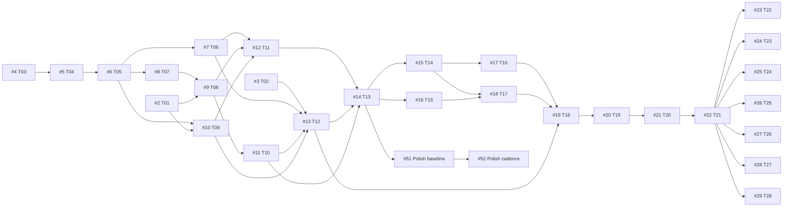

# Kế hoạch thực thi trên GitHub

## Trạng thái sau authoring PR #62 — 11/09/2026

#15–#19 Done (completed); PR #62 đã merge main `016ba56fde8310848e062b75ed016fd5771a8c4a`. #20 In Progress/Ready, sole author `/root/implement_issue20` từ main này theo quyết định Orchestrator; #21 Blocked chờ Gate 2. #51/#52 và discovery #23–#29 giữ Deferred; không đổi DAG.

[Đối chiếu authoring → Gate 2](reconciliation/2026-09-11-authoring-gate2.md).

## Lịch sử bàn giao sau PR #53 — 11/09/2026

PR #53 đã được review Đạt, CI pass và Orchestrator merge thành main `0c1597cbf323d36e83c36db06dea18d2747d5917`. Từ mốc này, #15/#16 **In Progress / Ready**, đã được giao sole authors:

- #15: `/root/implement_issue15` sở hữu đề xuất extension dùng chung (model/schema/format/capabilities/Pose) và mesh.
- #16: `/root/implement_issue16` sở hữu solver IK cùng types/helpers riêng.
- Hai owner thống nhất hợp đồng chung trước khi tích hợp. Shared model/evaluator entry được sửa tuần tự theo bàn giao; không tự tạo hai version hoặc model không tương thích, không ghi đè thay đổi của nhau. Việc giao triển khai không chứng minh extension/API mới đã được nghiệm thu.

#14 giữ Done; #51/#52 giữ Todo / Deferred / P2 ở Polish. Các snapshot nghiệm thu Gate 1 trước mốc này ghi #15/#16 Todo/Ready là lịch sử; đây là trạng thái tại mốc lịch sử PR #53; trạng thái hiện tại theo mốc PR #62 ở đầu tài liệu và GitHub Project.

## Mục tiêu và nguồn sự thật

Website animation 2D độc lập, agent dùng tools trên trang để dựng rig, tạo/sửa animation, quan sát và xuất project. Web player là đích đầu tiên; full Spine parity là lộ trình dài hạn.

- Repository: https://github.com/hoangnb24/learn-spine (main).
- Project: https://github.com/users/hoangnb24/projects/3.
- Product: [docs/product/README.md](https://github.com/hoangnb24/learn-spine/blob/main/docs/product/README.md).
- Agent handoff: [docs/product/agent-workflow.md](https://github.com/hoangnb24/learn-spine/blob/main/docs/product/agent-workflow.md).
- Acceptance gates: [docs/product/experiments.md](https://github.com/hoangnb24/learn-spine/blob/main/docs/product/experiments.md).
- Backlog có cấu trúc: [docs/product/backlog.json](https://github.com/hoangnb24/learn-spine/blob/main/docs/product/backlog.json).

## Bắt đầu và điều phối

Snapshot 11/09/2026: #2–#13 đã Done; main `b6577a3b44b8016a9c7ba3ec9f60fbb869419538`, PR #48 đã merge. Quyết định chủ dự án ngày 11/09/2026: chấp nhận Gate 1 theo chức năng, Orchestrator đã nghiệm thu chức năng và merge PR #48 tại `b6577a3b44b8016a9c7ba3ec9f60fbb869419538` (head reviewer `13bba23ceeda484aaf6e8b262b7bbceb2fc3c386`). Hiệu năng chuyển sang Polish #51 (phép đo/profile/baseline) → #52 (tối ưu/retest p95 <=16.7 ms); đây không phải performance pass. #14 đã Closed (completed)/Done; #15–#19 Done; #20 In Progress / Ready, #21 Blocked theo mốc PR #62 bên dưới. Polish không chặn các giai đoạn chức năng và không phụ thuộc #22.

Core/renderer/diagnostics và authoring #15–#19 đã merge. #20 đã được giao dựng và đo Gate 2 qua commands hiện có; #21 chờ kết quả Gate 2, xem đối chiếu authoring. Xem [đối chiếu](reconciliation/2026-09-11-gate1.md).

GitHub blocked-by là dependency kỹ thuật trực tiếp; sub-issues chỉ là phân cấp theo dõi, không phải thứ tự thực thi. Wave là đợt sớm nhất theo DAG, không yêu cầu chờ toàn bộ một đợt. Chỉ nhận việc khi dependency đã merge và đạt, tôn trọng ownership/file chung; không coi issue bị hủy là đầu vào đã sẵn sàng.

Readiness hiện là snapshot, không có automation tự cập nhật. Agent hoàn tất/merge cần mở khóa downstream và cập nhật field/plan. P0 là nền tảng/gate/quyết định; P1 là triển khai; P2 gồm Polish đã hoãn và discovery sau MVP.

## Backlog

| Issue | Stage | Wave | Blocked by | Readiness |
| --- | --- | --- | --- | --- |
| [#2](https://github.com/hoangnb24/learn-spine/issues/2) Chuẩn hóa assets, nguồn sử dụng và bộ fixture đối chứng | Foundation | 0 | — | Ready |
| [#3](https://github.com/hoangnb24/learn-spine/issues/3) Thử agent khám phá và gọi WebMCP trên trình duyệt thực tế | Foundation | 0 | — | Ready |
| [#4](https://github.com/hoangnb24/learn-spine/issues/4) Chốt hợp đồng project, tọa độ, module và giao dịch tools v0 | Foundation | 0 | — | Ready |
| [#5](https://github.com/hoangnb24/learn-spine/issues/5) Dựng workspace sản phẩm độc lập và kiểm tra CI cơ bản | Foundation | 1 | [#4](https://github.com/hoangnb24/learn-spine/issues/4) | Ready |
| [#6](https://github.com/hoangnb24/learn-spine/issues/6) Triển khai model project v0 và kiểm tra dữ liệu đầu vào | Robot | 2 | [#5](https://github.com/hoangnb24/learn-spine/issues/5) | Ready |
| [#7](https://github.com/hoangnb24/learn-spine/issues/7) Bộ lệnh atomic, revision, retry và lịch sử hoàn tác | Robot | 3 | [#6](https://github.com/hoangnb24/learn-spine/issues/6) | Ready |
| [#8](https://github.com/hoangnb24/learn-spine/issues/8) Tính pose xương và nội suy animation theo thời gian | Robot | 3 | [#6](https://github.com/hoangnb24/learn-spine/issues/6) | Ready |
| [#9](https://github.com/hoangnb24/learn-spine/issues/9) Renderer PixiJS cho ảnh gắn xương và viewport nhất quán | Robot | 4 | [#8](https://github.com/hoangnb24/learn-spine/issues/8), [#2](https://github.com/hoangnb24/learn-spine/issues/2) | Ready |
| [#10](https://github.com/hoangnb24/learn-spine/issues/10) Đóng gói project, lưu tự động và mở lại không mất assets | Robot | 3 | [#6](https://github.com/hoangnb24/learn-spine/issues/6), [#2](https://github.com/hoangnb24/learn-spine/issues/2) | Ready |
| [#11](https://github.com/hoangnb24/learn-spine/issues/11) Render pose/chuỗi ảnh, playback và vòng đời job quan sát | Robot | 5 | [#9](https://github.com/hoangnb24/learn-spine/issues/9) | Ready |
| [#12](https://github.com/hoangnb24/learn-spine/issues/12) Editor tối thiểu và player độc lập dùng cùng core | Robot | 5 | [#7](https://github.com/hoangnb24/learn-spine/issues/7), [#9](https://github.com/hoangnb24/learn-spine/issues/9), [#10](https://github.com/hoangnb24/learn-spine/issues/10) | Ready |
| [#13](https://github.com/hoangnb24/learn-spine/issues/13) Kết nối tools sản phẩm qua WebMCP và công bố capabilities | Robot | 6 | [#3](https://github.com/hoangnb24/learn-spine/issues/3), [#7](https://github.com/hoangnb24/learn-spine/issues/7), [#11](https://github.com/hoangnb24/learn-spine/issues/11), [#10](https://github.com/hoangnb24/learn-spine/issues/10) | Ready |
| [#14](https://github.com/hoangnb24/learn-spine/issues/14) Gate 1 — kiểm chứng robot từ art đến project và player | Robot | 7 | [#12](https://github.com/hoangnb24/learn-spine/issues/12), [#13](https://github.com/hoangnb24/learn-spine/issues/13), [#11](https://github.com/hoangnb24/learn-spine/issues/11) | Ready |
| [#15](https://github.com/hoangnb24/learn-spine/issues/15) Mesh, bind pose, weights và deform trong core | Deformation | 8 | [#14](https://github.com/hoangnb24/learn-spine/issues/14) | Ready |
| [#16](https://github.com/hoangnb24/learn-spine/issues/16) IK hai xương và chân trụ với hành vi xác định | Deformation | 8 | [#14](https://github.com/hoangnb24/learn-spine/issues/14) | Ready |
| [#17](https://github.com/hoangnb24/learn-spine/issues/17) Hiển thị mesh và thay texture giữ nguyên kích thước logic | Deformation | 9 | [#15](https://github.com/hoangnb24/learn-spine/issues/15) | Ready |
| [#18](https://github.com/hoangnb24/learn-spine/issues/18) Chẩn đoán weights, neo, trượt chân và nối vòng | Deformation | 9 | [#15](https://github.com/hoangnb24/learn-spine/issues/15), [#16](https://github.com/hoangnb24/learn-spine/issues/16) | Ready |
| [#19](https://github.com/hoangnb24/learn-spine/issues/19) Tools và điều khiển tối thiểu cho mesh, IK và chẩn đoán | Deformation | 10 | [#17](https://github.com/hoangnb24/learn-spine/issues/17), [#18](https://github.com/hoangnb24/learn-spine/issues/18), [#13](https://github.com/hoangnb24/learn-spine/issues/13) | Ready |
| [#20](https://github.com/hoangnb24/learn-spine/issues/20) Gate 2 — kiểm chứng khăn, thạch và chân trụ | Deformation | 11 | [#19](https://github.com/hoangnb24/learn-spine/issues/19) | Ready |
| [#21](https://github.com/hoangnb24/learn-spine/issues/21) Gate 3 — đo agent tạo và sửa animation qua WebMCP | Agent evaluation | 12 | [#20](https://github.com/hoangnb24/learn-spine/issues/20) | Blocked |
| [#22](https://github.com/hoangnb24/learn-spine/issues/22) Chốt kiến trúc MVP và quyết định mở rộng từ bằng chứng | Decision | 13 | [#21](https://github.com/hoangnb24/learn-spine/issues/21) | Blocked |
| [#23](https://github.com/hoangnb24/learn-spine/issues/23) Discovery — nhập PSD và cập nhật art giữ nguyên rig | Later discovery | 14 | [#22](https://github.com/hoangnb24/learn-spine/issues/22) | Deferred |
| [#24](https://github.com/hoangnb24/learn-spine/issues/24) Discovery — mixing, chuyển tiếp, events và đồng bộ audio | Later discovery | 14 | [#22](https://github.com/hoangnb24/learn-spine/issues/22) | Deferred |
| [#25](https://github.com/hoangnb24/learn-spine/issues/25) Discovery — skins, linked mesh, clipping và thứ tự vẽ | Later discovery | 14 | [#22](https://github.com/hoangnb24/learn-spine/issues/22) | Deferred |
| [#26](https://github.com/hoangnb24/learn-spine/issues/26) Discovery — path và transform constraints | Later discovery | 14 | [#22](https://github.com/hoangnb24/learn-spine/issues/22) | Deferred |
| [#27](https://github.com/hoangnb24/learn-spine/issues/27) Discovery — physics tái lập khi seek, reset và export | Later discovery | 14 | [#22](https://github.com/hoangnb24/learn-spine/issues/22) | Deferred |
| [#28](https://github.com/hoangnb24/learn-spine/issues/28) Discovery — spritesheet, video và đầu ra game engine | Later discovery | 14 | [#22](https://github.com/hoangnb24/learn-spine/issues/22) | Deferred |
| [#29](https://github.com/hoangnb24/learn-spine/issues/29) Discovery — từ ảnh phẳng đến art tách lớp và rig đề xuất | Later discovery | 14 | [#22](https://github.com/hoangnb24/learn-spine/issues/22) | Deferred |
| [#51](https://github.com/hoangnb24/learn-spine/issues/51) Chuẩn hóa phép đo/profile/baseline | Polish | Chưa lên lịch | #14 (đầu vào) | Deferred |
| [#52](https://github.com/hoangnb24/learn-spine/issues/52) Tối ưu cadence/retest <=16.7ms | Polish | Chưa lên lịch | #51 | Deferred |

Project Stage chưa có lựa chọn Polish; hai issue giữ Stage trống, Phase Polish ghi trong body/backlog. Readiness Deferred, Priority P2, Status Todo.

## Đồ thị dependency

