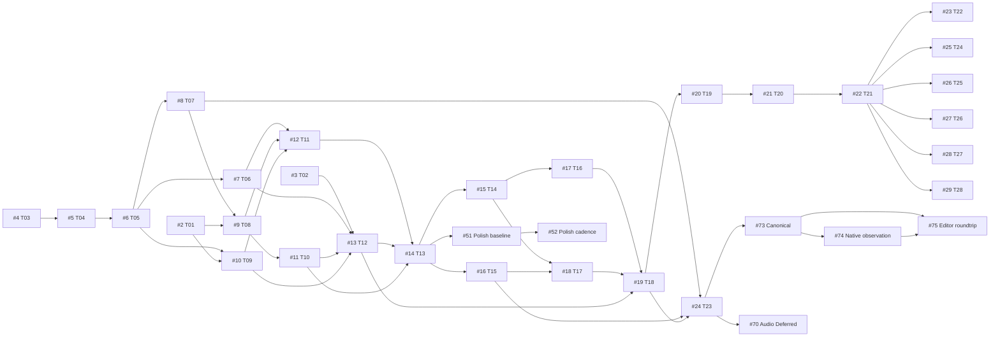

# Kế hoạch thực thi trên GitHub

## Trạng thái hiện hành — 12/09/2026

Ngày 12/09/2026 — **DEFERRED BY OWNER**. Chủ dự án hoãn chọn nơi sử dụng, đầu ra animation và logic tương ứng đến khi có nhu cầu thực tế. Trọng tâm là tạo, xem và sửa ngay trên trang. Lưu/mở lại, ZIP và Player là khả năng hiện có, không phải nhu cầu đầu ra đã chốt. #22 OPEN/Todo/Deferred; #23 và #25–#29 Deferred, #28 chỉ xem lại khi có nhu cầu đầu ra thực. #51 và #52 Todo/Deferred: chủ dự án xác nhận Polish để sau, gồm cả đo/profile baseline và tối ưu. #24 đã CLOSED/completed sau nghiệm thu discovery Đạt tại `d539f8d85dd5f66dfd78d50a8f01d4e1c1cee2b3`; [CI Mixing numeric 34685586726 SUCCESS](https://github.com/hoangnb24/learn-spine/actions/runs/34685586726), [PR #72](https://github.com/hoangnb24/learn-spine/pull/72) merge main `a25dc95cc6588de5c5a3389fff207a6d9131e0a1`. Đây chỉ là spec/prototype transform và event metadata, riêng kết quả này không chứng minh native/UI; trạng thái implementation theo cập nhật dưới. #24/#73/#74/#75 CLOSED/completed · Done/Ready. Chuỗi Composition v1 tạo/xem/sửa đã nghiệm thu theo scope từng issue, gồm editor và native→UI roundtrip. Roadmap #1 giữ OPEN; #22/#23/#25–#29/#51/#52/#70 vẫn Todo/Deferred. Không mở event/audio/deform mixing/generic auto-stop/performance hoặc đầu ra mới. Phần được chọn đã hoàn tất; việc tiếp theo cần ưu tiên sản phẩm mới hoặc quyết định mở lại mục đang hoãn, không tự chọn/mở issue và không suy thành blocker kỹ thuật. Không duyệt MVP hoặc production. [Đối chiếu](reconciliation/2026-09-12-composition-v1.md).

## Lịch sử sau Gate 3 PR #66 — 11/09/2026

Gate 3 #21 đã nghiệm thu Đạt/Project Done, PR #66 squash-merged main `fe112ca002513e3767715e9d32ecbfb58dde833a`, accepted head `d6f18420a0651845b95933da36b79b523cfc6bf9`, CI run 34585694942 SUCCESS. #21 đã Closed (completed)/Done; trạng thái đóng được kiểm tra lại trên GitHub. #22 Todo/Ready để chuẩn bị đề xuất quyết định, chủ dự án chưa chốt MVP. #23–#29 và #51/#52 vẫn Deferred; không mở production.

[Đối chiếu ba gate → đề xuất MVP](reconciliation/2026-09-11-three-gates.md).

## Lịch sử bàn giao sau PR #53 — 11/09/2026

PR #53 đã được review Đạt, CI pass và Orchestrator merge thành main `0c1597cbf323d36e83c36db06dea18d2747d5917`. Từ mốc này, #15/#16 **In Progress / Ready**, đã được giao sole authors:

- #15: `/root/implement_issue15` sở hữu đề xuất extension dùng chung (model/schema/format/capabilities/Pose) và mesh.
- #16: `/root/implement_issue16` sở hữu solver IK cùng types/helpers riêng.
- Hai owner thống nhất hợp đồng chung trước khi tích hợp. Shared model/evaluator entry được sửa tuần tự theo bàn giao; không tự tạo hai version hoặc model không tương thích, không ghi đè thay đổi của nhau. Việc giao triển khai không chứng minh extension/API mới đã được nghiệm thu.

#14 giữ Done; #51/#52 giữ Todo / Deferred / P2 ở Polish. Các snapshot nghiệm thu Gate 1 trước mốc này ghi #15/#16 Todo/Ready là lịch sử; đây là trạng thái tại mốc lịch sử PR #53; trạng thái hiện tại theo mốc 12/09 ở đầu tài liệu và GitHub Project.

## Mục tiêu và nguồn sự thật

Website animation 2D độc lập, agent dùng tools trên trang để dựng rig, tạo/sửa animation, quan sát và sửa ngay trên trang. Nơi sử dụng/đầu ra đã hoãn; lưu/mở/ZIP/Player có sẵn không chốt nhu cầu sản phẩm.

- Repository: https://github.com/hoangnb24/learn-spine (main).
- Project: https://github.com/users/hoangnb24/projects/3.
- Product: [docs/product/README.md](https://github.com/hoangnb24/learn-spine/blob/main/docs/product/README.md).
- Agent handoff: [docs/product/agent-workflow.md](https://github.com/hoangnb24/learn-spine/blob/main/docs/product/agent-workflow.md).
- Acceptance gates: [docs/product/experiments.md](https://github.com/hoangnb24/learn-spine/blob/main/docs/product/experiments.md).
- Backlog có cấu trúc: [docs/product/backlog.json](https://github.com/hoangnb24/learn-spine/blob/main/docs/product/backlog.json).

## Lịch sử khởi động và quy tắc điều phối

Snapshot 11/09/2026: #2–#13 đã Done; main `b6577a3b44b8016a9c7ba3ec9f60fbb869419538`, PR #48 đã merge. Quyết định chủ dự án ngày 11/09/2026: chấp nhận Gate 1 theo chức năng, Orchestrator đã nghiệm thu chức năng và merge PR #48 tại `b6577a3b44b8016a9c7ba3ec9f60fbb869419538` (head reviewer `13bba23ceeda484aaf6e8b262b7bbceb2fc3c386`). Hiệu năng chuyển sang Polish #51 (phép đo/profile/baseline) → #52 (tối ưu/retest p95 <=16.7 ms); đây không phải performance pass. #14 đã Closed (completed)/Done; #15–#20 Done; #21 accepted/Done, #22 Ready chuẩn bị đề xuất theo mốc PR #66 bên dưới. Polish không chặn các giai đoạn chức năng và không phụ thuộc #22.

Ba gate đã có nghiệm thu theo phạm vi đã ghi; #21 native 7/9 đạt ngưỡng, #22 Ready tại snapshot 11/09 để chuẩn bị đề xuất; hiện Deferred theo quyết định 12/09. Không tự chốt MVP hoặc mở production/discovery ngoài #24 đã được cho phép, xem đối chiếu ba gate. Xem [đối chiếu](reconciliation/2026-09-11-gate1.md).

GitHub blocked-by là dependency kỹ thuật trực tiếp; sub-issues chỉ là phân cấp theo dõi, không phải thứ tự thực thi. Wave là đợt sớm nhất theo DAG, không yêu cầu chờ toàn bộ một đợt. Chỉ nhận việc khi dependency đã merge và đạt, tôn trọng ownership/file chung; không coi issue bị hủy là đầu vào đã sẵn sàng.

Readiness hiện là snapshot, không có automation tự cập nhật. Agent hoàn tất/merge cần mở khóa downstream và cập nhật field/plan. P0 là nền tảng/gate/quyết định; P1 là triển khai; P2 gồm Polish đã hoãn và discovery; riêng #24 đã được mở theo chủ dự án.

## Backlog

| Issue | Stage | Wave | Blocked by | Readiness |
| --- | --- | --- | --- | --- |
| [#2](https://github.com/hoangnb24/learn-spine/issues/2) Chuẩn hóa assets, nguồn sử dụng và bộ fixture đối chứng | Foundation | 0 | — | Ready |
| [#3](https://github.com/hoangnb24/learn-spine/issues/3) Thử agent khám phá và gọi WebMCP trên trình duyệt thực tế | Foundation | 0 | — | Ready |
| [#4](https://github.com/hoangnb24/learn-spine/issues/4) Chốt hợp đồng project, tọa độ, module và giao dịch tools v0 | Foundation | 0 | — | Ready |
| [#5](https://github.com/hoangnb24/learn-spine/issues/5) Dựng workspace sản phẩm độc lập và kiểm tra CI cơ bản | Foundation | 1 | [#4](https://github.com/hoangnb24/learn-spine/issues/4) | Ready |
| [#6](https://github.com/hoangnb24/learn-spine/issues/6) Triển khai model project v0 và kiểm tra dữ liệu đầu vào | Robot | 2 | [#5](https://github.com/hoangnb24/learn-spine/issues/5) | Ready |
| [#7](https://github.com/hoangnb24/learn-spine/issues/7) Bộ lệnh atomic, revision, retry và lịch sử hoàn tác | Robot | 3 | [#6](https://github.com/hoangnb24/learn-spine/issues/6) | Ready |
| [#8](https://github.com/hoangnb24/learn-spine/issues/8) Tính pose xương và nội suy animation theo thời gian | Robot | 3 | [#6](https://github.com/hoangnb24/learn-spine/issues/6) | Ready |
| [#9](https://github.com/hoangnb24/learn-spine/issues/9) Renderer PixiJS cho ảnh gắn xương và viewport nhất quán | Robot | 4 | [#8](https://github.com/hoangnb24/learn-spine/issues/8), [#2](https://github.com/hoangnb24/learn-spine/issues/2) | Ready |
| [#10](https://github.com/hoangnb24/learn-spine/issues/10) Đóng gói project, lưu tự động và mở lại không mất assets | Robot | 3 | [#6](https://github.com/hoangnb24/learn-spine/issues/6), [#2](https://github.com/hoangnb24/learn-spine/issues/2) | Ready |
| [#11](https://github.com/hoangnb24/learn-spine/issues/11) Render pose/chuỗi ảnh, playback và vòng đời job quan sát | Robot | 5 | [#9](https://github.com/hoangnb24/learn-spine/issues/9) | Ready |
| [#12](https://github.com/hoangnb24/learn-spine/issues/12) Editor tối thiểu và player độc lập dùng cùng core | Robot | 5 | [#7](https://github.com/hoangnb24/learn-spine/issues/7), [#9](https://github.com/hoangnb24/learn-spine/issues/9), [#10](https://github.com/hoangnb24/learn-spine/issues/10) | Ready |
| [#13](https://github.com/hoangnb24/learn-spine/issues/13) Kết nối tools sản phẩm qua WebMCP và công bố capabilities | Robot | 6 | [#3](https://github.com/hoangnb24/learn-spine/issues/3), [#7](https://github.com/hoangnb24/learn-spine/issues/7), [#11](https://github.com/hoangnb24/learn-spine/issues/11), [#10](https://github.com/hoangnb24/learn-spine/issues/10) | Ready |
| [#14](https://github.com/hoangnb24/learn-spine/issues/14) Gate 1 — kiểm chứng robot từ art đến project và player | Robot | 7 | [#12](https://github.com/hoangnb24/learn-spine/issues/12), [#13](https://github.com/hoangnb24/learn-spine/issues/13), [#11](https://github.com/hoangnb24/learn-spine/issues/11) | Ready |
| [#15](https://github.com/hoangnb24/learn-spine/issues/15) Mesh, bind pose, weights và deform trong core | Deformation | 8 | [#14](https://github.com/hoangnb24/learn-spine/issues/14) | Ready |
| [#16](https://github.com/hoangnb24/learn-spine/issues/16) IK hai xương và chân trụ với hành vi xác định | Deformation | 8 | [#14](https://github.com/hoangnb24/learn-spine/issues/14) | Ready |
| [#17](https://github.com/hoangnb24/learn-spine/issues/17) Hiển thị mesh và thay texture giữ nguyên kích thước logic | Deformation | 9 | [#15](https://github.com/hoangnb24/learn-spine/issues/15) | Ready |
| [#18](https://github.com/hoangnb24/learn-spine/issues/18) Chẩn đoán weights, neo, trượt chân và nối vòng | Deformation | 9 | [#15](https://github.com/hoangnb24/learn-spine/issues/15), [#16](https://github.com/hoangnb24/learn-spine/issues/16) | Ready |
| [#19](https://github.com/hoangnb24/learn-spine/issues/19) Tools và điều khiển tối thiểu cho mesh, IK và chẩn đoán | Deformation | 10 | [#17](https://github.com/hoangnb24/learn-spine/issues/17), [#18](https://github.com/hoangnb24/learn-spine/issues/18), [#13](https://github.com/hoangnb24/learn-spine/issues/13) | Ready |
| [#20](https://github.com/hoangnb24/learn-spine/issues/20) Gate 2 — kiểm chứng khăn, thạch và chân trụ | Deformation | 11 | [#19](https://github.com/hoangnb24/learn-spine/issues/19) | Ready |
| [#21](https://github.com/hoangnb24/learn-spine/issues/21) Gate 3 — đo agent tạo và sửa animation qua WebMCP | Agent evaluation | 12 | [#20](https://github.com/hoangnb24/learn-spine/issues/20) | Ready |
| [#22](https://github.com/hoangnb24/learn-spine/issues/22) Chốt kiến trúc MVP và quyết định mở rộng từ bằng chứng | Decision | 13 | [#21](https://github.com/hoangnb24/learn-spine/issues/21) | Deferred |
| [#23](https://github.com/hoangnb24/learn-spine/issues/23) Discovery — nhập PSD và cập nhật art giữ nguyên rig | Later discovery | 14 | [#22](https://github.com/hoangnb24/learn-spine/issues/22) | Deferred |
| [#24](https://github.com/hoangnb24/learn-spine/issues/24) Discovery — mixing, chuyển tiếp và events metadata | Later discovery | 14 | #8, #16, #19 (đã merged) | Ready (Done/completed) |
| [#25](https://github.com/hoangnb24/learn-spine/issues/25) Discovery — skins, linked mesh, clipping và thứ tự vẽ | Later discovery | 14 | [#22](https://github.com/hoangnb24/learn-spine/issues/22) | Deferred |
| [#26](https://github.com/hoangnb24/learn-spine/issues/26) Discovery — path và transform constraints | Later discovery | 14 | [#22](https://github.com/hoangnb24/learn-spine/issues/22) | Deferred |
| [#27](https://github.com/hoangnb24/learn-spine/issues/27) Discovery — physics tái lập khi seek, reset và export | Later discovery | 14 | [#22](https://github.com/hoangnb24/learn-spine/issues/22) | Deferred |
| [#28](https://github.com/hoangnb24/learn-spine/issues/28) Discovery — spritesheet, video và đầu ra game engine | Later discovery | 14 | [#22](https://github.com/hoangnb24/learn-spine/issues/22) | Deferred |
| [#29](https://github.com/hoangnb24/learn-spine/issues/29) Discovery — từ ảnh phẳng đến art tách lớp và rig đề xuất | Later discovery | 14 | [#22](https://github.com/hoangnb24/learn-spine/issues/22) | Deferred |
| [#51](https://github.com/hoangnb24/learn-spine/issues/51) Chuẩn hóa phép đo/profile/baseline | Polish | Chưa lên lịch | #14 (đầu vào) | Deferred |
| [#52](https://github.com/hoangnb24/learn-spine/issues/52) Tối ưu cadence/retest <=16.7ms | Polish | Chưa lên lịch | #51 | Deferred |
| [#70](https://github.com/hoangnb24/learn-spine/issues/70) Discovery — audio clock, stop/restart và kiểm nghe | Later discovery | Chưa lên lịch | #24 | Deferred |
| [#73](https://github.com/hoangnb24/learn-spine/issues/73) Canonical data, Session, evaluator | Composition v1 | Tuần tự | #24 | Ready (Done/completed) |
| [#74](https://github.com/hoangnb24/learn-spine/issues/74) Native tools, observation, bounds | Composition v1 | Tuần tự | #73 | Ready (Done/completed) |
| [#75](https://github.com/hoangnb24/learn-spine/issues/75) Editor và native→UI roundtrip | Composition v1 | Tuần tự | #73, #74 | Ready (Done/completed) |

Project Stage chưa có lựa chọn Polish; hai issue giữ Stage trống, Phase Polish ghi trong body/backlog. Snapshot 12/09: #51 và #52 Readiness Deferred. Cả hai Priority P2, Status Todo.

## Đồ thị dependency

