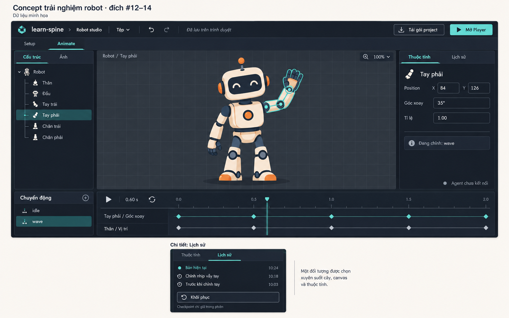
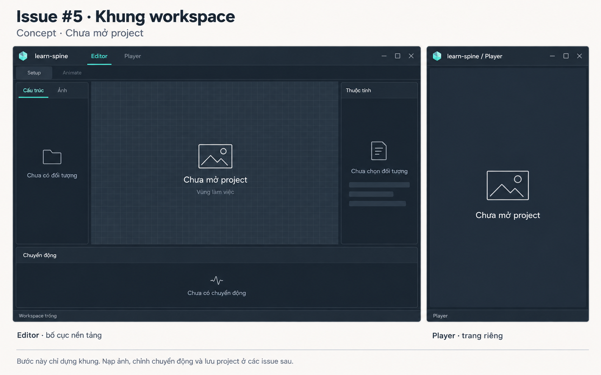

# Design preview — 11/09/2026

Hai ảnh concept được tạo sau [audit sản phẩm](product-ux-brief-2026-09-11.md) và [nghiên cứu Mobbin](mobbin-ux-research-2026-09-11.md). Đây là hướng thiết kế, không phải ảnh chụp phần mềm đã triển khai hoặc bằng chứng gate đã đạt. Không thay đổi acceptance GitHub.

## Trải nghiệm đích #12–14

Canvas giữ vai trò chính. Cùng một cánh tay được chọn ở cây đối tượng, canvas, thuộc tính và timeline. Setup/Animate tách rõ; idle/wave nằm cạnh timeline. Lịch sử thay cho thuộc tính trong cùng panel phải, được minh họa bằng một inset riêng; không phải cửa sổ thứ hai cần mở thường trực. Khôi phục checkpoint thay đổi project; checkpoint chỉ giữ trong phiên. Lưu trên trình duyệt khác với tải gói project. Agent ở host bên ngoài, không thêm chat nhúng.

Robot và các giá trị là dữ liệu minh họa do công cụ tạo ảnh sinh ra, không phải fixture của repository đã được engine render. Các nhãn cây là nhãn trình bày, chưa chốt cấu trúc bone/attachment thực tế. Nhãn Position còn bằng tiếng Anh; khi triển khai nên thống nhất thành Vị trí. Ảnh không chứng minh khả năng phím tắt, focus, responsive, validation hoặc lưu/khôi phục.

## Phần xây trước ở #5

Giữ cùng màu, vị trí panel và tên vùng làm việc, nhưng chưa mở phiên project: không robot, track, keyframe, lưu giả hay kết nối agent giả. Player có entry và vùng xem riêng, không mang cây/inspector của editor. Các nhãn mode chỉ giữ chỗ; #5 không cần hiện thực thao tác Setup/Animate. Trang rỗng không có nghĩa tạo model bones=[] trái hợp đồng v0.

## Mapping phạm vi

| Thành phần trong concept | Issue liên quan |
| --- | --- |
| Editor và Player entry, khung trống | #5 |
| Dữ liệu, commands, lịch sử, checkpoint | #6–7, tích hợp #12 |
| Robot trên canvas, play/seek, timeline | #8–9, tích hợp #12 |
| Lưu cục bộ, tải/mở gói project | #10, tích hợp #12 |
| Agent host bên ngoài | #13 |
| Quy trình robot idle/wave thực tế | #14 |

Không đưa mesh, IK, physics, video, spritesheet, compare/onion-skin, cloud hoặc chat backend vào hướng này. Menu nhập ảnh và trạng thái lỗi chưa được minh họa thành màn riêng; không xem ảnh hiện tại là đặc tả đầy đủ cho #12.

## Điều thay đổi nhờ nghiên cứu

Khung cũ chỉ cho thấy một app trống. Bản mới giải thích cả trải nghiệm đích và phần nền tảng xây trước. Cấu trúc canvas/cây/inspector và danh sách animation tham khảo Rive; liên kết selection tham khảo Framer; history dùng chung panel tham khảo Figma. Các nguồn và giới hạn quan sát ghi trong tài liệu Mobbin, không sao chép logo hoặc nhận toàn bộ tính năng app tham khảo vào sản phẩm.

## Hiện vật và cách tạo

- Công cụ: built-in `image_gen`, tạo mới hai ảnh; không dùng CLI/API fallback. Đã mở cả hai ảnh bằng `view_image` để kiểm tra bố cục, chữ và giới hạn scope; copy nguyên bản vào repository, không sửa bitmap bằng code.
- Ảnh A: `previews/robot-editor-concept-2026-09-11.png`.
- Ảnh B: `previews/issue-5-shell-concept-2026-09-11.png`.
- Prompt A: UI mockup desktop 16:10, nền ngoài trắng ấm, app navy-charcoal, nhấn teal; robot region minh họa chọn tay, cây/canvas/inspector đồng bộ, Setup/Animate, idle/wave timeline và keys, lưu trình duyệt/tải gói/Mở Player; inset lịch sử cùng panel có Khôi phục và giới hạn trong phiên; caption concept #12–14; loại chat, cloud, advanced animation và compare.
- Prompt B: cùng visual system, editor lớn và Player riêng nhỏ hơn; caption concept #5; cây, canvas, thuộc tính, chuyển động ở trạng thái chưa mở project, không controls giả hoạt động; note nạp ảnh/chỉnh/lưu thuộc issue sau.

Ảnh chỉ phục vụ review thiết kế. Bước implementation vẫn cần hợp đồng phối hợp và kiểm tra thực tế trong các issue tương ứng.
