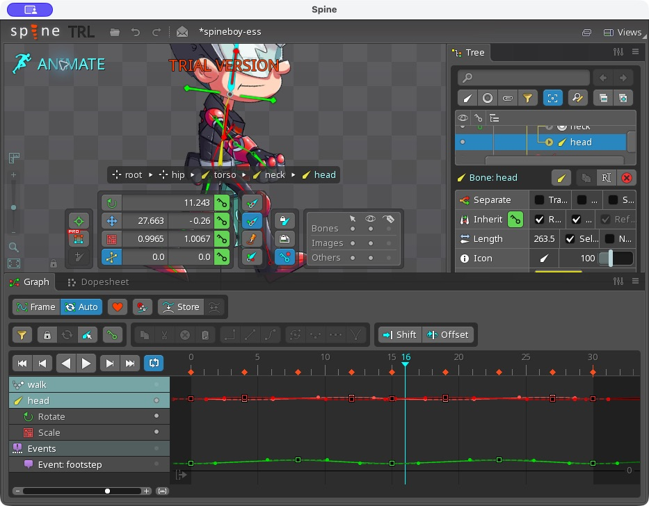

# Điều khiển Spine Editor đã hoạt động

Kiểm chứng ngày 06/09/2026 trên editor 4.3.23 Trial.

## Mở đúng bản app

- Bản dùng cho Computer Use: `/Users/tubakhuym/Applications/SpineTrial-Control.app`.
- Gọi `sky.get_app_state({app: "local.spine.trial"})`; nếu ở launcher, quan sát ảnh rồi bấm Start.
- Đã bổ sung `CFBundleIdentifier = local.spine.trial` vào Info.plist của bản sao. App gốc `/Applications/SpineTrial.app` được đối chiếu hash với backup và không thay đổi.
- Backup: `/Users/tubakhuym/.codex/backups/spine-trial-20260906/SpineTrial.app`.
- Bản sao cuối cùng chỉ sửa Info.plist. Thử ký lại toàn bộ bundle đã thất bại; sau đó đã chép lại từ backup trước khi bổ sung ID và chạy thành công. Không lặp lại bước ký toàn bộ bundle.

## Những gì đã làm trực tiếp trong UI

1. Mở Examples → Spineboy → Download Project (ESS).
2. Chọn xương head trên canvas; Tree hiển thị Bone: head.
3. Ở Setup, đổi rotation 23.184° thành 35°; đầu nhân vật nghiêng theo.
4. Chuyển Animate; phát walk. Quan sát timeline lần lượt ở frame 10 và 25 với tư thế khác nhau.
5. Dừng playback, về Setup và nhập lại rotation 23.184°. Cmd+Z lúc ô nhập còn focus không hoàn tác phép xoay nên đã phục hồi bằng giá trị gốc.
6. Để editor ở Animate, walk dừng tại frame 16. Project có dấu * do đã thao tác thử; không tuyên bố lưu project.

## Cách thao tác tiếp

Giao diện tùy biến của Spine chỉ cung cấp cửa sổ và menu qua accessibility. Dùng ảnh từ get_app_state để xác định tọa độ, rồi sky.click/press_key/drag. Đọc lại trạng thái sau mỗi nhóm thao tác. Không coi accessibility tree không đổi là giao diện không đổi: cần xem screenshot.

