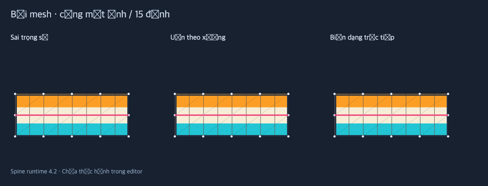

# Bài mesh, weights và deform

Thực hành ngày 06/09/2026 bằng Spine Runtime 4.2.120. Chưa thực hành thao tác tương ứng trong editor.



## Câu hỏi

Vì sao xoay xương mà ảnh không đi theo? Làm sao phân biệt uốn ảnh nhờ xương với sửa trực tiếp vị trí các điểm của ảnh?

## Thiết lập

Một ảnh kiểm tra 256 × 96 có lưới và ba dải màu, tạo bằng Python để dễ nhìn biến dạng. Cùng một mesh gồm 15 đỉnh và 16 tam giác. Ba skin dùng chung tên attachment nhưng chứa ba biến thể:

- `wrong-weights`: toàn bộ đỉnh chỉ theo xương gốc.
- `default`: phần đầu theo xương gốc, phần cuối theo xương con, vùng giữa trộn ảnh hưởng hai xương.
- `manual`: mesh không có trọng số, dùng key sửa vị trí đỉnh.

Mesh chia ảnh thành các tam giác; weights xác định xương nào tác động tới từng đỉnh. [Mesh attachments](https://esotericsoftware.com/spine-meshes), [Weights view](https://esotericsoftware.com/spine-weights).

## Thử sai và sửa

1. Xoay xương con 35°. Với trọng số sai, ảnh không đổi dù đường xương đã xoay. Với trọng số đã sửa, phần cuối uốn lên trong khi điểm gốc giữ nguyên. Đây là lỗi gán ảnh hưởng xương, không phải lỗi đặt key xoay.
2. Với mesh không trọng số, tăng vị trí giữa dải 20 đơn vị qua key biến dạng. Cột giữa tăng đúng 20, xương không cần xoay.
3. Cố ý đặt timeline vào trường `deform` ở đầu animation. Loader 4.2.120 đọc được file nhưng không tạo timeline này. Cấu trúc được loader hiện tại đọc là `animations → flutter → attachments → manual → strip → strip → deform`. Sau sửa, số timeline tăng từ 0 lên 1 và biến dạng xuất hiện.

Kết luận của thử nghiệm 3 chỉ áp dụng cho phiên bản đã kiểm tra; không suy rộng cấu trúc này sang mọi phiên bản Spine. Đã đối chiếu nhánh Attachment timelines trong mã `SkeletonJson.js` của dependency hiện tại. [Mã nguồn runtime](https://github.com/EsotericSoftware/spine-runtimes/tree/4.2/spine-ts/spine-core).

## Bằng chứng

`checks.json` ghi kết quả đo bằng runtime:

- Trọng số sai: thay đổi vị trí lớn nhất bằng 0.
- Trọng số đã sửa: thay đổi lớn nhất khoảng 82,10 đơn vị.
- Biến dạng trực tiếp: điểm giữa thay đổi đúng 20 đơn vị.
- Schema sai/đúng: 0/1 timeline được nạp.

Đã xem khung hình ở 0,5 giây: biến dạng xuất hiện đúng vùng; hình so sánh giúp phân biệt ảnh và đường xương. Chưa kiểm tra mesh phức tạp hoặc tối ưu chất lượng biến dạng ở góc gập lớn.

## Làm lại

Tại thư mục gốc:

```sh
python3 scripts/build_mesh_lab.py
node scripts/check_mesh_lab.mjs
node scripts/render_mesh_lab.mjs
```

Sau khi điều khiển được editor: tự tạo mesh tương tự, bind hai xương, chỉnh weights và key deform qua giao diện, rồi đối chiếu với bài này. Các thao tác đó vẫn chưa đạt.
