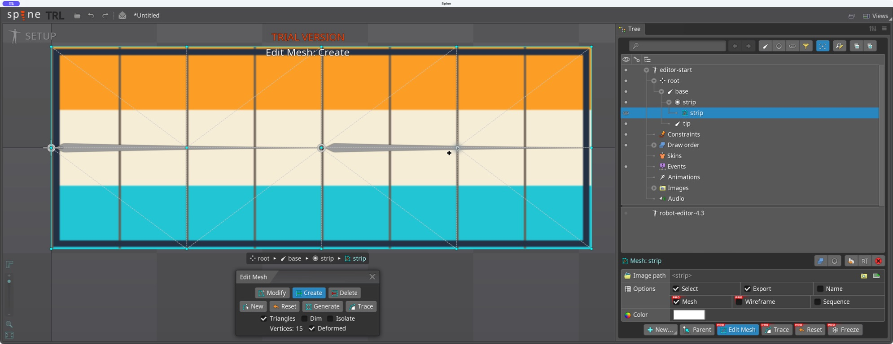
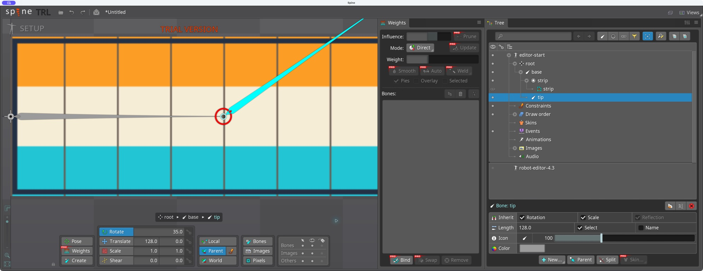
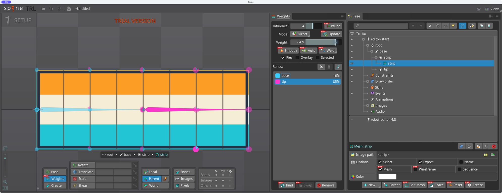
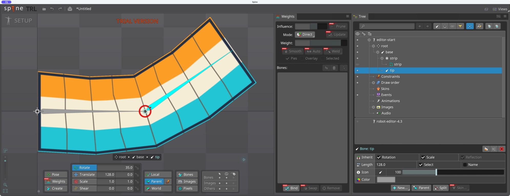
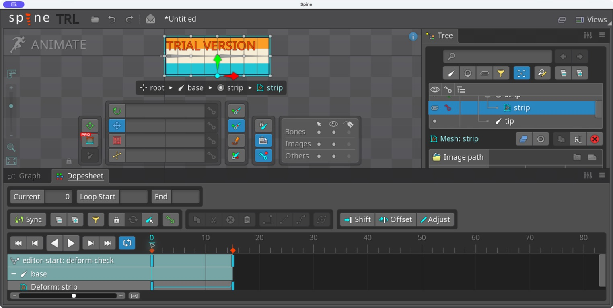

# Bài 6 — Mesh, weights và deform trong editor

Thực hành ngày 06/09/2026 bằng Computer Use trong Spine 4.3.23 Trial. Đã tạo lưới từ ảnh, cố ý bind sai rồi sửa, chỉnh weights và đặt key deform. Đây là bài kiểm chứng cơ chế; chất lượng uốn còn cần cải thiện.

## Dựng mesh từ ảnh region

Nhập [editor-start.json](../exercises/mesh-lab/editor-start.json) thành skeleton mới trong cùng project. File chỉ có ba xương `root → base → tip`, một ảnh region 256×96 và không có animation. Ẩn robot để thao tác riêng.

Trong Setup, chọn attachment strip, bật Mesh rồi Edit Mesh. Tạo 15 đỉnh thành 5 cột × 3 hàng: hai mép và hàng giữa. Lưới này được tạo trực tiếp trong editor, không nhập mesh đã dựng sẵn.

## Bind sai rồi sửa

Mở Views → Weights. Bind riêng `base`, thoát Bind rồi xoay `tip` 35°. Xương tip xoay nhưng dải ảnh vẫn phẳng: mesh chưa chịu ảnh hưởng của tip.

Undo góc xoay, chọn mesh, Bind thêm tip rồi Auto weights. Xoay tip lần nữa làm ảnh uốn theo. Trọng số ở giữa ban đầu nghiêng về base: tip khoảng 35,72%. Dùng Weights chỉnh ba hàng ở cột giữa về khoảng 49,7% tip, rồi thử mở rộng vùng chuyển tiếp: cột 1/4 khoảng 14,08%, cột 3/4 khoảng 84,9%.

Thử xoay 35° cho thấy trải weights rộng hơn làm mép trái võng xuống. Hai xương và cách phân bố này chưa cho đường cong đẹp; không thể coi việc tăng vùng chuyển tiếp là luôn tốt hơn. Cần thử thêm xương hoặc điều chỉnh vùng ảnh thực sự cần mềm, rồi so sánh tại nhiều góc uốn.

## Key deform độc lập với xương

Undo xoay tip về 0°. Sang Animate, tạo animation trống `deform-check`:

1. Ở frame 0, chọn đỉnh của mesh và nhấn `L` để đặt key ban đầu.
2. Sang frame 15, dùng Translate, chọn lần lượt ba đỉnh cột giữa và nhấn `Shift+Up` một lần cho mỗi đỉnh. Auto Key đang bật. Thao tác kéo chuột thử trước đó không tạo dịch chuyển rõ; phím dịch đỉnh cho kết quả quan sát được.
3. Dopesheet xuất hiện dòng `Deform: strip` với key 0 và 15.
4. Chuyển về frame 0: dải ảnh phẳng. Quay lại frame 15: cả cột giữa nhô lên khoảng 10 đơn vị màn hình tại mức zoom hiện tại, hai xương vẫn nằm ngang. Key được giữ sau đổi frame.

Weights quyết định xương kéo mỗi đỉnh bao nhiêu. Deform thay đổi vị trí đỉnh theo animation, nên có thể làm ảnh đổi hình ngay cả khi xương đứng yên. Bài này chưa tạo vòng lặp hoàn chỉnh hay animation lá cờ đẹp.

## Phạm vi lưu lại

File JSON là đầu vào region để dựng lại bài, **không chứa mesh và key vừa làm trong editor**. Kết quả editor hiện nằm trong project Trial chưa lưu; các ảnh trên là bằng chứng thao tác. Chưa kiểm chứng lưu/mở lại hoặc export kết quả editor.
