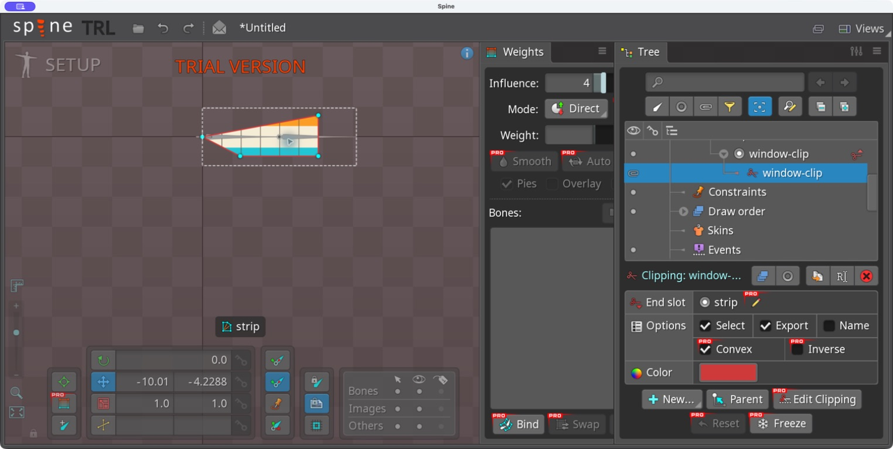
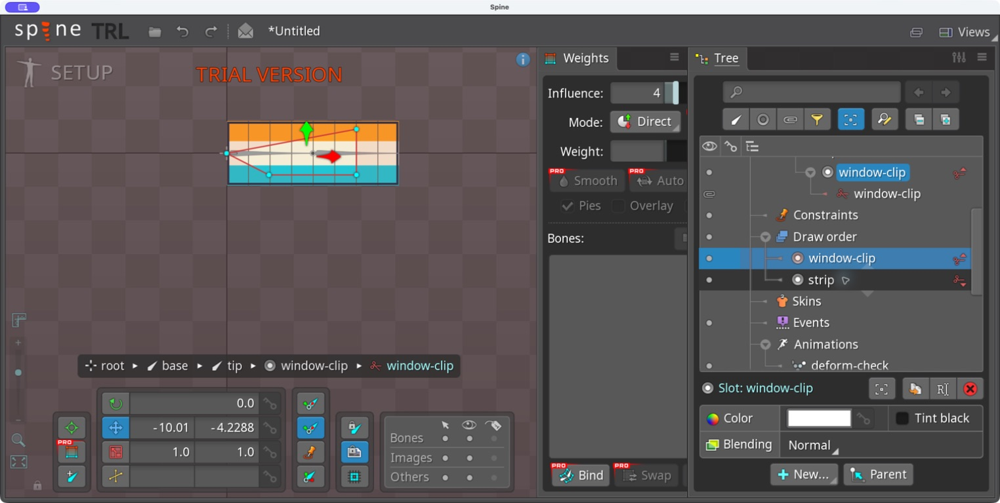
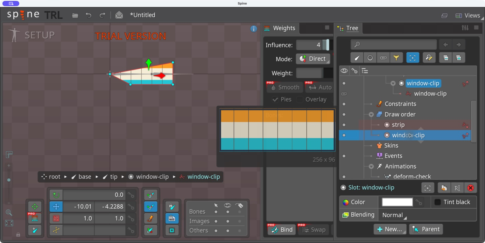

# Bài 7 — Clipping và thứ tự slot

Thực hành ngày 06/09/2026 trong Spine 4.3.23 Trial bằng Computer Use, trên skeleton `editor-start` của bài mesh. Đã tạo vùng clipping, đặt End slot, cố ý làm sai Draw order rồi sửa.

## Tạo vùng cắt ảnh

Trong Setup, chọn xương `tip` → New → Clipping, đặt tên `window-clip`. Tạo đa giác bốn đỉnh bên trong ảnh strip, thoát New và đóng Edit Clipping. Kết quả là một tứ giác với đầu trái nhọn; thao tác tạo đỉnh đầu không nằm đúng vị trí hình chữ nhật dự kiến, nên bài này dùng đa giác thực tế để kiểm chứng.

Chọn bút cạnh End slot rồi bấm ảnh strip trên canvas. Thuộc tính đổi từ `window-clip` sang `strip`. Ảnh chỉ còn hiện bên trong đa giác.

Clipping tác động theo thứ tự vẽ từ slot chứa nó tới End slot, gồm cả slot kết thúc. Đây là phạm vi theo slot, không phải quan hệ cha/con của xương. Tham khảo [Spine User Guide — Clipping](https://eu.esotericsoftware.com/spine-clipping).

## Lỗi cố ý và cách sửa

Mở Draw order. Ban đầu danh sách hiển thị `strip` phía trên, `window-clip` phía dưới. Chọn `window-clip`, nhấn `=` một lần để đưa nó lên trên strip. Toàn bộ ảnh chữ nhật xuất hiện trở lại dù đường đa giác clipping vẫn hiện: ảnh đã được vẽ trước khi clipping bắt đầu.

Nhấn `-` một lần để đưa window-clip xuống dưới strip. Ảnh lại bị cắt đúng đa giác. Không cần đổi vị trí xương hay sửa các đỉnh để khắc phục lỗi này.

## Kết luận thực hành và giới hạn

Nếu có đa giác mà ảnh không bị cắt, kiểm tra Draw order và End slot trước. Bài này kiểm chứng một vùng clipping với một ảnh mesh; chưa kiểm chứng nhiều vùng, key bật/tắt clipping hoặc chi phí chạy runtime.

Clipping đang nằm trong project Trial chưa lưu. JSON đầu vào của bài mesh vẫn chỉ chứa region ban đầu; ảnh chụp và các bước trên ghi lại kết quả editor, không thay thế file project có thể mở lại.
