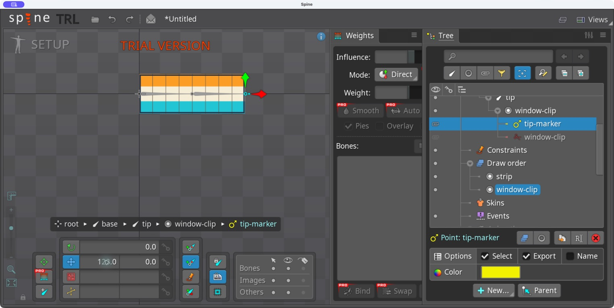
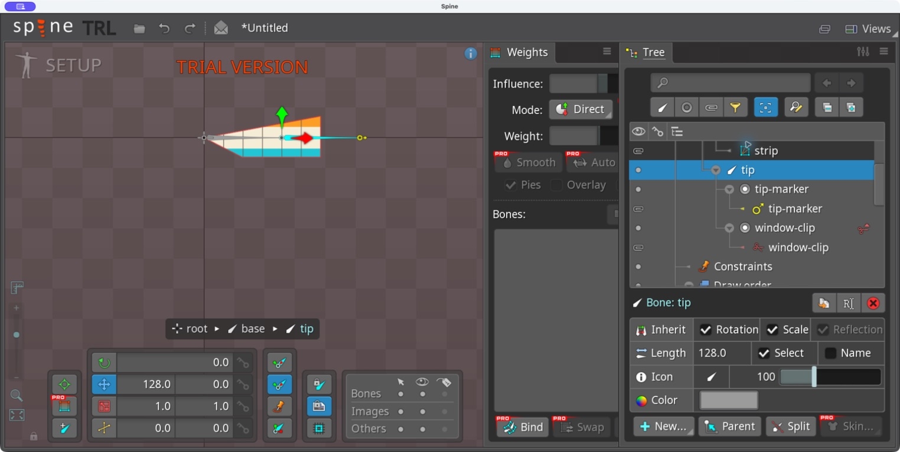
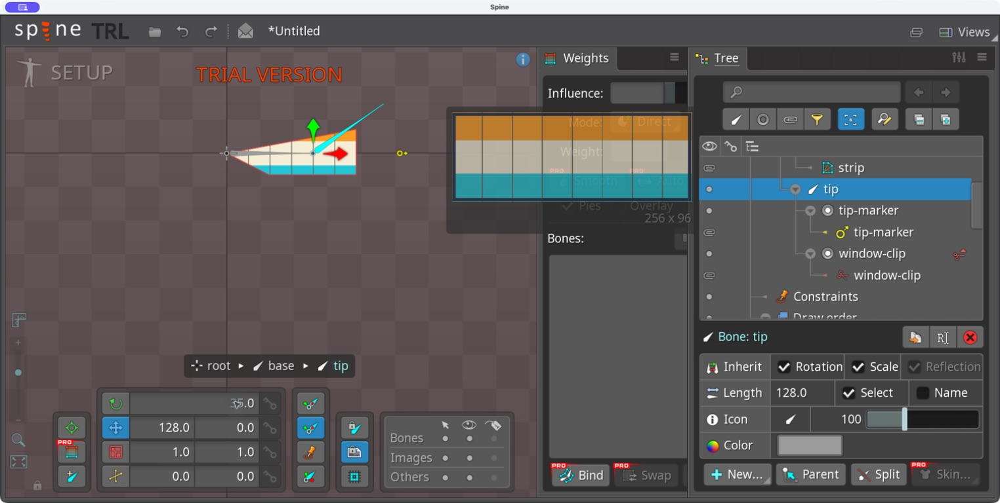
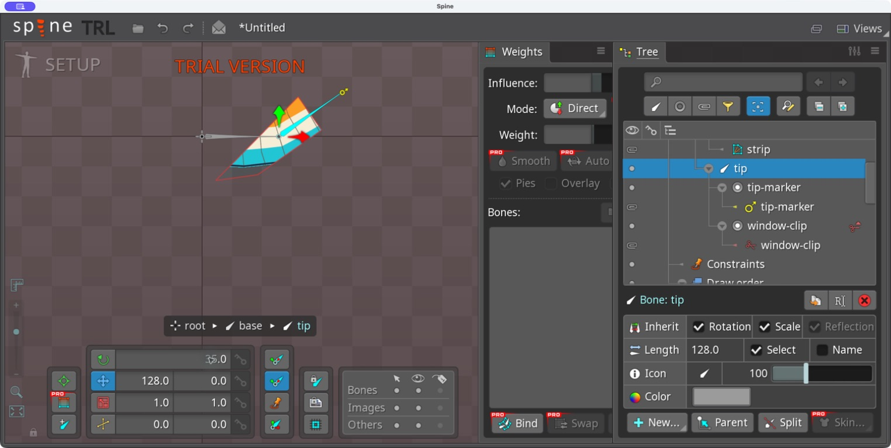

# Bài 8 — Point, slot riêng và Compensation

Thực hành ngày 06/09/2026 trong Spine 4.3.23 Trial bằng Computer Use. Đã đặt Point ở đầu xương, sửa xung đột attachment trong slot và so sánh xoay xương khi bật/tắt Compensation.

## Point ở đầu xương

Trên skeleton editor-start, tạo Point tên `tip-marker`. Đặt Translate X = 128, Y = 0; xương tip dài 128 nên điểm nằm tại đầu xương. Point mang vị trí và hướng, có thể dùng làm vị trí phát hiệu ứng trong runtime. Không key trực tiếp vị trí/góc của Point; muốn nó chuyển động theo animation thì key xương chứa nó. [Tài liệu Point](https://en.esotericsoftware.com/spine-points).

## Lỗi cùng slot với clipping

Lần tạo đầu chọn slot `window-clip`, nên Point được thêm cùng slot với clipping. Point hiện thì clipping tắt và ảnh chữ nhật hiện đầy đủ. Đây là xung đột attachment đang hoạt động, không phải lỗi hình đa giác.

Cách sửa đã thực hiện: chọn Point → Parent → chọn xương tip → tạo slot mới tên tip-marker. Bật lại attachment window-clip bằng biểu tượng bên trái trong Tree. Point và vùng cắt ảnh cùng xuất hiện, vẫn thuộc xương tip nhưng ở hai slot riêng.

## Compensation có thể làm bài thử gây hiểu lầm

Đổi góc tip từ 0° sang 35° trong Setup. Lần đầu xương xoay nhưng Point vẫn nằm ngang ở vị trí cũ; clipping cũng đứng yên. Nút giữ nguyên ảnh/attachment khi chỉnh xương đang bật.

Undo về 0°, tắt nút Compensation của ảnh rồi nhập lại 35°. Lần này Point đi lên cùng đầu xương và đổi hướng; clipping cũng xoay theo tip. Sau khi chụp bằng chứng, Undo trả xương về 0°.

Compensation hữu ích khi sửa vị trí xương mà cần giữ hình đang lắp ráp tại chỗ. Khi kiểm tra quan hệ xương–attachment, phải biết tùy chọn này đang bật hay tắt để diễn giải kết quả đúng. [Tài liệu Tools — Compensation](https://en.esotericsoftware.com/spine-tools).

## Giới hạn

Bài này kiểm chứng vị trí/hướng Point trong editor và hai lỗi thao tác. Chưa gắn hiệu ứng hay đọc tọa độ Point trong game. Kết quả vẫn ở project Trial chưa lưu; JSON đầu vào không chứa Point vừa tạo.
