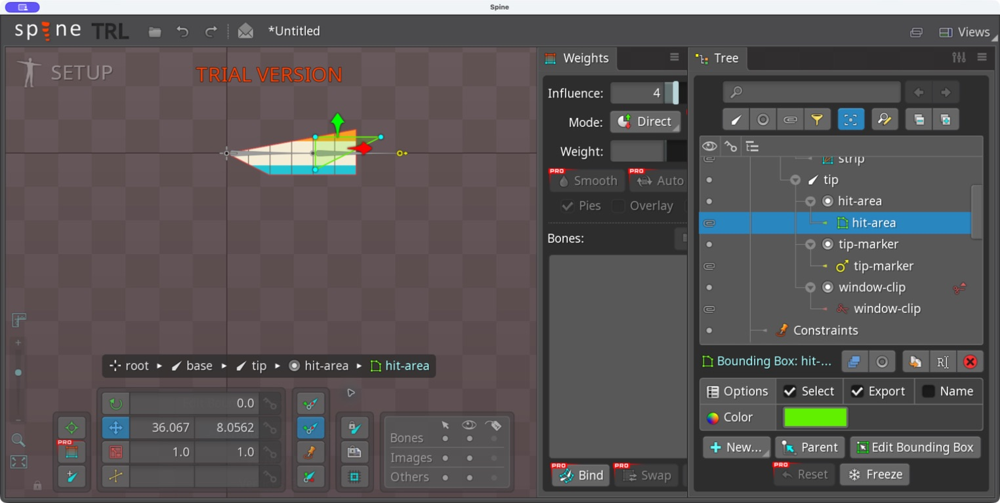
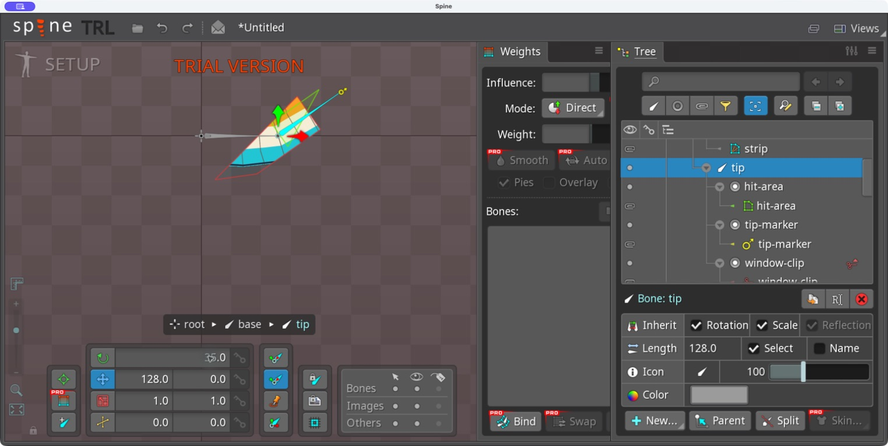

# Bài 9 — Bounding Box và kiểm tra va chạm

Thực hành ngày 06/09/2026: tạo Bounding Box trực tiếp trong editor 4.3.23 Trial, sau đó làm bài kiểm tra độc lập bằng runtime 4.2 đã cài trong repo.

## Trong editor

Chọn xương tip → New → Bounding Box → đặt tên `hit-area`. Vẽ đa giác rồi thoát New và Edit Bounding Box. Kết quả quan sát được là tam giác xanh ở nửa phải dải ảnh, thuộc slot riêng. Chuỗi bấm dự định tạo bốn đỉnh chỉ cho ra ba đỉnh hữu hiệu; bài thử dùng tam giác thực tế, không coi đó là hình chữ nhật.

Đổi góc tip từ 0° sang 35° khi Compensation ảnh đã tắt. Tam giác xanh xoay cùng xương và Point. Sau khi chụp bằng chứng, Undo trả tip về 0°.

Bounding Box mô tả vùng để chương trình kiểm tra va chạm. Vùng màu xanh trong editor không phải phần ảnh bị cắt; clipping đỏ từ bài trước vẫn quyết định phần ảnh hiển thị. Chỉ tạo Bounding Box chưa tự sinh phản ứng va chạm trong game.

## Kiểm chứng runtime độc lập

Chạy `node scripts/check_bounds_lab.mjs`. Script tạo tam giác bằng code với tọa độ đơn giản để kiểm tra chính xác; đây **không phải bản export của kết quả editor**.

Các kiểm tra đã chạy qua:

- Điểm bên trong trả về hit-area; đoạn thẳng cắt tam giác cũng được phát hiện.
- Điểm (218, -16) nằm trong hình chữ nhật bao ngoài nhưng ngoài tam giác: kiểm tra hình bao cho true, kiểm tra đa giác trả null. Vì vậy hình bao chỉ nên dùng để lọc sơ bộ.
- Xoay xương 90° và cập nhật transform nhưng chưa gọi `bounds.update` vẫn cho kết quả va chạm cũ. Gọi cập nhật bounds sửa được lỗi này: điểm cũ trượt, điểm mới (128, 20) trúng.
- Tắt attachment rồi cập nhật bounds loại bỏ vùng va chạm.

Thứ tự thực hành: cập nhật animation/xương → cập nhật world transform → `bounds.update(skeleton, true)` → kiểm tra điểm hoặc đoạn thẳng. Chi tiết API được đối chiếu với mã nguồn SkeletonBounds của runtime cài trong repo.

Mã thử: [check_bounds_lab.mjs](../scripts/check_bounds_lab.mjs). Kết quả: [bounds-checks.json](../exercises/mesh-lab/bounds-checks.json).

## Phần còn thiếu

Chưa tích hợp va chạm với nhân vật/game hoặc deform vùng va chạm. Kết quả editor vẫn ở project Trial chưa lưu; bài runtime không chứng minh quy trình export/mở lại editor đã hoàn thành.
