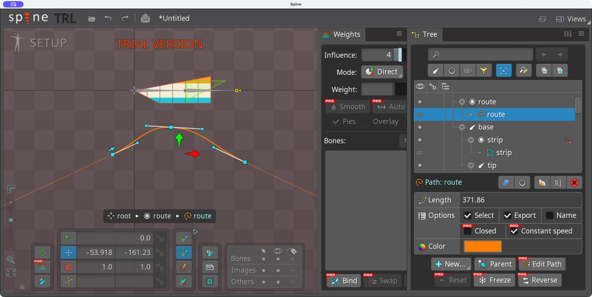
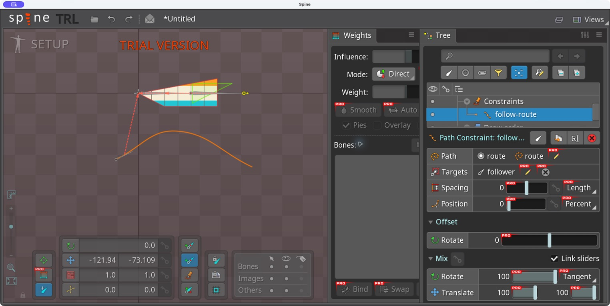
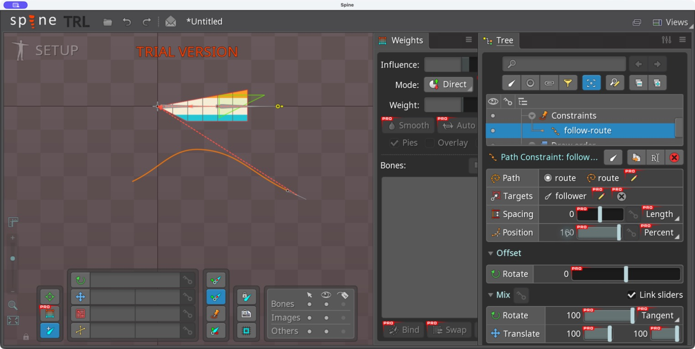
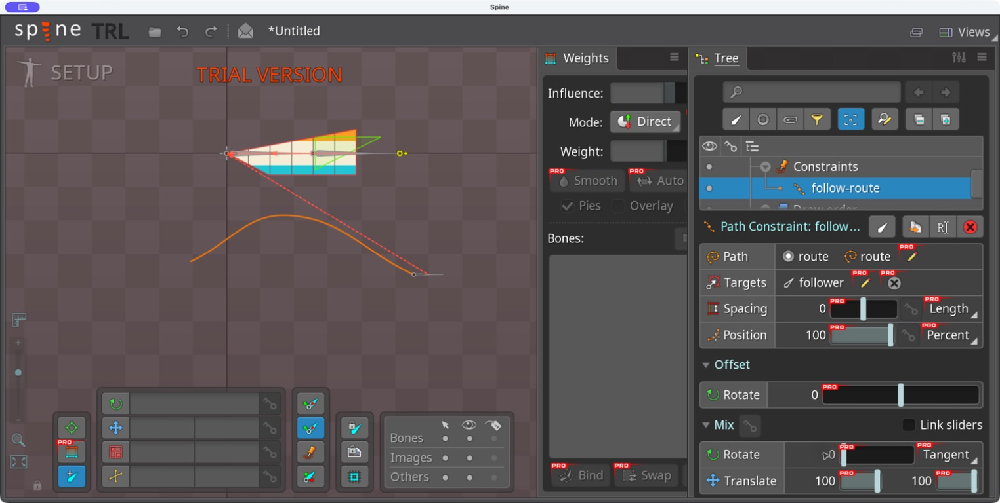
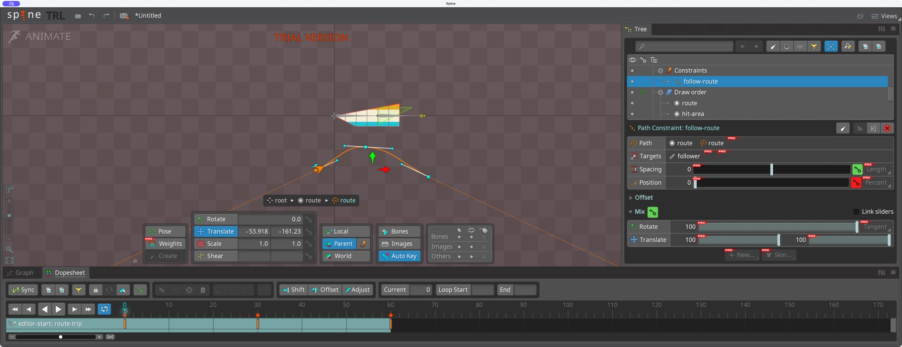
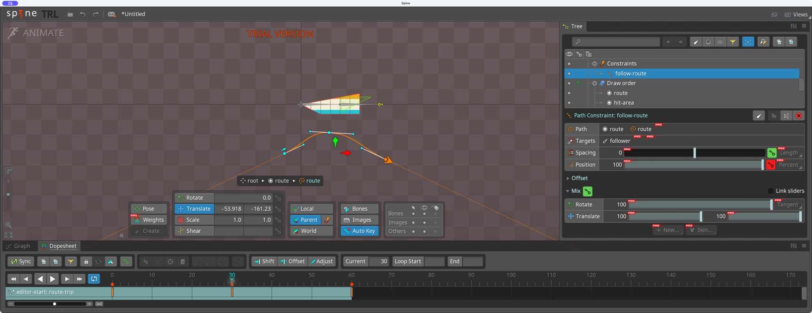
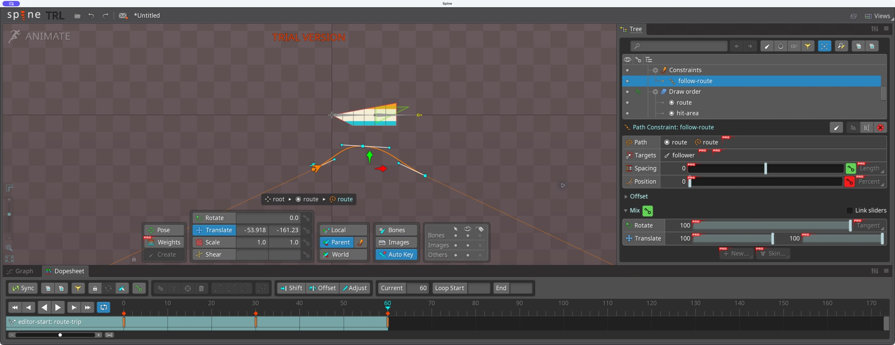
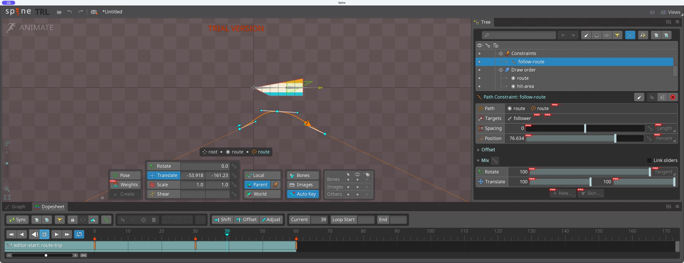

# Bài 10 — Path và xương bám đường

Thực hành ngày 06/09/2026 trong Spine 4.3.23 Trial bằng Computer Use. Đã tạo Path, dựng xương follower riêng, gắn Path Constraint và đối chiếu Position/Rotate Mix trong Setup. Đã bổ sung animation đi–về trong editor ngày 07/09/2026 (xem cuối bài).

## Dựng đường và xương

Chọn root → New → Path, đặt tên `route`. Trong Edit Path: New, tạo ba điểm chính từ trái thấp lên giữa cao rồi xuống phải. UI cho 7 vertices gồm điểm điều khiển của hai đoạn cong; Length hiển thị khoảng 371,86. Thoát New và Edit Path. Constant speed đang bật, Closed tắt.

Chọn lại root, dùng Create Bone (`N`) kéo xương dài khoảng 44 đơn vị ở ngoài đường, đặt tên `follower`. Route và follower cùng dưới root, nên đường không bị kéo theo follower.

Chọn follower → New → Path Constraint → bấm đường route → đặt tên `follow-route`. Constraint có Target là follower, Path là route, Position theo Percent và Rotate mode Tangent.

## Đối chiếu vị trí và hướng

Nhập Position lần lượt 0, 50, 100. Gốc follower nằm ở đầu trái, gần đỉnh đường cong và cuối phải. Hướng follower lần lượt chếch lên, gần ngang rồi chếch xuống theo đường. Với đường không đối xứng này, 50% không trùng chính xác điểm điều khiển giữa.

## Lỗi hướng và cách sửa

Ở Position 100, bỏ Link sliders rồi đặt Rotate Mix = 0, giữ Translate X/Y Mix = 100. Follower vẫn ở cuối đường nhưng nằm ngang theo góc ban đầu: vị trí đúng không đồng nghĩa hướng đã được điều khiển.

Trả Rotate Mix = 100 làm hướng lại theo tiếp tuyến của đường. Cuối bài trả Position về 0. Các thuộc tính được đối chiếu với [Spine User Guide — Path Constraints](https://eu.esotericsoftware.com/spine-path-constraints).

## Việc còn lại

Đã key Position theo thời gian trong phần bổ sung bên dưới; chưa thử chuỗi nhiều xương/Spacing hoặc thay hình đường bằng deform. Kết quả hiện ở project Trial chưa lưu; JSON đầu vào không chứa Path và constraint vừa tạo. Phần Setup và animation cơ bản đã có bằng chứng; chưa hoàn thành chuyển động quay đầu hoặc quy trình export.

## Bổ sung: kiểm tra runtime trong lúc editor bị khóa

Khi đang tạo animation mới trong Animate, Mac khóa màn hình; Computer Use không thể tiếp tục. Chưa đặt key cho animation mới trong editor.

Đã chạy `node scripts/check_path_lab.mjs` trên một đường cubic đối xứng tạo riêng bằng code. Đây không phải đường export từ editor. Kết quả trong [path-checks.json](../exercises/mesh-lab/path-checks.json):

- Position 0/50/100% cho tọa độ (0,0), (100,75), (200,0), hướng khoảng +63,43°/0°/−63,43°.
- Rotate Mix = 0 giữ nguyên vị trí cuối đường nhưng góc trở về 0°.
- Lấy 61 pose của hành trình đi–về cho pose đầu/cuối trùng nhau. Constant speed cho tỷ lệ đoạn dịch chuyển dài nhất/ngắn nhất khoảng 1,069 trong nửa đi; đây là kiểm tra gần đúng bằng dây cung.
- Chiều về vẫn giữ hướng tiếp tuyến về phía trước của đường, nên vật đang chạy lùi. Khớp pose vòng lặp chưa đồng nghĩa có động tác quay đầu đẹp.

Khi mở khóa Mac, tiếp tục tạo `route-trip`, đặt Position 0/100/0 tại frame 0/30/60 rồi kiểm tra playback. Bài runtime không được tính là đã hoàn thành bước editor này.

## 07/09/2026 — Đã đặt key và phát trong editor

Mac đã mở khóa, project cũ vẫn còn. Tạo animation trống `route-trip` trên editor-start, đặt key Position của follow-route:

| Frame | Position |
| --- | --- |
| 0 | 0% |
| 30 | 100% |
| 60 | 0% |

Dùng nút key bên phải Position ở frame 0, rồi Auto Key khi đổi giá trị ở 30 và 60. Dopesheet có dòng Path position: follow-route. Chọn lại các frame xác nhận key còn giữ; frame 45 nội suy về 50%.

Playback được bật và quan sát ở hai trạng thái khác nhau: frame 39, Position khoảng 76,634%; frame 34 trong một vòng khác, Position khoảng 95,336%. Follower thay đổi vị trí dọc theo đường. Sau đó dừng ở frame 45, Position 50%.

Pose 0/60 khớp bằng quan sát; chưa kết luận chuyển hướng ở hai đầu đã mượt. Chặng về đi lùi vì Tangent giữ hướng theo chiều Path. Cần thêm xử lý quay đầu nếu bài dùng nhân vật có hướng nhìn. Project editor vẫn chưa lưu vì Trial.

## Trạng thái sau bài 41

Skeleton editor-start và route-trip không còn trong project đang mở khi quay lại kiểm tra. Bài trên là bằng chứng lịch sử, không phải file lưu có thể mở lại. [Bài 41](041-editor-path-turnaround.md) đã dựng Path mới trong skeleton riêng và thực hành quay đầu ở hai đầu đường.
