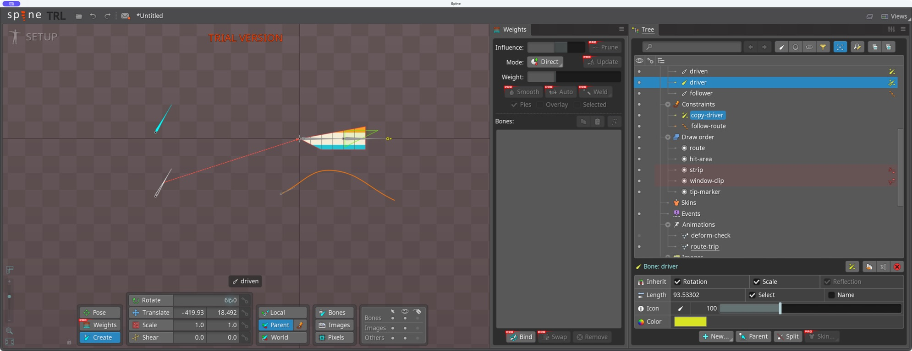
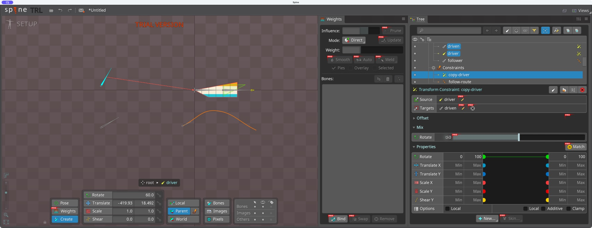
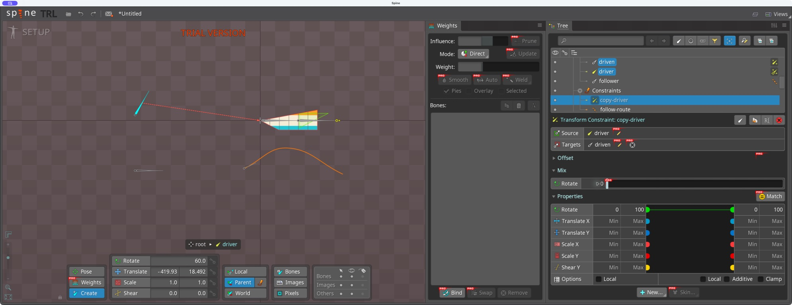
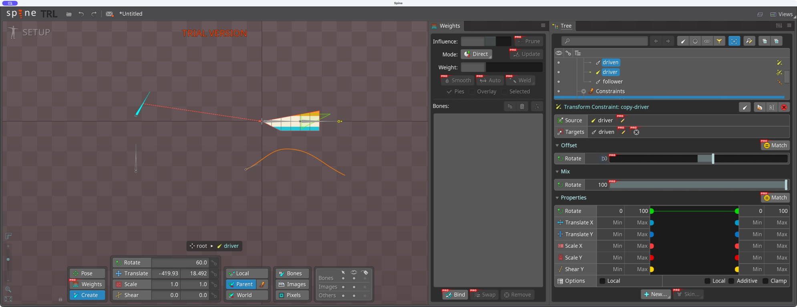

# Bài 11 — Transform Constraint trong Spine 4.3

Thực hành 07/09/2026 bằng Computer Use trên editor 4.3.23 Trial. Đã dựng hai xương độc lập, nối sao chép góc và kiểm tra Mix/Offset. Chưa key constraint hoặc kiểm tra toàn bộ các kiểu ánh xạ.

## Dựng và nối thuộc tính

Trong Setup, chọn root và dùng Create Bone (`N`) tạo `driver` ở trên, `driven` ở dưới. Cả hai là con trực tiếp của root, dài khoảng 93,53 đơn vị, góc ban đầu 0°. Chọn driven → New → Transform Constraint → chọn driver làm Source → đặt tên `copy-driver`.

Giao diện 4.3 hiện bảng Properties với các đầu nối. Constraint mới chưa có đường nối, nên không tự sao chép góc. Kéo đầu nối xanh Rotate bên trái sang Rotate bên phải. Đường nối xuất hiện, dải nguồn và đích đều 0–100; phần Mix có Rotate = 100.

Đây là khác biệt giao diện cần chú ý khi xem hướng dẫn cũ. Tài liệu [Transform Constraints](https://en.esotericsoftware.com/spine-transform-constraints) hỗ trợ khái niệm sao chép transform/Mix/Offset; các bước nối Properties ở đây được kiểm chứng trực tiếp trên 4.3.

## Thử một biến tại một thời điểm

Đặt driver = 60°. Driven xoay cùng khoảng 60° nhưng vẫn ở vị trí bên dưới: chỉ Rotate đã được nối, Translate chưa nối.

Giữ driver 60°, đổi Rotate Mix:

| Mix | Kết quả quan sát ở driven |
| --- | --- |
| 100% | Góc bằng driver, khoảng 60° |
| 50% | Góc khoảng 30° |
| 0% | Trở về nằm ngang, góc gốc 0° |

Trả Mix về 100%, mở Offset, nhập Rotate = 30°. Driven dựng đứng khoảng 90° trong khi driver vẫn 60°. Sau bài thử trả Offset và driver về 0°, giữ kết nối Rotate và Mix 100%.

## Cách chẩn đoán và giới hạn

Nếu constraint mới không tác động, kiểm tra đường nối Properties của 4.3. Nếu tác động yếu hoặc không có, kiểm tra Mix; nếu góc lệch cố định, kiểm tra Offset. Bài này chưa thử Translate, Scale, Shear, Local/Additive/Clamp hay ánh xạ chéo thuộc tính; không suy rộng kết quả của Rotate sang mọi trường hợp.

Các góc driven được đối chiếu bằng hình ảnh, không đọc số world rotation từ file export. Project vẫn ở Trial chưa lưu; JSON đầu vào chưa có hai xương/constraint mới.
