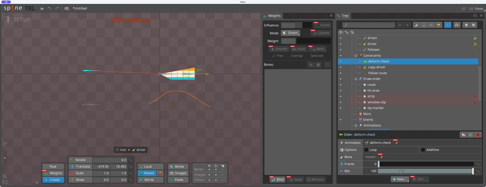
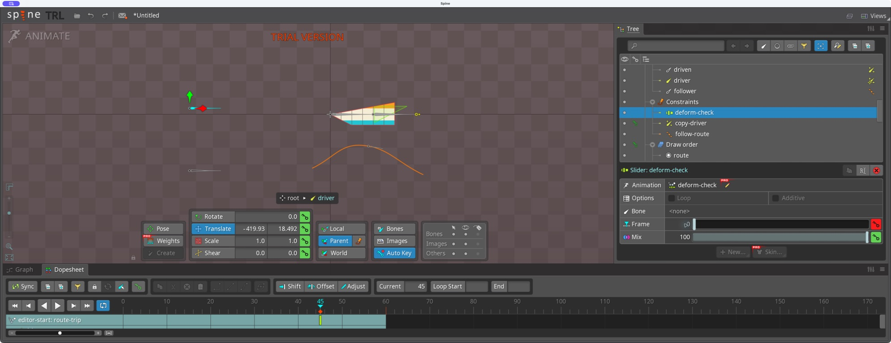
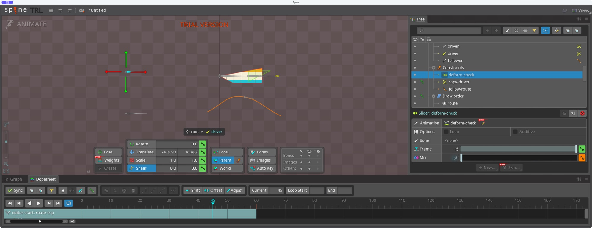
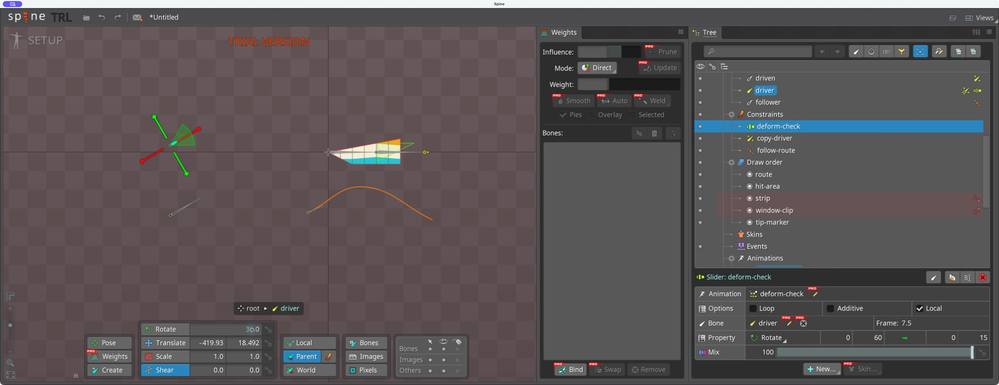
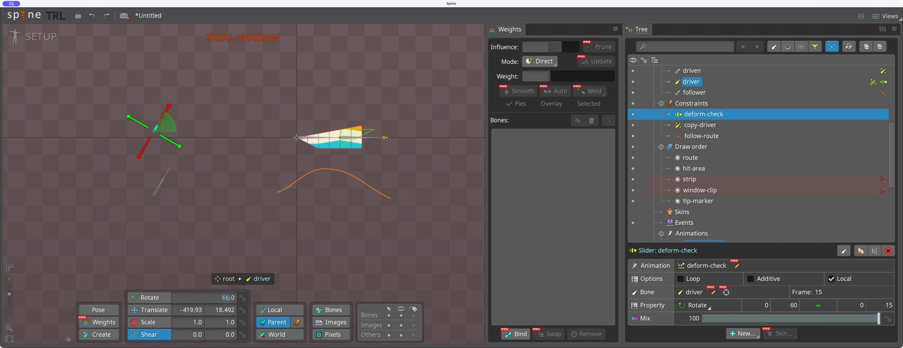
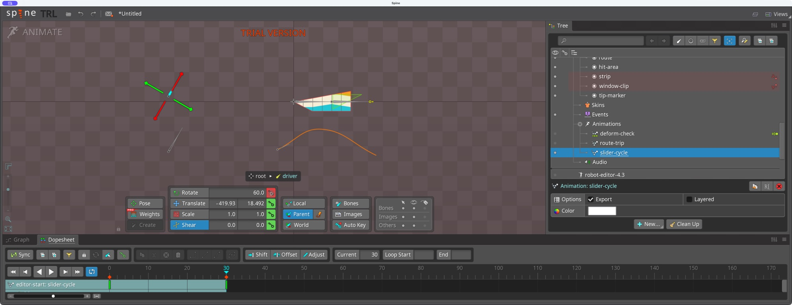
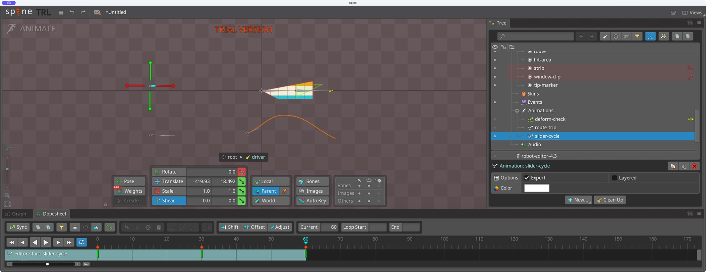
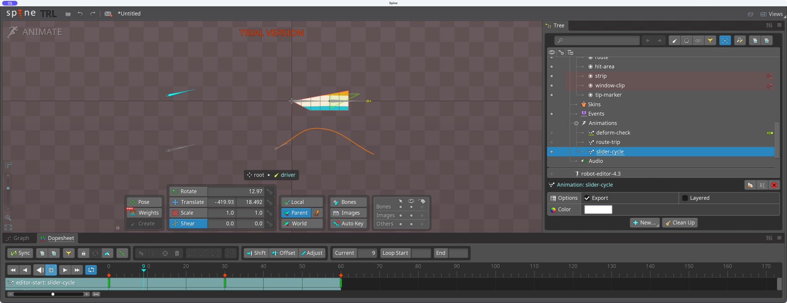
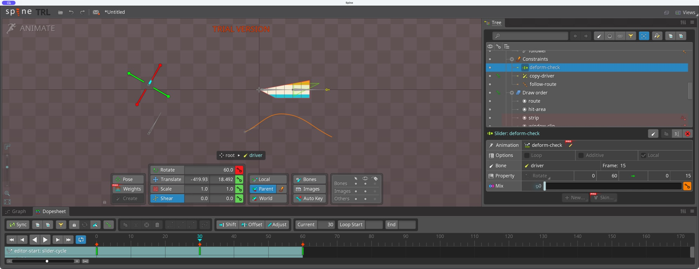
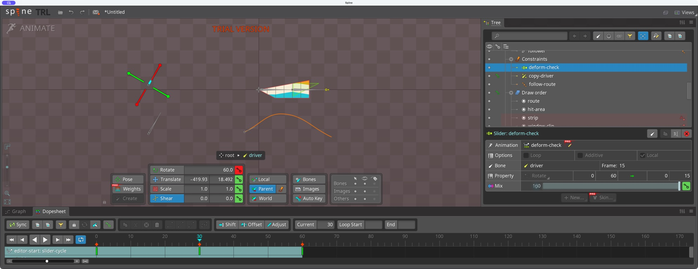

# Bài 12 — Slider chọn tư thế từ animation

Thực hành 07/09/2026 trên Spine 4.3.23 Trial. Đã tạo Slider từ `deform-check`, thử Frame/Mix, nối góc xương với frame và phát animation điều khiển riêng.

## Dựng và thử bằng tay

Trong Setup, chọn animation `deform-check` → New → Slider. Constraint mới cùng tên nằm trong Constraints. Animation nguồn có deform tại frame 0 và 15 từ bài 6.

Đặt Frame 15, Mix 100 rồi sang Animate, khi `route-trip` đang ở frame 45. Thử Frame 0 làm cột giữa mesh trở về đường thẳng; Frame 15 cho cột giữa nhô nhẹ lên. Giữ Frame 15 và đổi Mix 0 cũng bỏ tác động deform. Hai xương của dải ảnh vẫn nằm ngang. Ảnh bị clipping nên chỉ so sánh vùng giữa còn nhìn thấy.

Auto Key đang bật đã tạo key Frame thử ở frame 45 của route-trip. Dùng nút Undo trên thanh công cụ hoàn tác: Frame trở lại 15 và dấu key frame 45 biến mất. Tắt Auto Key trước khi thử Mix; phép thử Mix sau đó không tạo key. Chuyển về Setup trả Mix về 100.

## Điều khiển bằng xương

Trong Setup, nhấn bút ở Bone và chọn `driver`. Frame thủ công được thay bằng Property. Giữ Local bật, Property Rotate; sửa khoảng góc nguồn từ 0–100 thành 0–60, khoảng frame đích 0–15. Loop và Additive tắt.

| Góc driver | Frame hiển thị trong bảng Slider |
| --- | --- |
| 0° | 0 |
| 30° | 7,5 |
| 60° | 15 |

Sau thử trả driver về 0°, bảng hiện Frame 0. Transform Constraint của bài 11 vẫn làm driven xoay cùng driver; nó không phải nguyên nhân deform của mesh.

## Animation điều khiển và kiểm tra nguyên nhân

Tạo animation trống `slider-cycle`, chuyển Animate. Auto Key tắt; đặt key Rotate thủ công cho driver: frame 0 = 0°, frame 30 = 60°, frame 60 = 0°. Timeline xác nhận ba key. Không sao chép key deform sang animation mới.

Đã phát bằng nút Play với Loop của playback bật. Ảnh trong lúc phát ghi nhận frame và góc thay đổi. Đầu/cuối cùng góc 0° và cùng hình mesh; đây là xác nhận pose nối khớp, chưa phải phép đo độ êm vận tốc.

Dừng tại frame 15 của slider-cycle: driver = 30°, bảng Slider hiện Frame 7,5. Hai mốc thời gian khác nhau: timeline chính chạy 0–60, Slider lấy tư thế từ animation nguồn 0–15.

Tại frame 30, giữ driver 60° và thử Mix 0: vùng giữa mesh trở về phẳng, các xương driver/driven vẫn nghiêng. Trả Mix 100: biến dạng xuất hiện lại. Phép thử này xác nhận Slider gây deform, còn Transform Constraint chỉ sao chép góc sang driven. Auto Key tắt nên không thêm key Mix. Cuối bài trả về frame 0, Mix 100 và dừng playback.

Chưa thử Loop của bản thân Slider, Additive, nhiều Slider chồng nhau hay Local so với World. Project Trial chưa lưu được; các file ảnh là bằng chứng, không thay cho project mở lại được.

Nguồn: [Sliders — Spine User Guide](https://en.esotericsoftware.com/spine-sliders), đối chiếu ngày 07/09/2026.
