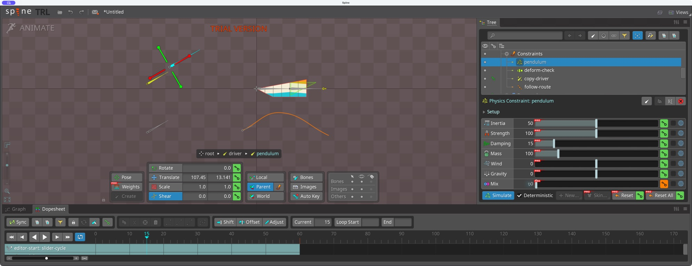
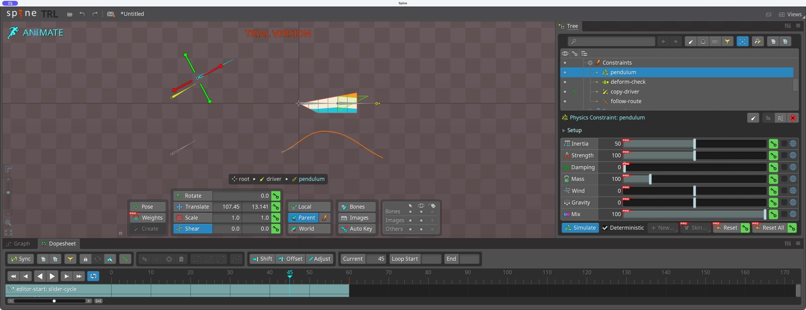
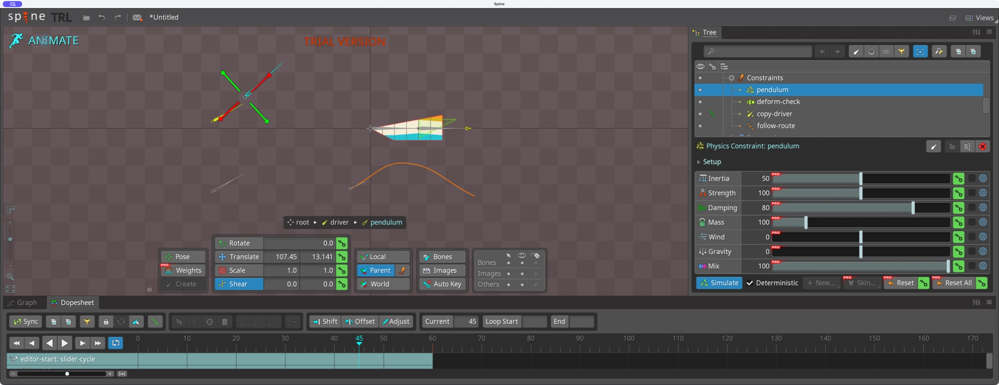
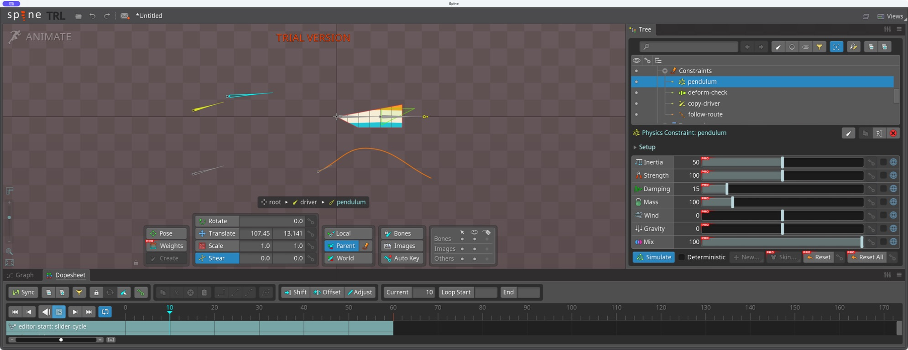
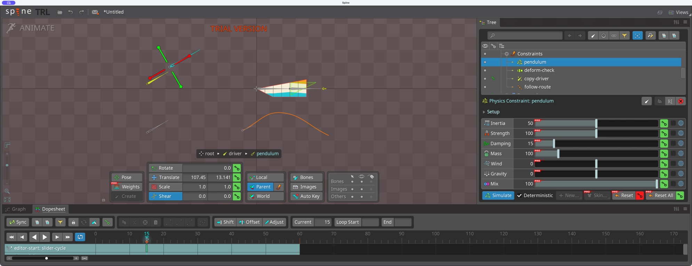

# Bài 13 — Physics trên xương phụ

Thực hành 07/09/2026, Spine 4.3.23 Trial. Đã tạo Physics Constraint trong editor, kiểm chứng độ trễ bằng Mix và phát mô phỏng. Đây là bài cơ chế trên xương trần, chưa phải anten nhân vật hoàn thiện.

## Dựng

Chọn driver trong Setup, bật Create và kéo ở vùng trống gần đầu xương để tạo xương con, đổi tên thành `pendulum`. Lần kéo đúng vào đầu driver trước đó đã đổi chiều dài driver; dùng Undo trên thanh công cụ khôi phục 93,53302 rồi tạo lại ở vùng trống. Pendulum có Length 133,729; Translate theo cha X 107,45, Y 13,141; Rotate 0°.

Chọn pendulum → New → Physics Constraint. Constraint tự lấy tên pendulum. Giữ Rotation 100, Translate X/Y, Scale X và Shear X đều 0. Đổi FPS từ mặc định 20 thành 60. Các thông số còn lại: Inertia 50, Strength 100, Damping 15, Mass 100, Wind/Gravity 0, Mix 100.

Animation `slider-cycle` đã key driver 0°/60°/0° tại frame 0/30/60. Không đặt key cho pendulum. Nó nhận chuyển động của cha rồi chịu Physics.

## Tách tác động Physics khỏi quan hệ cha/con

Trong Animate, bật Deterministic để đối chiếu tại cùng frame. Ở frame 15, driver nghiêng 30°, pendulum có hướng thấp hơn một chút do độ trễ. Thử Mix 0: pendulum trở về song song với cha. Trả Mix 100 để khôi phục tác động. Auto Key tắt, không tạo key Mix.

## Thử Damping và tránh so sánh sai

Sửa Damping trong Animate mà không đặt key chỉ là thay đổi tạm: khi nhảy sang frame khác, số trở lại 15. Vì vậy thử Damping 0 và 80 bằng cách sửa trong Setup rồi trở về Animate frame 45, Deterministic vẫn bật. Hai hình cho hướng pendulum khác nhau trong khi pose cha giống nhau.

Một ảnh ở một frame chưa chứng minh thời gian tắt rung. Không kết luận Damping cao luôn làm xương gần pose gốc hơn tại mọi thời điểm. Cần bài có chuyển động giật rồi dừng và so sánh chuỗi frame để đánh giá độ tắt dần. Sau thử trả Damping trong Setup về 15.

## Playback

Tắt Deterministic, về frame 0 và Play với Simulate bật. Ảnh lúc phát cho thấy pendulum lệch hướng so với driver khi cha đang quay. Dừng playback, bật lại Deterministic rồi trả frame 0.

## Reset key

Đặt Reset key cho riêng pendulum tại frame 15 bằng biểu tượng chìa khóa bên cạnh Reset. Dopesheet xuất hiện key 15. Nhảy về 0 rồi quay lại 15 với Deterministic bật: pendulum trở về song song với driver, thay cho độ trễ trước đó. Undo việc đặt key và lặp lại 0 → 15: độ trễ trở lại. Key thử đã được hoàn tác.

Chưa kiểm chứng lực gió/trọng lực, nhiều constraint nối tiếp, thời gian tắt rung hoặc điểm nối vòng có Physics. Bộ key driver nối khớp không tự chứng minh trạng thái mô phỏng cũng nối khớp. Project Trial vẫn chưa lưu/xuất; ảnh và công thức dựng lại là bằng chứng hiện có.

Nguồn khái niệm: [Physics Constraints — Spine User Guide](https://en.esotericsoftware.com/spine-physics-constraints), đối chiếu 07/09/2026. Hướng dẫn nêu Deterministic tính lại từ đầu để giữ pose nhất quán theo frame; Damping giảm dao động, còn kết quả tại mỗi thời điểm phụ thuộc cả quá trình chuyển động.
