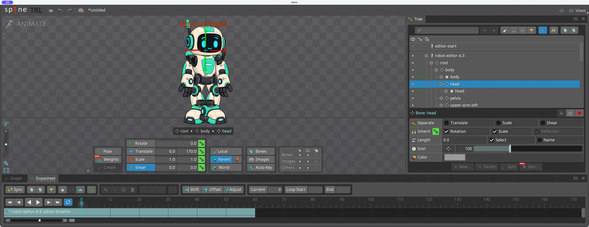
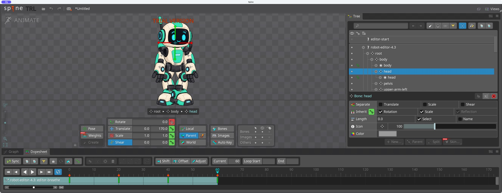
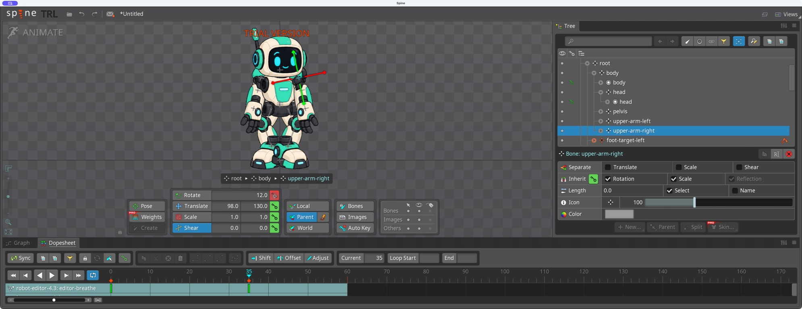
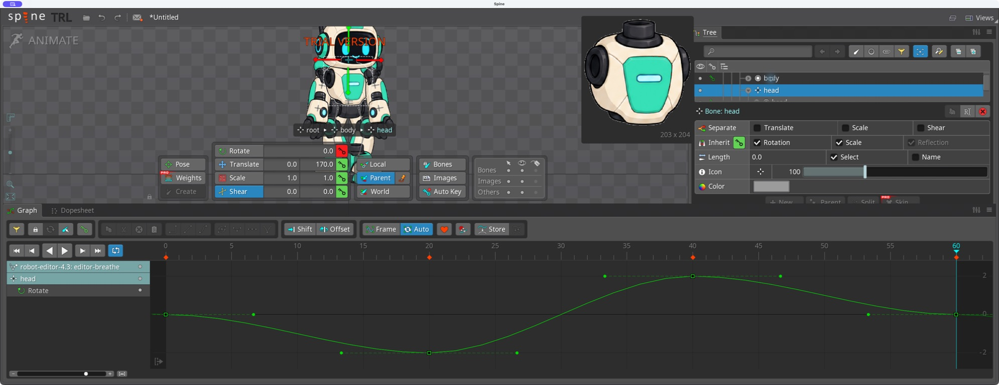
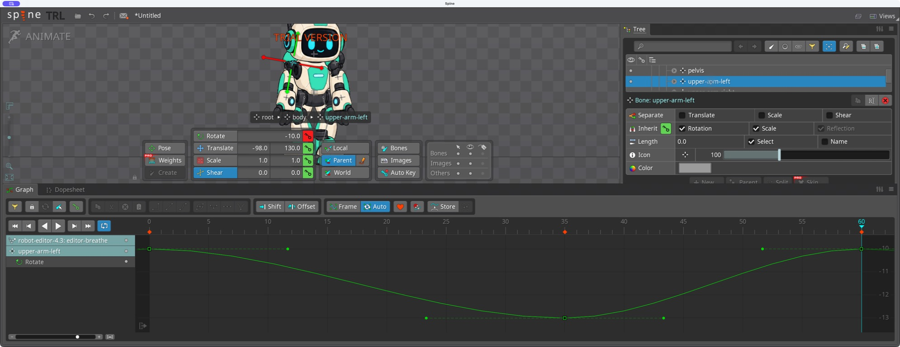
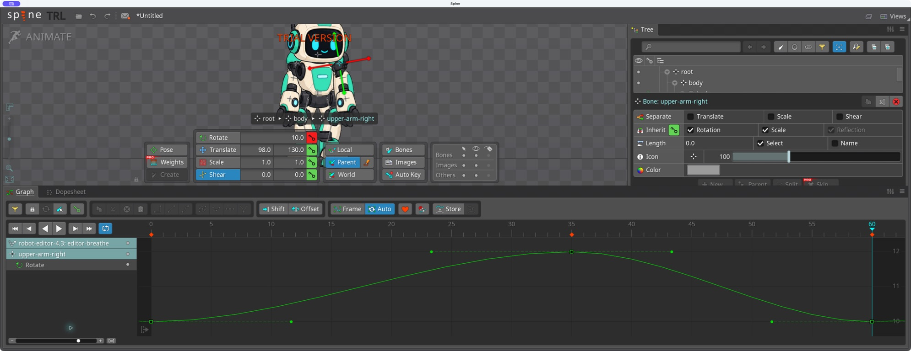
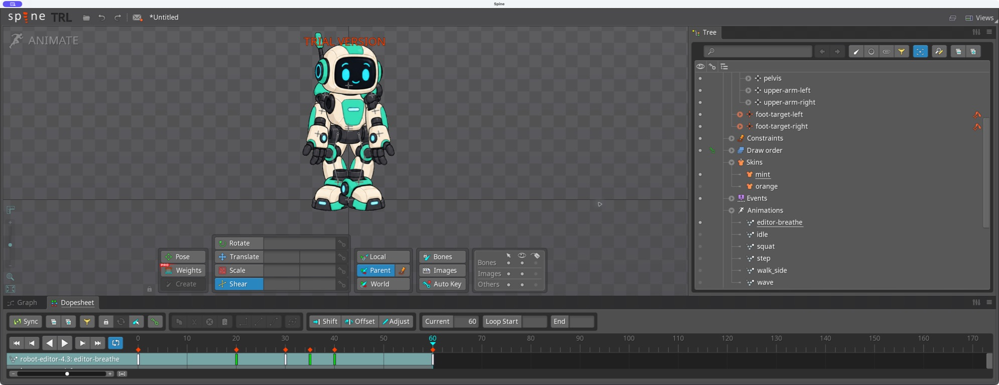
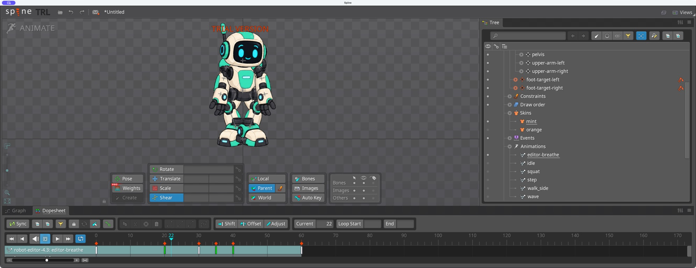

# Bài 14 — Bổ sung nhịp đầu và tay cho robot

Ngày 07/09/2026, thao tác trên `editor-breathe` trong editor Trial. Đã hoàn thiện key đầu/hai tay, kiểm tra Graph và phát vòng. Đây là vòng đứng nhẹ 2 giây; các động tác khác của robot vẫn chưa hoàn thiện.

Ẩn skeleton bài mesh, hiện robot và dùng nút căn hình vào viewport. Robot đang dùng màu mint. Nhịp body từ bài 5 vẫn có key Y 304/296/304 tại frame 0/30/60.

## Đầu

Thêm Rotate head tại frame 0/20/40/60 với góc 0°/−2°/+2°/0°. Biên độ nhỏ để đầu nghiêng nhẹ và vùng cổ vẫn được che tại các pose đã xem. Key đầu đạt cực trị trước và sau đáy nhịp body, thay cho chỉ nhún toàn thân.

Đã phát thử phần đầu rồi dừng, quay lại frame 20 xác nhận −2° còn giữ. Một lần nhập số dương còn sót dấu/ký tự cũ trong ô Rotate; sửa bằng xóa hết nội dung ô trước khi nhập và kiểm tra lại +2° trên giao diện. Không dựa vào việc gửi phím thành công để coi giá trị đã đúng.

## Tay

Tay trái có góc gốc −10°. Đã key frame 0 = −10°, frame 35 = −13°, frame 60 = −10°. Đỉnh nhịp tay trễ 5 frame so với đáy nhịp body. Sau đó chọn tay phải, xác nhận góc gốc +10° ở frame 0.

Sau lần Mac khóa, đọc lại giao diện xác nhận tay phải chưa có key. Đã đặt key tay phải 0/35/60 = +10°/+12°/+10°. Biên độ tay phải 2° nhỏ hơn tay trái 3°, tránh hai tay hoàn toàn đối xứng.

## Graph và vòng nối

Mở rộng Graph và lần lượt chọn head, upper-arm-left, upper-arm-right. Cả ba đường hiện các đoạn Bezier với tiếp tuyến ngang ở đầu, cực trị và cuối. Graph tay trái xác nhận −10/−13/−10 tại 0/35/60; tay phải +10/+12/+10; đầu 0/−2/+2/0 tại 0/20/40/60. Không cần đổi thêm nội suy vì các key mới đã dùng dạng cong này.

Thu Graph, bỏ chọn xương để xem toàn bộ nhân vật. So frame 0 và 60: đầu/tay/thân và vị trí chân khớp nhau. Phát vòng rồi dừng ở frame 0. Ở các tư thế đã kiểm tra, cổ và vai không lộ khe hở mới. Chuyển động vẫn nhỏ, phù hợp đứng chờ; chưa phải thay đổi biểu cảm hay quay đầu theo chiều sâu.

Hai bước sửa từ bản body-only là thêm nhịp đầu lệch thời điểm, sau đó bổ sung hai tay trễ hơn đáy thân. Bằng chứng Graph hỗ trợ độ liên tục góc ở vòng nối; chưa có video xuất từ editor hoặc phép đo chân trượt cho bản editor này.

## Việc còn lại

Nhịp đứng đã qua kiểm tra key, đường cong, pose nối và playback cơ bản. Vẫy tay và dáng đi robot vẫn cần các vòng sửa riêng theo PLAN. Project Trial chưa lưu được; các ảnh và hướng dẫn này không thay cho project có thể mở lại.
