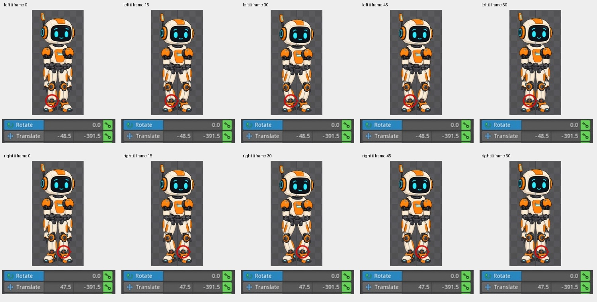
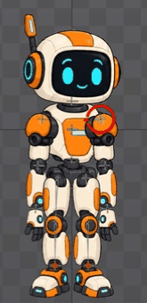
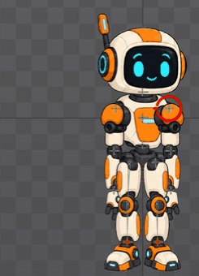
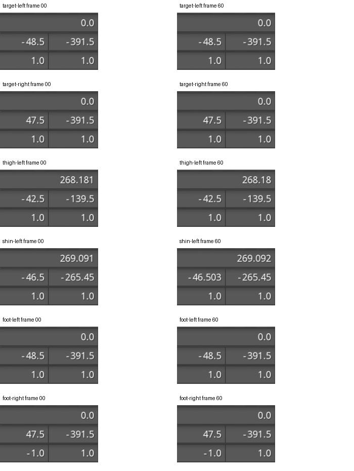

# Bài 19 — Tự dựng IK để chân giữ chỗ khi nhún

Ngày 07/09/2026, Spine 4.3.25 Trial, tiếp tục rig dựng bằng tay ở [bài 17](017-editor-handbuilt-rig.md).

## Kết quả

Rig hiện có 18 xương, 15 region và hai IK constraint. Đã đổi `animation` thành `wave-handbuilt`, tạo riêng `idle-handbuilt`. Bản idle có nhịp hạ thân 12 đơn vị trong vòng 60 frame. Tại các frame 0, 15, 30, 45, 60, cả hai bàn chân giữ cùng tọa độ và góc theo số hiển thị trong editor.

Đã bổ sung nhịp đầu và hai tay, rồi xem đủ 61 tư thế của idle và 61 tư thế của wave sau khi thêm IK. Phần cuối bài ghi rõ phạm vi kiểm tra và bản xem chậm.

## Tạo lỗi để xác định nguyên nhân

Trong Animate, chọn nhóm Animations → New → Animation để tạo `idle-handbuilt` từ trống. Với body, đặt Translate X = -0.5 xuyên suốt, Y = 2.5 / -9.5 / 2.5 tại frame 0 / 30 / 60.

Trước IK, cả người dịch xuống, gồm bàn chân: [frame 0](../exercises/robot/evidence/robot-handbuilt-idle-fk00.jpg), [frame 30](../exercises/robot/evidence/robot-handbuilt-idle-fk30.jpg). Đây không phải gập gối; chân đi theo chuỗi cha body → pelvis → thigh → shin → foot.

Graph sau đó cho thấy key đầu và key giữa đã dùng Bezier theo thiết lập hiện có, với tiếp tuyến nằm ngang ở đỉnh/đáy nhịp: [ảnh Graph](../exercises/robot/evidence/robot-handbuilt-idle-bezier.jpg). Không ghi việc kiểm tra này thành một lần đổi từ Linear sang Bezier.

## Dựng IK bên trái

Trong Setup, căn trục xương theo các khớp trước khi tạo constraint. Bật Compensation Bones và Images khi chỉnh bên trái để giữ hình và xương con tại chỗ, rồi tắt cả hai trước khi thử chuyển động.

| Xương | Tọa độ World trong tư thế ban đầu | Góc World trước tạo IK | Length |
| --- | --- | --- | --- |
| thigh-left | -42.5, -139.5 | -90.9094° | 126.016 |
| shin-left | -44.5, -265.5 | -91.8183° | 126.063 |

Chọn shin-left → New → IK Constraint, bấm lại shin-left để editor tạo target ở đầu xương. Đặt tên `leg-ik-left`. Sau đó đổi Parent thành thigh-left và Child thành shin-left bằng biểu tượng bút chì ở thuộc tính constraint. Target nằm dưới root, không nằm trong nhánh chân.

Mix = 100, Softness = 0, Stretch tắt, Positive bật. [Ảnh cấu hình ban đầu](../exercises/robot/evidence/robot-handbuilt-ik-left-setup.jpg).

Ở frame 30, cổ chân giữ chỗ nhưng bàn chân nghiêng theo cẳng chân: [lỗi góc bàn chân](../exercises/robot/evidence/robot-handbuilt-ik-left30-before-foot-fix.jpg). Trong Setup, tắt Inherit Rotation của foot-left và đặt góc World = 0. [Sau sửa](../exercises/robot/evidence/robot-handbuilt-ik-left30-flat.jpg).

## Bên phải: xử lý nhánh phản chiếu

Thigh-right ban đầu có Scale X = -1. Lần căn trục bằng World/Compensation không giữ đúng hình như bên trái; đã hoàn tác và đặt lại theo Parent coordinates. Không suy rộng thành kết luận lỗi phần mềm: thao tác trên nhánh có phản chiếu cần kiểm tra lại cả xương lẫn region.

Các giá trị dưới đây là bước dựng trước khi IK tự tính góc xương:

| Mục trong nhánh phải | Rotate theo Parent | Translate theo Parent | Scale |
| --- | --- | --- | --- |
| thigh-right | 90.9094° | giữ vị trí hông cũ | -1, 1 |
| region thigh-left dưới thigh-right | 90.9094° | 69.9912, 1.111 | 0.8, 0.8 |
| shin-right | -0.9089° | x khoảng 126.016, y gần 0 | 1, 1 |
| region shin-left dưới shin-right | 91.8183° | 59.9698, 1.9038 | 0.8, 0.8 |
| foot-right, sau tắt Inherit Rotation | 0° | 126.063, 0 | 1, 1 |
| region foot-left dưới foot-right | 0° | 15, -40 | 0.6, 0.6 |

Length đùi/cẳng chân phải lần lượt 126.016 và 126.063. Đã kiểm tra lại tư thế đứng đủ ảnh, bàn chân hướng ra ngoài trước khi tạo IK phải. Việc dùng ảnh có tên left trong nhánh phải là do nhân đôi chuỗi ảnh ở bài 17.

Tạo `leg-ik-right` theo cách bên trái: target ở đầu shin-right, Parent = thigh-right, Child = shin-right. Ban đầu Positive bật làm gối phải gập vào trong: [ảnh trước](../exercises/robot/evidence/robot-handbuilt-idle-ik30.jpg). Tắt Positive trong Setup để gập ra ngoài: [ảnh sau](../exercises/robot/evidence/robot-handbuilt-idle-ik30-outward.jpg). Các giá trị Mix/Softness/Stretch giống bên trái.

## Kiểm chứng

Chọn từng **xương bàn chân**, đặt World coordinates, đọc Rotate/Translate ở năm frame. Không chỉ đọc tọa độ target.

| Frame | foot-left X, Y, Rotate | foot-right X, Y, Rotate |
| --- | --- | --- |
| 0 | -48.5, -391.5, 0° | 47.5, -391.5, 0° |
| 15 | -48.5, -391.5, 0° | 47.5, -391.5, 0° |
| 30 | -48.5, -391.5, 0° | 47.5, -391.5, 0° |
| 45 | -48.5, -391.5, 0° | 47.5, -391.5, 0° |
| 60 | -48.5, -391.5, 0° | 47.5, -391.5, 0° |

Ảnh gốc nằm ở `exercises/robot/evidence/robot-handbuilt-ik-foot-{left,right}{00,15,30,45,60}.jpg`. Bảng ảnh đầu bài ghép phần nhân vật và trường số từ mười ảnh này. Kết luận chỉ ở độ chính xác của số editor hiển thị và các frame đã lấy mẫu.

Đã phát vòng, ghi lại [frame 39](../exercises/robot/evidence/robot-handbuilt-idle-play-a.jpg) rồi [frame 28](../exercises/robot/evidence/robot-handbuilt-idle-play-b.jpg), sau đó dừng. Tư thế và playhead thay đổi; đây chưa phải đánh giá toàn bộ chuyển động bằng video.

Nguồn cơ chế và cách tạo constraint: [IK constraints — Spine User Guide](https://esotericsoftware.com/spine-ik-constraints). Trial vẫn chưa lưu được project; bài ghi và ảnh là bằng chứng thao tác, không thay thế project mở lại được.

## Bổ sung nhịp đầu và tay

Trong `idle-handbuilt`, chọn từng xương, dùng **Parent coordinates** và đặt Rotate như sau. Giá trị là góc theo cha; tay phải thuộc nhánh phản chiếu nên không thay bằng góc World cùng dấu.

| Xương | Frame 0 | Đỉnh nhịp | Frame 60 |
| --- | --- | --- | --- |
| head | -1° | +2° tại 35 | -1° |
| upper-arm-left | -3° | -6° tại 33 | -3° |
| upper-arm-right | +3° | +6° tại 37 | +3° |

Chín key mới làm đầu và tay đổi chiều sau thân (thân đạt đáy tại frame 30). Dopesheet đã xác nhận ba key cho mỗi xương. Đã mở Graph cho cả ba đường xoay, bấm Frame để căn vừa đường cong. Cả ba có tiếp tuyến ngang ở key đầu, đỉnh/đáy và cuối; không sửa thêm key trong lần kiểm tra này. Ảnh: [đầu](../exercises/robot/evidence/robot-handbuilt-idle-head-graph.jpg), [tay trái](../exercises/robot/evidence/robot-handbuilt-idle-left-graph.jpg), [tay phải](../exercises/robot/evidence/robot-handbuilt-idle-right-graph.jpg).

## Xem đủ tư thế và kiểm tra lại wave

Chụp từng frame nguyên từ 0 đến 60 trong editor cho cả hai animation, rồi xem bốn bảng ảnh của mỗi bộ. Ở độ phân giải ảnh chụp, không thấy khớp bị rời hay tay xuyên thân; bàn chân idle nhìn vẫn phẳng. Kiểm tra này bổ sung cho bảng tọa độ năm mẫu phía trên, không thay thế đo tọa độ ở mọi frame.

- [Ảnh idle và báo cáo](../exercises/robot/evidence/handbuilt-idle-review/capture-report.json): tư thế đầu/cuối nhìn khớp, nhưng pixel không trùng tuyệt đối. Sai khác nhỏ tập trung ở chân; chưa xác định nguyên nhân, không kết luận vòng lặp chính xác tới từng pixel.
- [Ảnh wave sau IK và báo cáo](../exercises/robot/evidence/handbuilt-wave-ik-review/capture-report.json): vùng nhân vật ở frame 0/60 trùng pixel. Không thấy lỗi hình mới sau khi sửa chân trong 61 tư thế đã xem.

Hai GIF ghép từ ảnh giao diện, dùng 60 frame với 80 ms/ảnh để xem chậm; chúng không phải bản xuất từ Spine và không thể dùng để kết luận nhịp phát ở tốc độ thường. Vùng chụp còn dấu chọn xương của editor.

Đã phát idle sau khi thêm chuyển động phụ với thiết lập playback hiện có của editor. Ảnh ghi nhận playhead ở [frame 9](../exercises/robot/evidence/robot-handbuilt-idle-secondary-play-a.jpg) và [frame 30](../exercises/robot/evidence/robot-handbuilt-idle-secondary-play-b.jpg), tư thế và góc tay đổi tương ứng; sau đó dừng tại frame 0. Hai ảnh chứng minh playback hoạt động, chưa đo tốc độ phát thực hay thay thế đánh giá video liên tục.

Tiếp theo: làm dáng đi dùng hai target chân; phần đánh giá nhịp bằng video ở tốc độ thường vẫn cần hoàn thiện.

## Kiểm tra lại bằng Outline ở khung lớn

Ngày 07/09/2026: robot hiển thị cao khoảng 570 pixel trong Outline, không bị bảng công cụ che chân. Đã chụp idle ở 0/60, lặp lại cả hai mốc lần nữa. Mỗi mốc trùng pixel với lần chụp lại chính nó, nhưng 0/60 vẫn khác: 18.282 pixel trong vùng cắt 300 × 595, tập trung từ phần đùi xuống bàn chân. Vì vậy đây là sai khác tái hiện được, chưa thể quy cho một lần chụp nhiễu.

Chọn body và đọc lại hai mốc: Rotate 0°, Translate −0,5 / 2,5, Scale 1 / 1, Shear 0 / 0 đều giống nhau theo số hiển thị. Điều này chỉ loại trừ sai khác ở các giá trị body đang hiển thị; chưa xác định lỗi nằm ở target, constraint hay xương chân. Chưa sửa dữ liệu animation trong lần kiểm tra này.

[Bảng tư thế lớn](../exercises/robot/evidence/full-body-review/contact-sheet.jpg) và [báo cáo đối chiếu](../exercises/robot/evidence/full-body-review/review.json). Bước chẩn đoán tiếp: đọc hai target IK và xương chân ở đúng 0/60; chỉ sửa sau khi xác định thuộc tính khác nhau hoặc tái hiện được ảnh hưởng của constraint.

### Định lượng sai khác thay vì chỉ đếm pixel

Kiểm tra tiếp cùng phiên: hai target IK và hai xương bàn chân ở 0/60 đều giữ nguyên số vị trí/góc: trái −48,5 / −391,5 / 0°, phải 47,5 / −391,5 / 0°. Đùi trái hiển thị 268,181° → 268,180°; cẳng chân trái 269,091° → 269,092° và X −46,500 → −46,503. Các trường này cho thấy sai khác rất nhỏ trên chuỗi IK, không phải bàn chân nhảy vị trí theo độ chính xác hiển thị.

Đếm pixel đơn thuần đã phóng đại mức đáng lo: trong vùng cắt có 18.282 pixel khác, nhưng chỉ 107 pixel khác hơn 8 mức màu trên thang 0–255; mức khác lớn nhất là 24. Chưa xác định nguyên nhân tính toán bên trong editor và không gọi đây là lỗi Spine đã được chứng minh. Quyết định giữ key hiện tại, không sửa dáng để ép trùng pixel; chuyển ưu tiên sang chất lượng chuyển động liên tục. Kết quả này đóng câu hỏi về mức độ sai khác hai đầu vòng ở độ chính xác đã đo, không thay cho đánh giá nhịp hoặc mọi frame.
