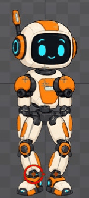
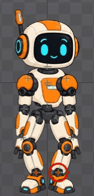

# Bài 20 — Bước tại chỗ bằng hai target IK

Ngày 07/09/2026, Spine 4.3.25 Trial. Tiếp tục rig dựng tay ở bài 19.

## Bản dựng đầu tiên

Đã tạo riêng `march-handbuilt` từ animation trống: thân chuyển sang hai bên, chân trái rồi chân phải nhấc 48 đơn vị. Có 15 key Translate trên body và hai target chân. Đây là bản dựng chuyển trọng lượng/bước tại chỗ, chưa hoàn thiện dáng đi tiến hay chuyển động tay.

GIF ghép 60 ảnh giao diện, 80 ms/ảnh, còn dấu chọn xương; không phải bản xuất Spine hay bằng chứng tốc độ phát thực.

## Các key đã dựng

Dùng Parent coordinates. Body và hai target đều là con của root. Giữ nguyên root trong animation này.

| Frame | Body X | Body Y |
| --- | --- | --- |
| 0 | -0.5 | -9.5 |
| 15 | 19.5 | -5.5 |
| 30 | -0.5 | -9.5 |
| 45 | -20.5 | -5.5 |
| 60 | -0.5 | -9.5 |

Target trái giữ X = -48.5; Y = -391.5 tại frame 0, 5, 25, 60, và -343.5 tại frame 15. Target phải giữ X = 47.5; Y = -391.5 tại frame 0, 35, 55, 60, và -343.5 tại frame 45. Như vậy mỗi chân có đoạn đặt xuống trước khi chân kia nhấc lên.

Graph thân có đường cong Bezier, tiếp tuyến ngang ở các key: [ảnh](../exercises/robot/evidence/robot-handbuilt-march-body-graph.jpg). Chuyển trọng lượng hiện chỉ là dịch thân, chưa mô phỏng đầy đủ cân bằng hay xoay hông.

## Lỗi thực tế và cách sửa

Key đầu chân phải bị nhập thành Y = +391.5. Khi xem frame 15, chân trụ bị kéo lên gần đầu; đọc lại key 0 mới xác định đúng lỗi dấu. Sửa thành -391.5 chưa đủ: đường Bezier vẫn có đoạn võng mạnh gần chỗ nối vòng. Chọn key Y đầu trong Graph, chuyển Linear rồi trở lại Bezier đã đưa tiếp tuyến về ngang. Sau sửa, đoạn giữ chân 0–35 và 55–60 nhìn phẳng trong Graph: [ảnh chân phải](../exercises/robot/evidence/robot-handbuilt-march-right-graph-fixed.jpg).

Key đầu chân trái cũng được đọc lại: đang là -394.5, đã sửa về -391.5 và đặt lại nội suy theo cách trên. [Graph chân trái sau sửa](../exercises/robot/evidence/robot-handbuilt-march-left-graph-fixed.jpg).

Bài học: đọc số sau nhập, kiểm tra cả đường nối giữa key. Không suy từ việc key cuối đúng rằng cả đoạn giữ chân đã đúng. Thao tác phím tắt trong cửa sổ này có lúc không cho kết quả mong muốn; dùng trạng thái mới để xác nhận trước bước tiếp theo.

## Kiểm tra

Chọn **xương bàn chân thực**, dùng World coordinates, không chỉ đọc target:

| Tư thế | Chân trụ | X | Y | Rotate |
| --- | --- | --- | --- | --- |
| Frame 15, nhấc trái | foot-right | 47.5 | -391.5 | 0° |
| Frame 45, nhấc phải | foot-left | -48.5 | -391.5 | 0° |

Ảnh [chân trụ phải](../exercises/robot/evidence/robot-handbuilt-march-support-right15.jpg), [chân trụ trái](../exercises/robot/evidence/robot-handbuilt-march-support-left45.jpg). Các số khớp vị trí đứng ban đầu ở bài 19, theo độ chính xác editor hiển thị. Mới đo hai thời điểm này; chưa đo toàn bộ đoạn chân trụ.

Đã chụp và xem đủ 61 tư thế nguyên từ 0 đến 60 trên bốn bảng ảnh. Không thấy khớp rời ở độ phân giải này; chân nhấc luân phiên và trở về mặt đất. Vùng ảnh nhân vật ở frame 0/60 trùng pixel. [Báo cáo](../exercises/robot/evidence/handbuilt-march-review/capture-report.json).

## Tinh chỉnh chuyển trọng lượng và chuyển động phụ

Bản hiện tại có 34 key: body có 9 key Translate, hai target có 10 key Translate, đầu/hai tay có tổng 15 key Rotate. Giữ các key ban đầu, thêm body ở frame 5/25 với X = 19.5, Y = -9.5 và frame 35/55 với X = -20.5, Y = -9.5. Thân tới phía chân trụ trước lúc nhấc chân và giữ X ở đó cho tới khi đặt chân xuống.

Khi chèn key vào đường Bezier có sẵn, các tay nắm còn nghiêng làm X vượt quá giá trị muốn giữ. Đã chọn các key mới và dùng **Flat** để đưa tiếp tuyến ngang. [Graph thân sau sửa](../exercises/robot/evidence/robot-handbuilt-march2-body-graph.jpg) có đoạn X phẳng 5–25 và 35–55. Y nhún nhẹ giữa các đoạn này.

Đây cũng là cách thao tác rõ hơn cho lỗi đường cong ở phần trên: chọn đúng key, áp dụng Flat rồi kiểm tra Graph. Không dựa riêng vào thao tác chuyển Linear rồi Bezier. [Spine Graph User Guide](https://esotericsoftware.com/spine-graph) giải thích các preset và cách chèn key giữ hình dạng đường cong cũ.

Các góc dưới đây dùng Parent coordinates:

| Xương | 0 | 15 | 30 | 45 | 60 |
| --- | --- | --- | --- | --- | --- |
| upper-arm-left | -5° | -12° | -5° | +2° | -5° |
| upper-arm-right | +5° | -2° | +5° | +12° | +5° |

Head dùng 0° tại 0/30/60, -2° tại 18 và +2° tại 48. Đầu trễ ba frame so với đỉnh nhịp chân. Đã xem Graph của [đầu](../exercises/robot/evidence/robot-handbuilt-march2-head-graph.jpg), [tay trái](../exercises/robot/evidence/robot-handbuilt-march2-upper-arm-left-graph.jpg), [tay phải](../exercises/robot/evidence/robot-handbuilt-march2-right-graph.jpg): năm key mỗi xương, các điểm đổi chiều có tiếp tuyến ngang.

## Đo chân trụ trên từng frame nguyên

Đã chụp lại đủ frame 0–60 sau tinh chỉnh. Với xương bàn chân thực ở World coordinates:

- Foot-right tại **mọi frame nguyên 0–30**: X = 47.5, Y = -391.5, Rotate = 0°. [Bảng số](../exercises/robot/evidence/handbuilt-march2-review/support-00-30.jpg).
- Foot-left tại **mọi frame nguyên 31–60**: X = -48.5, Y = -391.5, Rotate = 0°. [Bảng số](../exercises/robot/evidence/handbuilt-march2-review/support-31-60.jpg).

Đã đọc toàn bộ hai bảng, không chỉ hai tư thế đỉnh. Kết luận ở độ chính xác editor hiển thị; chưa kiểm tra frame lẻ hay đo đồng thời cả hai chân trong các đoạn hai chân cùng chạm đất.

Đã xem bốn bảng tư thế của bản mới, đủ 61 ảnh: không thấy khớp rời ở độ phân giải chụp. Tư thế đầu/cuối nhìn khớp; dấu chọn xương đổi sau frame 30 nên không dùng so sánh pixel cả vùng ảnh cho bản này. [Báo cáo](../exercises/robot/evidence/handbuilt-march2-review/capture-report.json).

## Phần còn làm

Đã chạy playback ở Timeline FPS 30, Speed 100%, Interpolated bật trong [bài 21](021-editor-events-audio.md), đồng thời thêm event bước chân. Còn đánh giá nhịp đặt chân và chuyển thân qua video liên tục; dáng đi tiến cần bài riêng về di chuyển root và nối vòng. Trial chưa lưu được project mở lại; các ảnh và bài ghi không thay thế project.
