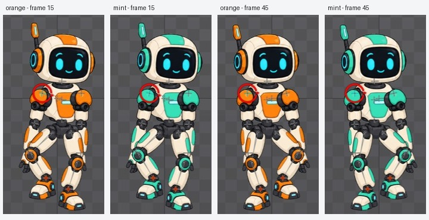

# Bài 22 — hai skin dùng chung rig dựng tay

Đã tạo `orange` và `mint` trên rig robot dựng trong editor, chuyển đủ 15 region vào skin placeholders và đổi skin ở hai tư thế của `march-handbuilt`.

## Cơ chế và cách dựng

Skin placeholder là ô thay ảnh trong slot. Mỗi skin cung cấp ảnh cho ô đó; animation vẫn điều khiển cùng các xương. [Hướng dẫn Skins chính thức](https://esotericsoftware.com/spine-skins) mô tả cách tạo skin, đưa attachment vào placeholder và nhân bản skin.

Quy trình đã thực hành trong Spine 4.3.25 Trial:

1. Trong Setup, chọn Skins → New → Skin, đặt tên `orange`.
2. Lọc Tree để chỉ hiện attachments: tắt Bones và Slots, bật Attachments bằng các nút trên thanh Tree.
3. Chọn từng region, New → Skin Placeholder, giữ tên gợi ý. Làm đủ 15 region. [Cây placeholders](../exercises/robot/evidence/robot-handbuilt-skin-placeholders.jpg).
4. Chọn orange và Duplicate thành `mint`. Bản sao có attachment riêng, đã kiểm tra bằng cách sửa ảnh thân của mint rồi chuyển về orange: thân orange vẫn dùng ảnh cam.
5. Mở Skins view, chọn mint. Gán Image path của từng region sang `mint/<tên ảnh gốc>` và xác nhận hình cập nhật.

Rig phản chiếu nhiều ảnh nhánh trái để dựng nhánh phải. Vì vậy, cả hai nhánh dùng `mint/upper-arm-left`, `mint/forearm-left`, `mint/hand-left`, `mint/thigh-left`, `mint/shin-left`, `mint/foot-left`; không thay chúng bằng ảnh phải chỉ vì tên xương là right. Ba ảnh còn lại dùng `mint/body`, `mint/head`, `mint/pelvis`. Giữ vị trí, góc và tỷ lệ attachment khi đổi đường dẫn.

Ảnh mint đã có từ bài chuẩn bị tài nguyên; không tạo lại ảnh trong bài này. [Skin hoàn chỉnh trong Setup](../exercises/robot/evidence/robot-handbuilt-skin-mint-setup.jpg).

## Lỗi gặp và cách sửa

Thử Shift+Down để chọn nhiều dòng Tree đã tác động lên công cụ Rotate, khiến ảnh thân xoay sai. Đã chọn lại region thân, chuyển Parent coordinates và nhập Rotate = 0; tư thế thân trở về đúng trước khi nhân bản. [Ảnh sau sửa](../exercises/robot/evidence/robot-handbuilt-skin-body-zero.jpg). Không dùng chuỗi phím này để chọn nhiều attachment trong phiên điều khiển hiện tại.

Đã làm lại Duplicate và thấy dấu chọn Rename attachments trong [hộp tùy chọn](../exercises/robot/evidence/robot-handbuilt-skin-duplicate-options.jpg), nhưng sau tạo, mint vẫn dùng ảnh cam và tên region chưa có tiền tố. Chưa xác định nguyên nhân, không kết luận đây là lỗi Spine. Cách hoàn tất đã kiểm chứng là nhập trực tiếp Image path cho từng region của mint.

Tắt skin đang active làm cả robot biến mất vì mọi region đã nằm trong skin. Bật lại trong Skins view làm robot hiện lại; đây là trạng thái không có skin hiển thị, không phải mất file ảnh.

## Đối chiếu trong Animate

Đã đổi qua lại orange/mint khi dừng tại frame 15 và 45. Hai cặp ảnh cho thấy cùng tư thế, không thấy region lệch hoặc mất ở độ phân giải chụp.

| Frame | Góc upper-arm-left | X theo Parent | Y theo Parent | Ảnh đầy đủ |
| --- | --- | --- | --- | --- |
| 15 | -12° với cả hai skin | -83.9999 | 27.9999 | [orange](../exercises/robot/evidence/robot-handbuilt-skin-orange-march15.jpg), [mint](../exercises/robot/evidence/robot-handbuilt-skin-mint-march15.jpg) |
| 45 | +2° với cả hai skin | -83.9999 | 27.9999 | [orange](../exercises/robot/evidence/robot-handbuilt-skin-orange-march45.jpg), [mint](../exercises/robot/evidence/robot-handbuilt-skin-mint-march45.jpg) |

Phép đo số chỉ áp dụng cho xương nêu trong bảng. Chưa đo mọi xương, chưa chụp lại toàn bộ 61 frame sau thêm skin và chưa kiểm tra trang phục khác hình dáng, linked mesh hay phối nhiều skin. Bài này đạt đổi bộ ảnh màu trên cùng animation ở các tư thế đã kiểm tra.

Cửa sổ kết thúc ở mint, march frame 45, playback dừng. Project Trial vẫn chưa lưu để mở lại được; bài ghi và ảnh không thay thế file project.
