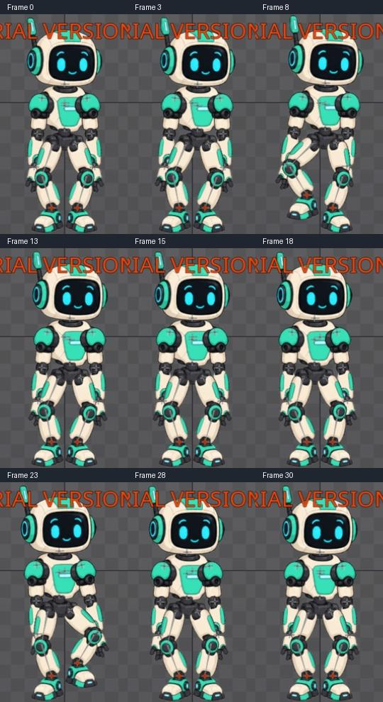

# Bài 25 — tạo nhịp một giây cho dáng đi dựng tay

Đã tạo `walk-handbuilt` ngay trong Spine 4.3.25 Trial, bằng cách nhân bản `march-handbuilt` và rút thời gian từ frame 0–60 xuống 0–30. Playback hiện dùng 30 FPS nên chu kỳ mới dài một giây. Đây mới là nền nhịp: nhân vật vẫn bước tại chỗ, chưa phải dáng đi tiến hoàn chỉnh.

## Thao tác đã làm

1. Trong Tree, tìm `march`, nhấn Enter để chọn animation; bấm Duplicate rồi Rename thành `walk-handbuilt`.
2. Mở Dopesheet, bỏ chọn xương để hiện các đường của toàn animation. Kiểm tra có thân, hai target IK, đầu, hai tay và Events; không chỉ co thời gian của một xương đang chọn.
3. Kéo vùng chọn trên hàng tổng hợp của animation từ frame 0 đến 60. Kéo cạnh phải vùng chọn về frame 30. Các key chuyển động và hai event cùng thay đổi thời điểm.
4. Cuộn xuống kiểm tra event; hai key nay ở 13 và 28. Đối chiếu tư thế tại các mốc và phát thử.

Hàng tổng hợp chỉ đại diện cho các dòng đang hiện. Phải bỏ chọn xương/kiểm tra bộ lọc trước khi dùng nó để sửa toàn animation. Cách kéo cạnh vùng chọn để đổi thời gian được đối chiếu với [Dopesheet User Guide](https://esotericsoftware.com/spine-dopesheet).

## Làm tròn frame có ảnh hưởng đến nhịp

Lần kéo này bật bắt vào frame nguyên. Các mốc lẻ không được chia đôi chính xác:

| Mốc cũ | Mốc mới |
| --- | --- |
| 0 | 0 |
| 5 | 3 |
| 15 | 8 |
| 18 | 9 |
| 25 | 13 |
| 30 | 15 |
| 35 | 18 |
| 45 | 23 |
| 48 | 24 |
| 55 | 28 |
| 60 | 30 |

Một số mốc chậm hơn nửa frame, tức khoảng 0,0167 giây so với chia đôi chính xác. Hai event vẫn ở lúc chân tương ứng đặt xuống vì key chân và event được đổi nhịp cùng nhau. Chưa kiểm chứng lại String hoặc nghe âm thanh trong lượt này.

Ảnh [hàng tổng hợp sau co thời gian](../exercises/robot/evidence/walk-handbuilt-retimed-overview.jpg), [event 13](../exercises/robot/evidence/walk-handbuilt-event13.jpg), [event 28](../exercises/robot/evidence/walk-handbuilt-event28.jpg).

## Bằng chứng tư thế và playback

Đã chụp và xem các frame 0, 3, 8, 13, 15, 18, 23, 28, 30. Chân trái nhấc ở 8, chân phải nhấc ở 23; tại hai mốc event, chân đã đặt lại xuống. Không thấy khớp rời trên bảng ảnh này. Đây là kiểm tra chín tư thế, không phải đo chân trụ trên mọi frame hoặc kiểm tra video liên tục.

Vùng ảnh nhân vật `(445,90)–(625,400)` trong hai ảnh gốc frame 0/30 trùng pixel. Không dùng điều đó để kết luận tốc độ nối vòng êm.

Đã bật playback, thấy timeline chuyển từ 30 sang 8 và tư thế đổi; sau đó dừng tại 25 rồi đưa về 0. [Ảnh đang phát](../exercises/robot/evidence/walk-handbuilt-playing.jpg) đồng thời cho thấy Timeline FPS 30, Speed 100% và Interpolated bật. Chưa đánh giá chất lượng nhịp bằng video ở tốc độ thường.

## Sắp giao diện khi không đủ chỗ

Phiên này Interface scale đang là 180%; đã xem Settings rồi Cancel, không đổi cài đặt hoặc khởi động lại. Đóng bảng Skins, tạm kéo Dopesheet cao lên để sửa key. Sau đó thu nhỏ Dopesheet bằng chuột phải trên nút menu của bảng; mở Timeline riêng, kéo xuống đáy và giảm chiều cao. Bố cục này cho phép thấy cả nhân vật và thanh tua. Nút Zoom to fit căn lại nhân vật sau thay đổi bố cục; xem [Viewport](https://eu.esotericsoftware.com/spine-ui).

## Còn làm

`walk-handbuilt` vẫn dùng vị trí chân của bài march. Cần thiết kế quãng tiến, phối root với target chân để giữ điểm trụ, rồi đánh giá nhịp và sửa qua các vòng. Các phép đo runtime ở bài 23/24 không tự áp dụng cho animation dựng tay này. Trial vẫn chưa lưu được project; ảnh và hướng dẫn chỉ giúp dựng lại.
