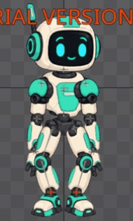

# Bài 27 — làm mềm lúc nhấc và đặt chân trong Spine

Đã sửa trực tiếp `walk-handbuilt`: hai đoạn vung X của mỗi chân dùng Bezier, các đoạn trụ vẫn Linear. Qua số đo bàn chân thực, quãng dịch chuyển ở frame sát lúc nhấc/đặt giảm từ 6 xuống khoảng 1,6–1,8 đơn vị; chân trụ vẫn đứng yên ở mọi frame nguyên 0–30.

## Sửa gì và vì sao

Bản đầu ở [bài 26](026-editor-walk-travel.md) đi đúng vị trí nhưng tốc độ ngang chuyển ngay từ đứng yên sang 6 đơn vị/frame. Đổi riêng key X frame 3 và 8 của target trái, frame 18 và 23 của target phải sang Bezier. Không đổi thời gian hay giá trị các key, Y nhấc chân, root hoặc event.

Tay nắm ở đầu/cuối pha vung được kéo theo hướng bù root: độ dốc Parent X gần −2 đơn vị/frame. Hai tay nắm quanh key giữa giữ liên kết để hướng tiếp tuyến liên tục; tăng độ dốc lên gần giá trị +7 đã tính. Đây là chỉnh tay bằng Graph, **không phải nhập chính xác công thức smoothstep**. Hai chân có sai khác nhỏ do thao tác tay.

Ảnh đường cong: [trái](../exercises/robot/evidence/walk-left-x-bezier-pass2.jpg), [phải](../exercises/robot/evidence/walk-right-x-bezier-pass2.jpg). Đường trụ trước/sau vẫn thẳng. Cách chọn loại nội suy và chỉnh tay nắm đối chiếu [Graph User Guide](https://esotericsoftware.com/spine-graph).

## Kiểm tra trước/sau

Chọn `foot-left/right`, đọc ở World axes, chụp đủ 31 frame mỗi chân. Đã đọc cả hai bảng ảnh, không chỉ tọa độ target.

| Khoảng frame | Bản Linear: dịch X | Bản sửa: dịch X |
| --- | ---: | ---: |
| Trái 3 → 4 | 6 | 1,65 |
| Trái 12 → 13 | 6 | 1,61 |
| Phải 18 → 19 | 6 | 1,65 |
| Phải 27 → 28 | 6 | 1,76 |

Đây là **quãng dịch trong một frame**, chưa phải phép đo vận tốc tức thời ngay tại key. Giá trị hiển thị đã làm tròn. Không kết luận tiếp tuyến khớp tuyệt đối hoặc hết mọi khựng từ bảng này.

Chân trái giữ X = −48,5 ở frame 0–3, X = 11,5 ở 13–30. Chân phải giữ X = 47,5 ở 0–18, X = 107,5 ở 28–30. Mọi frame trụ của cả hai chân vẫn có Y = −391,5; góc bàn chân là 0° ở cả 62 mẫu. Các mốc nhấc Y đã đọc vẫn giống bản đầu.

Bằng chứng: [bảng trái](../exercises/robot/evidence/handbuilt-walk-travel-pass2/left-values.jpg), [bảng phải](../exercises/robot/evidence/handbuilt-walk-travel-pass2/right-values.jpg), [số đọc lại từ ảnh](../exercises/robot/evidence/handbuilt-walk-travel-pass2/review.json).

## Xem lại toàn thân

Đã bỏ chọn xương, chụp và xem đủ [31 tư thế](../exercises/robot/evidence/handbuilt-walk-travel-pass2/poses.jpg). Không thấy khớp rời hoặc tay xuyên thân ở độ phân giải chụp. Chân thu gần nhau giữa chu kỳ; chất lượng chuyển trọng lượng và nhịp toàn thân còn cần đánh giá tiếp.

GIF ghép frame 0–29, mỗi ảnh 80 ms, dùng để xem chậm. Đây không phải video realtime hay ảnh xuất từ Spine. Root tiến 60 đơn vị nên GIF phát lại sẽ nhảy về đầu; chưa giải quyết việc đặt nhân vật liên tục qua các vòng của bản dựng tay. Đã bật playback trong editor, lưu [ảnh đang phát](../exercises/robot/evidence/handbuilt-walk-travel-pass2/playing.jpg), rồi dừng ở frame 0.

## Thao tác Graph rút ra từ bài này

Graph quá thấp khiến 40 đơn vị X chỉ chiếm vài pixel. Đã chuyển tab Graph vào nhóm Timeline, thu Dopesheet, kéo cao nhóm Graph rồi bấm Frame. Chọn chấm ở hàng Translate X để chỉ hiện đường này. Khi kéo tay nắm, phải kiểm tra lại vị trí sau thao tác; có lần chỉ chọn được tay nắm mà chưa kéo được. Đã điều chỉnh lại và dùng số đo bàn chân để xác nhận kết quả.

Sau bài: đóng tab Graph, trả Timeline về dưới cùng, dừng `walk-handbuilt` frame 0, skin mint. Project vẫn chưa lưu/xuất được do Trial. Kế hoạch tổng thể chưa hoàn tất.
