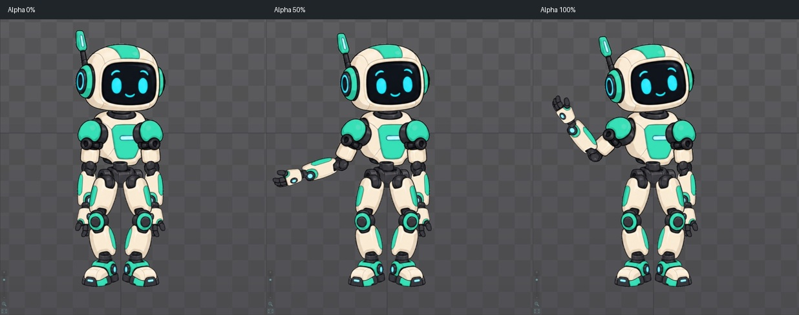

# Bài 31 — phối idle và wave trong Preview

Ngày 07/09/2026, Spine 4.3.25 Trial. Bài dùng robot mint tự dựng trong editor, với `idle-handbuilt` và `wave-handbuilt` đã có. Không tạo animation mới và không xuất dữ liệu trong bài này.

## Kết quả

Đã đặt idle ở track 0, wave ở track 1, thử Alpha 0/50/100 và bỏ lớp wave để trở về idle. Track là lớp phát animation; lớp trên có thể thay thế những thuộc tính mà nó đặt key. Alpha điều chỉnh mức ảnh hưởng của lớp đó. Nhấn lại animation đang chạy trong danh sách Preview sẽ chuyển lớp ấy về animation rỗng, theo [tài liệu Preview chính thức](https://esotericsoftware.com/spine-preview#Animations).

Ảnh cho thấy Alpha 50 giảm biên độ vẫy, không làm mờ robot. Đầu và thân cũng có thay đổi nhỏ: wave có key ngoài cánh tay, nên chưa thể gọi đây là lớp chỉ điều khiển tay.

## Thực hiện lại

1. Hiện skeleton robot, ẩn `mesh-refine`, chọn robot rồi mở Views → Preview.
2. Mở rộng Preview bằng kéo đường phân cách. Fit ảnh rồi giảm zoom để chừa chỗ cho tay vẫy.
3. Chọn track 0 và `idle-handbuilt`. Chọn track 1 rồi chọn `wave-handbuilt`. Đọc lại giao diện sau mỗi lần đổi track: khi hiện thêm Alpha, các dòng Speed/Mix/Track dịch lên.
4. Cho chạy với Speed hiển thị 100, Repeat bật, Mix 0.25. Hai ảnh `both-playing.jpg` và `both-playing-second.jpg` ghi nhận tư thế thay đổi khi Preview đang phát. Đây là ảnh chụp rời, không phải video liên tục ở tốc độ thường.
5. Đặt Speed 0 để giữ tư thế, lần lượt nhập Alpha 100, 50, 0 rồi trả về 100. Các ảnh `alpha100.jpg`, `alpha50.jpg`, `alpha0.jpg` và `alpha100-restored.jpg` là bằng chứng. Không đổi thời điểm giữa các ảnh so sánh Alpha này.
6. Nhấn lại wave trong danh sách để bỏ lớp vẫy. Đã thử với Mix 0.25 khi đang phát và quan sát tay trở về dưới. Chưa lấy mẫu đủ dày để đánh giá độ êm trong khoảng chuyển 0.25 giây.
7. Làm phép kiểm tra tĩnh riêng: giữ Speed 0, chụp nền khi Alpha 0; trả Alpha 100, đặt Mix 0 rồi nhấn lại wave. Ảnh sau khi bỏ wave trùng vùng Preview của ảnh nền. Sau thử nghiệm trả Mix về 0.25.

Không dùng ảnh `idle-frozen.jpg` đầu bài làm chuẩn pixel cho các ảnh Alpha: trước loạt so sánh đã cho Preview chạy thêm để lấy tư thế vẫy. Giao diện Speed hiển thị cùng giá trị sau khi chuyển track trong phiên này; bài không kết luận đã kiểm chứng điều khiển tốc độ độc lập từng track.

## Lỗi thao tác và kiểm tra khôi phục

Một lần chuyển từ track 0 sang 1 rồi nhập số quá sớm đã khiến Backspace tác động vào skeleton đang chọn, làm robot biến mất khỏi cây. Đã bấm Undo một lần ngay sau đó; skeleton, các animation và robot trở lại. Sau khi nhập Alpha 100 đúng ô, ảnh toàn vùng Preview trùng pixel với ảnh Alpha 100 trước lỗi. Đây là bằng chứng khôi phục tư thế đang thử, không phải kiểm tra mọi dữ liệu trong project.

Cách tránh lặp lại: sau thao tác đổi bố cục, lấy trạng thái mới rồi mới nhấp ô số. Không gửi Backspace nếu chưa xác nhận đúng ô đang nhận nhập. Không dùng việc robot xuất hiện lại làm lý do bỏ qua kiểm tra ảnh đối chiếu.

## Bằng chứng và phạm vi kết luận

Thư mục: [preview-tracks](../exercises/robot/evidence/preview-tracks/).

| Kiểm tra | Kết quả |
| --- | --- |
| Alpha 0/50/100 | Ba tư thế khác nhau, tay nâng dần; đã xem ảnh ghép |
| Trả Alpha 100 sau Undo | `alpha100.jpg` và `alpha100-restored.jpg` trùng pixel trong vùng Preview |
| Bỏ wave khi Mix 0 | `clear-baseline-alpha0.jpg` và `clear-after-mix0.jpg` trùng pixel trong vùng Preview |
| Phát hai lớp | Hai ảnh khi Speed hiển thị 100 có tư thế khác nhau; chưa là đánh giá video liên tục |
| Kết thúc | Track 0 là idle, track 1 rỗng, Speed 0, Mix 0.25; robot hiện, mesh ẩn |

[comparison.json](../exercises/robot/evidence/preview-tracks/comparison.json) ghi phép so sánh vùng `(193,70)–(811,759)` trên ảnh 1524×768: bao trọn phần hình trong Preview, bỏ danh sách và điều khiển. Hai cặp cần bằng nhau có `difference_bbox: null`. Ảnh ghép chỉ cắt/thu nhỏ ảnh chụp để đặt cạnh nhau, không chỉnh hình robot.

Đã thực hành phối track trong editor. Còn thử lớp chỉ đặt key tay trên nền đi bộ, đánh giá chuyển tiếp liên tục, Hold Previous và Additive; chưa coi toàn bộ animation mixing hoặc chất lượng bộ động tác đã hoàn tất. Trial vẫn chưa lưu project để mở lại hoặc xuất animation tự làm.
