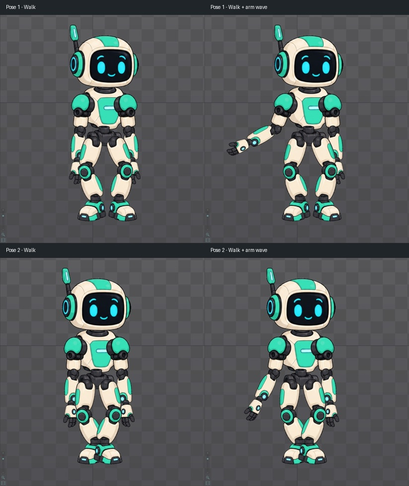

# Bài 32 — lớp vẫy chỉ điều khiển cánh tay

Ngày 07/09/2026, Spine 4.3.25 Trial. Đã tạo `wave-arm-only` trực tiếp trong editor bằng cách sao chép riêng các key của ba xương tay từ `wave-handbuilt`.

## Kết quả và lý do

Bản wave gốc có bốn đường xoay: vai, khuỷu, cổ tay và đầu. Khi dùng làm lớp trên, key đầu có thể thay thế nhịp đầu của walk. Bản mới chỉ có ba đường xoay ở tay trái, tổng cộng 18 key trong 60 frame. Bản wave gốc và walk vẫn còn trong danh sách animation.

[Ảnh Dopesheet của bản mới](../exercises/robot/evidence/arm-only/three-tracks.jpg) cho thấy ba hàng xương và ba hàng Rotate, không có hàng head hay các đường dịch thân/chân.

| Xương | Frame có key | Số key |
| --- | --- | --- |
| upper-arm-left | 0, 15, 45, 60 | 4 |
| forearm-left | 0, 15, 22, 30, 38, 45, 60 | 7 |
| hand-left | 0, 15, 24, 32, 40, 48, 60 | 7 |

Đã dùng Copy/Paste key để giữ các đoạn chuyển giữa key, không dựng lại từ các tư thế rời. Chưa đọc lại từng tọa độ tay nắm Bezier của bản sao trong Graph.

## Cách thực hiện lại

1. Trong cây, bật chấm cạnh `wave-handbuilt` để kích hoạt animation. Chỉ chọn tên hoặc nhấp phải từ Preview chưa chắc đổi animation đang chỉnh: đầu Dopesheet phải hiện `wave-handbuilt`.
2. Mở Dopesheet, bỏ chọn xương để thấy toàn bộ các hàng. Kéo hộp chọn bao trọn key của upper-arm-left, forearm-left và hand-left, dừng trước hàng head.
3. Nhấn nút Copy của Dopesheet. Chọn thư mục Animations → New → Animation, đặt tên `wave-arm-only`.
4. Xác nhận animation đích trống và Current = 0 rồi nhấn Paste của Dopesheet. Kiểm tra đủ ba đường, key cuối ở frame 60 và không có đường của đầu.
5. Mở Preview: đặt `walk-handbuilt` trên track 0, `wave-arm-only` trên track 1. Repeat bật, Mix 0.25, Alpha 100. Cho phát với Speed hiển thị 100.
6. Dừng bằng Speed 0 tại một tư thế. Chụp Alpha 100 và Alpha 0 tại cùng thời điểm. Trả Alpha 100, chạy sang pha khác và lặp lại phép so sánh.

Việc chọn hộp và sao chép key dựa trên [hướng dẫn Dopesheet](https://esotericsoftware.com/spine-dopesheet#Selection). Mục đích là chỉ đưa những thuộc tính cần thay thế vào lớp trên; giảm Alpha của cả bản wave không loại riêng ảnh hưởng của key đầu.

## Kiểm tra trên walk

Hai cặp ảnh lấy tại hai thời điểm khác nhau; trong từng cặp, Preview dừng và chỉ thay Alpha 0/100. Các tư thế này không gắn với số frame xác định, vì Preview phát độc lập với Timeline chính.

So sánh toàn vùng Preview `(193,70)–(811,759)` trên ảnh 1524×768 cho thấy sai khác nằm trong vùng cánh tay:

- Tư thế 1: hình chữ nhật sai khác `(256,303)–(497,584)` theo tọa độ ảnh toàn màn hình.
- Tư thế 2: `(307,303)–(465,588)`.
- Vùng đầu `(350,80)–(650,300)` và vùng bàn chân/phần thấp cẳng chân `(390,590)–(650,715)` trùng pixel ở cả hai cặp.

Các vùng so sánh riêng tránh phần tay che lên đùi. Không suy ra toàn bộ chân có cùng pixel ở vùng bị tay che. Bằng chứng Dopesheet xác nhận bản mới chỉ chứa key xoay của tay; ảnh xác nhận hành vi tại hai tư thế thử. Chưa dùng hai mẫu này để kết luận chân không trượt trong toàn vòng hoặc mọi tổ hợp pha đều không va chạm.

Có ảnh [khi đang phát hai lớp](../exercises/robot/evidence/arm-only/playing.jpg), nhưng chưa có video liên tục để đánh giá đầy đủ nhịp phối ở tốc độ thường. Vấn đề root quay lại đầu vòng của walk trong Preview vẫn thuộc bài xử lý vị trí qua vòng, không được giải quyết bằng lớp tay này.

## Kiểm tra vòng riêng và trạng thái cuối

Đã mở `wave-arm-only` trong Timeline chính, chụp frame 0 và 60 cùng góc nhìn. Toàn vùng nhân vật `(158,48)–(1047,528)` trùng pixel. Đây là kiểm tra tư thế nối, không phải đo vận tốc tức thời tại điểm nối.

[comparison.json](../exercises/robot/evidence/arm-only/comparison.json) chứa các vùng và kết quả pixel; `difference_bbox: null` nghĩa là không có pixel khác nhau trong vùng đó. Ảnh ghép chỉ cắt/thu nhỏ ảnh UI để đặt cạnh nhau.

Editor cuối bài dừng ở `wave-arm-only`, frame 22, robot mint hiện và mesh ẩn. Preview thu nhỏ, vẫn giữ walk trên track 0 và bản tay trên track 1, Speed 0, Mix 0.25, Alpha 100. [Tư thế cuối](../exercises/robot/evidence/arm-only/standalone22.jpg).

Đã có lớp tay riêng dùng được cho phép thử này. Còn đánh giá phối ở nhiều pha hơn và chuyển vào/ra lớp liên tục, rồi quay lại chất lượng dáng đi trong kế hoạch. Trial chưa lưu project để mở lại hoặc xuất animation tự làm.
