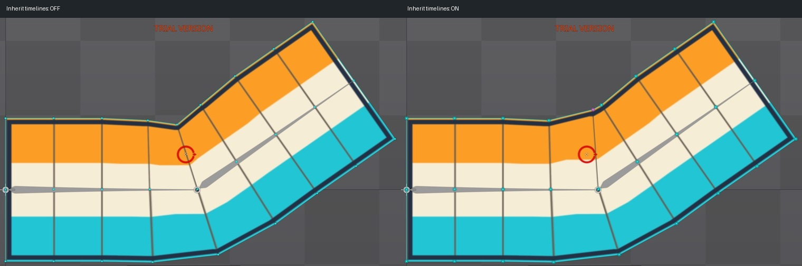

# Bài 33 — dùng chung mesh và key deform

Ngày 07/09/2026, Spine 4.3.25 Trial. Đã tạo `strip-linked` từ mesh `strip` trong skeleton `mesh-refine`. Bản mới dùng lại hình lưới, trọng số và bản sửa chỗ gập ở bài 30.

## Tạo và kiểm tra cấu trúc

Trong Setup, chọn mesh nguồn → New → Linked Mesh. Spine tạo `strip2`; đổi tên thành `strip-linked` và **bỏ chọn Clear image path** khi đổi tên để giữ Image path = `strip`. Bài này dùng cùng ảnh để có thể so sánh hình trực tiếp, chưa tạo mẫu màu hay ảnh thay thế.

Thuộc tính bản mới hiện `Linked Mesh`, trường Mesh trỏ tới `strip`, và Inherit timelines bật. [Cây đầy đủ](../exercises/mesh-lab/evidence/linked-mesh/same-slot.jpg) cho thấy `strip` và `strip-linked` cùng nằm dưới slot `strip` của xương base.

Theo [hướng dẫn Linked meshes](https://esotericsoftware.com/spine-meshes#Linked-meshes), các bản liên kết chia sẻ cấu trúc lưới và trọng số; Inherit timelines quyết định việc nhận key deform từ nguồn. Hai phép thử dưới đây kiểm chứng riêng hai quan hệ đó.

## Thử mất bản sửa chỗ gập rồi khôi phục

1. Hiện `strip-linked` bằng chấm cạnh attachment trong Setup. Chỉ chọn tên attachment chưa chắc làm nó hiện.
2. Chuyển Animate, bật `bend-corrective`, đặt frame 30. Khi bật một animation từ trạng thái không hoạt động, Timeline trở về frame 0; cần đặt lại frame sau đó.
3. Chụp khi Inherit timelines bật. Quay lại Setup, tắt tùy chọn, rồi về Animate tại cùng frame 30.
4. Mesh vẫn uốn theo xương, nhưng góc lõm ở mép trong trở lại: trọng số còn hoạt động, phần sửa bằng key deform không được nhận.
5. Bật lại Inherit timelines trong Setup, về Animate. Hình sửa trở lại đúng như trước phép thử.

Đã so sánh riêng mesh nguồn và linked mesh tại frame 0 (−35°) và frame 30 (+35°). Ở cả hai tư thế, ảnh toàn vùng hình khớp pixel khi Inherit timelines bật. Bản liên kết không cần sao chép thêm năm key deform đã làm ở bài 30.

## Thử trọng số dùng chung hai chiều

Chọn một đỉnh chính giữa lưới trong Weights, Mode Direct. Chỉ thay đổi đỉnh này; không dùng Smooth, Auto hoặc Bind.

| Bước | Attachment đang chọn | base | tip | Ảnh |
| --- | --- | --- | --- | --- |
| Đọc ban đầu | strip | 50 | 50 | [Nguồn 50](../exercises/mesh-lab/evidence/linked-mesh/source-weight50.jpg) |
| Đổi tip thành 60 | strip | 40 | 60 | [Nguồn 60](../exercises/mesh-lab/evidence/linked-mesh/source-weight60.jpg) |
| Chọn cùng đỉnh của bản liên kết | strip-linked | 40 | 60 | [Liên kết nhận 60](../exercises/mesh-lab/evidence/linked-mesh/linked-weight60.jpg) |
| Trả tip về 50 qua bản liên kết | strip-linked | 50 | 50 | [Trả về 50](../exercises/mesh-lab/evidence/linked-mesh/linked-weight50-restored.jpg) |
| Đọc lại nguồn | strip | 50 | 50 | [Nguồn đã khôi phục](../exercises/mesh-lab/evidence/linked-mesh/source-weight50-restored.jpg) |

Kết quả quan trọng: sửa trọng số của linked mesh cũng tác động tới nguồn. Nó không phải một bộ trọng số độc lập. Đã trả số về ban đầu và so sánh lại hình uốn của nguồn ở frame 0: khớp ảnh trước thử nghiệm.

## Bằng chứng và giới hạn

[comparison.json](../exercises/mesh-lab/evidence/linked-mesh/comparison.json) dùng vùng ảnh `(178,48)–(938,520)` bao trọn hình mesh ở hai tư thế kiểm tra. Bốn cặp có `difference_bbox: null`:

- Nguồn và liên kết ở frame 0.
- Nguồn và liên kết ở frame 30.
- Inherit timelines bật trước thử và sau khôi phục ở frame 30.
- Hình nguồn frame 0 trước và sau phép thử trọng số.

Cặp tắt/bật Inherit timelines có sai khác; ảnh cho thấy rõ góc lõm. Không dùng hình chữ nhật sai khác của cặp này để khẳng định chỉ một vùng pixel thay đổi. Ảnh ghép chỉ cắt/đặt cạnh nhau các ảnh UI, không chỉnh hình mesh.

Đã thực hành tạo linked mesh, dùng lại deform và kiểm tra trọng số chung. Chưa thử ảnh khác kích thước, đặt trong hai skin, thay đổi topology sau liên kết hay xuất runtime. Các phép so sánh hiện tại kiểm chứng hai tư thế, không thay cho kiểm tra toàn bộ chuyển động của mọi biến thể.

Cuối bài: Animate `bend-corrective`, frame 0; mesh nguồn `strip` đang hiện, `strip-linked` còn trong cùng slot và Inherit timelines bật. Đỉnh thử đã trả về base/tip = 50/50. Robot đang ẩn; các animation robot vẫn ở skeleton riêng. Bản Trial chưa lưu được project để mở lại.
