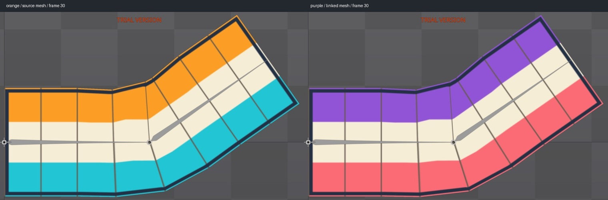

# Bài 34 — hai skin dùng chung linked mesh

Đã đưa mesh nguồn vào skin `orange`, mesh liên kết vào `purple`, đổi ảnh của purple và kiểm tra hai skin ở frame 0/30 của `bend-corrective` trong Spine 4.3.25 Trial.

## Cách dựng trong editor

1. Trong Setup, chọn Skins → New → Skin, tạo `orange`.
2. Chọn mesh nguồn `strip`, New → Skin Placeholder, giữ tên `strip`. Mesh nguồn chuyển vào placeholder của skin đang active.
3. Tạo skin rỗng `purple`. Hình biến mất vì skin này chưa cung cấp attachment cho placeholder đang hiển thị.
4. Chọn `strip-linked` đã tạo ở bài 33, nhấn P (Set Parent), chọn placeholder `strip` đang rỗng trong purple. Hình hiện lại. Không nhân bản weights hoặc key deform.
5. Đặt Image path của linked mesh thành `strip-variant`. Thuộc tính Mesh vẫn trỏ tới `orange → strip`, Inherit timelines vẫn bật. [Ảnh thiết lập](../exercises/mesh-lab/evidence/linked-skins/purple-setup.jpg).

Ảnh thử mới có kích thước 256 × 96 và cùng bố cục lưới với ảnh nguồn, chỉ dùng bảng màu khác. Tạo bằng `python3 scripts/build_mesh_variant.py`; script chỉ tạo fixture `strip-variant.png`, không sửa ảnh nguồn hoặc JSON runtime. Đây là bài thay bảng màu, chưa phải trang phục khác hình dáng.

Skin placeholder là ô attachment mà mỗi skin cung cấp nội dung riêng. Cách tạo skin và chuyển attachment vào placeholder dựa trên [hướng dẫn Skins chính thức](https://esotericsoftware.com/spine-skins); các bước và kết quả trên đã thực hành trực tiếp.

## Kiểm tra và lỗi nhập liệu

Trong Animate, đổi skin bằng chấm bên trái tên skin trên Tree, giữ nguyên frame và camera trong từng cặp:

| Tư thế | Mesh nguồn | Mesh liên kết |
| --- | --- | --- |
| Frame 0, uốn xuống | [orange](../exercises/mesh-lab/evidence/linked-skins/orange0.jpg) | [purple](../exercises/mesh-lab/evidence/linked-skins/purple0.jpg) |
| Frame 30, uốn lên | [orange](../exercises/mesh-lab/evidence/linked-skins/orange30.jpg) | [purple](../exercises/mesh-lab/evidence/linked-skins/purple30.jpg) |

Quan sát hai cặp: đường lưới, khớp và đường viền giữ cùng hình uốn; hai dải màu đổi đúng. Đổi lại orange ở frame 30 cho vùng chứa toàn bộ mesh trùng pixel với ảnh orange trước khi đổi, trong khung `(178,48)–(938,520)`. [Ảnh đổi lại](../exercises/mesh-lab/evidence/linked-skins/orange30-restored.jpg).

Lúc nhập Image path, Cmd+A không chọn hết chuỗi như dự kiến, làm tên thành `stripstrip-variant` và hiện MISSING. Đã sửa bằng End, Backspace hết chuỗi rồi nhập `strip-variant`; ảnh hiện đúng. Không cần đổi thư mục Images hoặc tạo lại mesh.

Phép kiểm tra chỉ gồm hai tư thế dừng và một lần đổi lại; chưa đo mọi đỉnh ở toàn bộ vòng hoặc đổi skin trong runtime. Bài 33 đã kiểm tra trọng số dùng chung và bật/tắt kế thừa deform; bài này bổ sung liên kết giữa hai skin và ảnh khác màu.

Editor kết thúc ở orange, `bend-corrective`, frame 30, playback dừng. Project Trial vẫn chưa lưu/xuất; tài liệu và ảnh không thay thế file project có thể mở lại.
