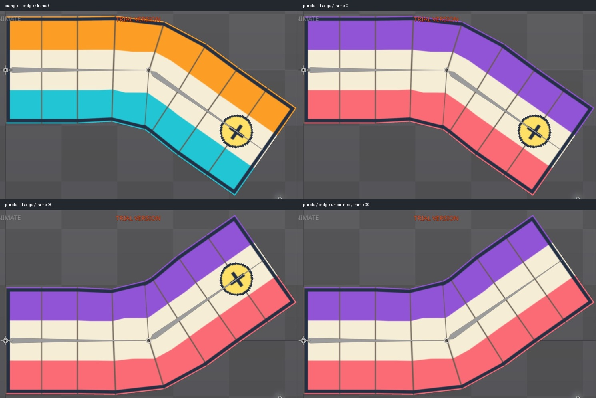

# Bài 35 — phối skin màu và phụ kiện độc lập

Đã tạo skin `badge` chỉ chứa một dấu phụ kiện, ghim nó trong Skins view và đổi `orange`/`purple` trên animation `bend-corrective`. Đã thử bật/tắt phụ kiện ở hai tư thế và tạo rồi sửa tình huống màu bị skin khác ghi đè.

## Dựng phụ kiện một lần

Trong Setup của Spine 4.3.25 Trial:

1. Tạo ảnh dấu tròn 32 × 32 bằng `python3 scripts/build_skin_badge.py`. Đây là fixture hình học, nền trong suốt, dùng để nhìn rõ vị trí và góc; không phải bộ trang phục hoàn chỉnh.
2. Chọn `skin-badge` trong Images, nhấn P (Set Parent), chọn xương `tip`, giữ tên slot mới `skin-badge`. Thử kéo ảnh ra viewport lần đầu không tạo attachment; dùng P đã tạo đúng slot và region dưới tip.
3. Chọn Parent coordinates, đặt region Translate X = 96, Y = 0, Rotate = 0, Scale = 1. Dấu nằm gần cuối dải và đi theo xương tip.
4. Tạo skin `badge`, chọn region rồi New → Skin Placeholder, giữ tên `skin-badge`. **Không chọn Duplicate attachment for each skin**: chỉ badge cung cấp attachment này; orange/purple chỉ cung cấp mesh cho placeholder `strip`.
5. Mở Views → Skins. Ghim badge bằng biểu tượng ghim ở mép phải dòng, rồi chọn orange hoặc purple. Badge vẫn hiện dù skin màu đang active. Phải mở Skins view riêng trong bố cục Animate nếu nó đang ẩn.

Chọn lại skin đang active có thể tắt nó. Khi toàn bộ skin đều tắt và không có skin ghim, các placeholder không cung cấp hình; cần bật skin hoặc ghim lại, không cần nhập lại ảnh.

## Kiểm tra độc lập

| Thử nghiệm | Bằng chứng | Kết quả |
| --- | --- | --- |
| Đổi màu ở frame 0 | [orange + badge](../exercises/mesh-lab/evidence/mixed-skins/orange-badge0.jpg), [purple + badge](../exercises/mesh-lab/evidence/mixed-skins/purple-badge0.jpg) | Dấu giữ vị trí và hướng trên tư thế uốn xuống |
| Đổi màu ở frame 30 | [orange + badge](../exercises/mesh-lab/evidence/mixed-skins/orange-badge30.jpg), [purple + badge](../exercises/mesh-lab/evidence/mixed-skins/purple-badge30.jpg) | Dấu theo tip ở tư thế uốn lên |
| Bỏ ghim badge ở frame 0 | [orange không badge](../exercises/mesh-lab/evidence/mixed-skins/orange-no-badge0.jpg) | Chỉ vùng phụ kiện thay đổi |
| Bỏ ghim badge ở frame 30 | [purple không badge](../exercises/mesh-lab/evidence/mixed-skins/purple-no-badge30.jpg) | Chỉ vùng phụ kiện thay đổi |

Đối chiếu pixel trong khung chứa toàn bộ mesh `(55,48)–(800,518)`: bỏ ghim chỉ tạo sai khác quanh dấu, trong hộp màn hình `(591,303)–(696,401)` ở frame 0 và `(591,175)–(696,273)` ở frame 30. Ghim lại ở cả hai frame trả vùng mesh trùng pixel trước khi bỏ ghim. Các hộp là vùng sai khác raster, không phải số đo đỉnh mesh.

## Lỗi có chủ đích: chọn cam nhưng vẫn thấy tím

[Skins view chính thức](https://esotericsoftware.com/spine-skins-view) phân biệt skin active để chỉnh với thứ tự áp dụng các skin ghim. Đã kiểm tra trực tiếp:

1. Badge và purple được ghim; orange active nhưng chưa ghim → [hình cam](../exercises/mesh-lab/evidence/mixed-skins/active-orange-overrides-pinned-purple0.jpg). Skin active chưa ghim được áp dụng sau cùng.
2. Ghim cả orange. Kéo purple lên trên orange trong danh sách ghim bên dưới → [hình tím dù orange vẫn active](../exercises/mesh-lab/evidence/mixed-skins/purple-above-active-orange0.jpg). Hai skin cùng cung cấp nội dung cho `strip`, nên mục cao hơn thắng. Badge dùng ô khác nên vẫn hiện.
3. Kéo orange lên trên purple → [hình cam trở lại](../exercises/mesh-lab/evidence/mixed-skins/orange-order-fixed0.jpg). Vùng mesh trùng pixel với tổ hợp orange + badge ban đầu. Không sửa đường dẫn ảnh hay key animation để giải quyết lỗi thứ tự.

Cuối bài đã bỏ ghim hai skin màu, giữ badge được ghim và orange active, dừng frame 0. [Trạng thái cuối](../exercises/mesh-lab/evidence/mixed-skins/final-orange-badge0.jpg).

Đã đạt phối một phụ kiện riêng với hai màu và xử lý ưu tiên skin trong editor ở các tư thế nêu trên. Chưa thử skin bones/constraints, trang phục khác tỷ lệ hoặc phối skin trong runtime. Không thêm key; project Trial vẫn chưa lưu/xuất.
