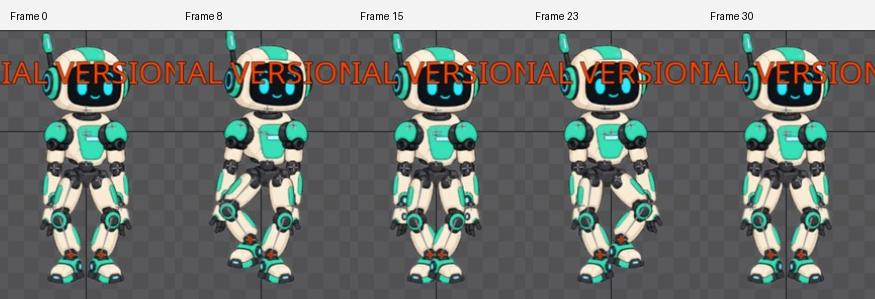

# Bài 37 — tách bản đi tại chỗ từ walk có root tiến

Đã tạo `walk-in-place` trong editor: root X giữ 0, chuyển động thân và chân tiếp tục theo chu kỳ 0–30. Năm tư thế đã được xem; vùng nhân vật ở frame 0/30 trùng pixel. Đây là bước chuẩn bị để đánh giá vòng đi liên tục, chưa kết luận dáng đi đã tự nhiên.

## Chọn việc cần sửa từ số đo

Trước khi thêm chuyển trọng lượng, đã đọc body của `walk-handbuilt`: ở frame 8, World X = 35,5; frame 23 = 25,5. Với root tiến 2 đơn vị/frame, suy ra X tương đối là +19,5 và −20,5. Body đã dịch ngang luân phiên nên không thêm một lớp dịch tương tự nữa. Ảnh số đo: [frame 8](../exercises/robot/evidence/walk-weight-shift/before-body8.jpg), [frame 23](../exercises/robot/evidence/walk-weight-shift/before-body23.jpg). Chưa đo lại khoảng cách tới chân trụ trong lượt này.

## Thao tác và lỗi gặp thực tế

1. Tạo bản có tên `walk-in-place` từ animation walk. Lần kích hoạt sau thao tác Duplicate không hiện chuyển động/key như mong đợi; chưa xác định nguyên nhân. Có thêm bản thử `walk-handbuilt2` còn trong Tree, không dùng làm kết quả.
2. Kích hoạt lại `walk-handbuilt`, mở Dopesheet và bỏ chọn xương để hiện toàn animation. Chọn các key 0–30 trên hàng tổng hợp, Copy, kích hoạt `walk-in-place`, đặt frame 0 rồi Paste. Không nhầm tên đang được chọn với animation đang hoạt động: kiểm tra dấu hoạt động và tiêu đề Dopesheet.
3. Chọn root tại frame 30. X ban đầu = 60. Nhập 0 rồi bấm nút key X: chỉ nhập số để lại nút màu cam, chưa ghi key. Đổi sang frame 15 đọc được X = 0; quay lại frame 30 vẫn là 0 với key đã ghi.
4. Thu Dopesheet, căn camera rồi xem 0, 8, 15, 23, 30. Quay lại bản gốc đọc root X ở frame 30 vẫn = 60. Trả editor về `walk-in-place`, frame 0.

Copy/Paste key là thao tác được mô tả trong [Keys User Guide](https://eu.esotericsoftware.com/spine-keys). Không coi hiện tượng Duplicate trong phiên này là lỗi đã xác định của Spine.

## Bằng chứng

- [Root giữa vòng = 0](../exercises/robot/evidence/walk-in-place/root15.jpg).
- [Root cuối vòng = 0, key đã ghi](../exercises/robot/evidence/walk-in-place/root30.jpg).
- [Bản gốc cuối vòng vẫn = 60](../exercises/robot/evidence/walk-in-place/original-root30.jpg).
- So sánh RGB vùng `(450,71)–(625,340)` của `pose0.jpg` và `pose30.jpg`: không có pixel khác. Camera giữ nguyên giữa năm ảnh.

Tại 8 và 23, hai chân lần lượt nhấc; ở 15 hai bàn chân gần nhau hơn mốc 0. Các ảnh cho thấy tư thế thay đổi và khép vòng về vị trí ban đầu. Chưa đủ bằng chứng để đánh giá tốc độ nối vòng hay chất lượng toàn thân ở tốc độ thường.

## Cách dùng và phần còn lại

Bản tại chỗ bỏ chuyển động root nội bộ. Nếu muốn nhân vật tiến trong game với quãng đường như bản gốc, phần điều khiển nhân vật cần cung cấp chuyển động tương ứng; chỉ phát tại chỗ thì chân trụ dịch lùi tương đối với màn hình. Chưa kiểm chứng bản editor này trong runtime.

Còn kiểm tra playback nhiều vòng ở tốc độ thường, các frame sát điểm nối, đường cong sau Copy/Paste và event/audio của bản mới. Trial vẫn chưa lưu/xuất được project; tài liệu và ảnh không thay thế file Spine mở lại được. Chưa đánh dấu toàn bộ phần dáng đi hoàn tất.

## Kiểm tra tiếp: đủ 31 tư thế và phát vòng

Đã tua, chụp và xem toàn bộ frame nguyên 0–30 trong [bảng 31 tư thế](../exercises/robot/evidence/walk-in-place/full-cycle/contact-sheet.jpg). Hai pha nhấc chân diễn ra luân phiên, đạt gần đỉnh tại 8 và 23; chân trở lại mặt phẳng đặt chân quanh 13 và 28. Không thấy khớp rời ở kích thước ảnh này. Chưa dùng quan sát đó thay cho phép đo tiếp xúc chính xác.

Vùng RGB `(450,71)–(625,340)` của lần chụp mới frame 0/30 tiếp tục trùng pixel. Các ảnh 29 → 30/0 → 1 không có bước nhảy vị trí toàn nhân vật rõ trong bộ ảnh; chưa đo vận tốc ở frame lẻ hoặc khẳng định tiếp tuyến nối vòng đã liên tục.

Đã mở Playback, đọc **Timeline FPS 30, Speed 100, Interpolated**, bật phát từ cuối vòng và thấy frame 8; lần đọc sau thấy frame 29 cùng chữ `footstep` xuất hiện. Sau đó dừng và trả frame 0. [Ảnh lúc phát](../exercises/robot/evidence/walk-in-place/full-cycle/playing.jpg) và [ảnh lần đọc sau](../exercises/robot/evidence/walk-in-place/full-cycle/playing-later.jpg) chứng minh playback/event hoạt động; không phải ghi hình liên tục để kết luận cảm giác nhịp.

[Clip xem nhịp 5 vòng](../exercises/robot/evidence/walk-in-place/full-cycle/reconstructed-30fps.mp4) được ghép từ ảnh editor frame 0–29, lặp năm lần ở 30 FPS. Không thêm frame 30 vì nó trùng 0 và sẽ kéo dài chu kỳ. Đã kiểm tra metadata: 150 frame, 5 giây, 30 FPS, 176×268. Clip không có âm thanh, không có mẫu frame lẻ và không phải dữ liệu runtime hay video export từ Spine.

Qua bộ ảnh, phần thân và tay còn khá ít chuyển động so với chân. Bước đánh giá tiếp nên đọc biên độ/pha hai vai và thử vung tay đối ứng trên một bản riêng, sau đó đối chiếu toàn thân; chưa tăng biên độ chỉ dựa vào nhận xét ảnh tĩnh. Phần sao chép đường cong, thông số event/audio, chất lượng nhịp liên tục và lưu/xuất vẫn mở.
