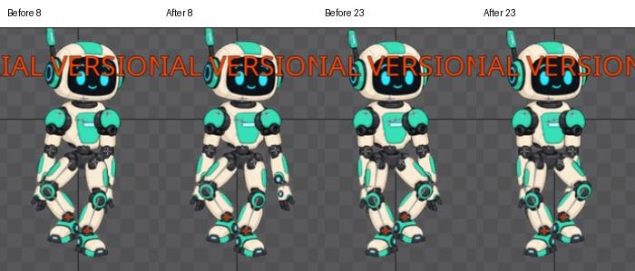

# Bài 38 — kiểm tra và đổi pha tay trong vòng đi

Đã đo hai vai của `walk-in-place`, rồi đổi hai key vai phải để hai tay dịch theo hướng đối nhau tại các mốc chính. Giữ bản chỉnh này trong editor để tiếp tục hoàn thiện dáng. Đây là một vòng sửa có so sánh trước/sau; chưa coi chất lượng đi đã đạt toàn bộ.

## Số đo quyết định thay đổi

Đọc Rotate trong hệ Parent, tránh nhầm 355° ở World với −5° tương đối. Vai phải có Scale X = −1, vai trái = 1; vì vậy cần xem hình sau đổi, không chỉ suy diễn từ dấu góc.

| Frame | Vai trái | Vai phải trước | Vai phải sau |
| --- | --- | --- | --- |
| 0 | −5° | 5° | 5° |
| 8 | −12° | −2° | 12° |
| 15 | −5° | 5° | 5° |
| 23 | 2° | 12° | −2° |
| 30 | −5° | 5° | 5° |

Ban đầu, độ lệch so với góc giữa vòng của cả hai vai cùng là −7° tại 8, +7° tại 23. Đảo hai giá trị vai phải khiến độ lệch hai bên trái dấu tại hai mốc này. Không tăng biên độ: mỗi vai vẫn có khoảng dao động 14° giữa hai key chính.

Ảnh đọc số trước sửa nằm trong `exercises/robot/evidence/walk-arm-audit/left*.jpg` và `right*.jpg`. Ảnh [key phải mới ở 8](../exercises/robot/evidence/walk-arm-audit/right-revised8.jpg), [key phải mới ở 23](../exercises/robot/evidence/walk-arm-audit/right-revised23.jpg) cho thấy giá trị đã được ghi.

## Thao tác thực tế

Chọn xương `upper-arm-right`, bật hệ Parent. Đến frame 8, nhập Rotate 12 rồi bấm nút key Rotate. Đến frame 23, nhập −2 và ghi key. Bỏ chọn xương, giữ camera, chụp lại đủ 0–30. Hai thay đổi này thực hiện trực tiếp trên `walk-in-place`; ảnh và clip bài 37 giữ trạng thái trước sửa để so sánh. Muốn trả hai key về bản trước: 8 = −2°, 23 = 12°.

Tại frame 8, tay phải tách khỏi sườn rõ hơn. Tại frame 23, tay phải vào trong và bị đùi che khá nhiều. Đây là điểm còn cần chỉnh tư thế hoặc xem lại thứ tự che khuất; không tự động coi việc đảo pha là dáng đi tự nhiên hơn trong mọi góc nhìn.

## Kiểm tra sau sửa

Đã xem [31 tư thế sau sửa](../exercises/robot/evidence/walk-arm-audit/revised/contact-sheet.jpg). Vùng nhân vật `(450,71)–(625,325)` của frame 0/30 trùng pixel. Không thấy khớp tay rời ở bộ ảnh này. Chỉ sửa hai key Rotate vai phải; chưa chỉnh key chân, thân hoặc root.

So ảnh phần chân `(450,280)–(625,325)` trước/sau có sai khác màu tối đa 6/255 trên 31 ảnh, nên không ghi nhận là trùng pixel. Ảnh chênh lệch ở hai mốc chính tập trung vào tay phải; sai khác rất nhỏ ở dưới phù hợp với ảnh JPEG, nhưng phép này không thay thế đo tọa độ bàn chân.

Đã bật phát rồi dừng và trả frame 0. Có [clip ghép 5 vòng ở 30 FPS](../exercises/robot/evidence/walk-arm-audit/revised/reconstructed-30fps.mp4), dựng từ 30 ảnh đầu của bộ mới, cùng cách với bài 37. Clip không có âm thanh và không phải export từ Spine.

Còn đánh giá nhịp liên tục, xử lý bàn tay bị che ở pha vào trong, kiểm tra đường cong sau đổi giá trị và thông số event/audio của bản sao. Trial vẫn chưa lưu/xuất project được.
