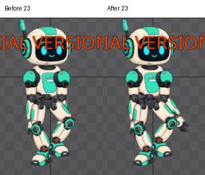

# Bài 39 — làm rõ bàn tay bị đùi che

Đã thêm nhịp gập khuỷu phải vào `walk-in-place` để bàn tay hiện rõ hơn khi chân phải nhấc. Sửa bằng tư thế, không thay thứ tự vẽ. Bộ ảnh 31 frame cho thấy khuỷu trở về thẳng ở cuối vòng và vùng nhân vật đầu/cuối khớp.

## Thử trước khi ghi key

Tại frame 23, `forearm-right` có Rotate Parent = 0°. Thử −20° rồi −35° khi chưa ghi key. Mức −35° đưa bàn tay ra ngoài vùng đùi rõ hơn. Chuyển về frame 0 xác nhận thử chưa ghi key đã trả Rotate về 0°.

Ảnh [trước sửa](../exercises/robot/evidence/walk-hand-clearance/before23.jpg), [thử −20°](../exercises/robot/evidence/walk-hand-clearance/try-minus20.jpg), [thử −35°](../exercises/robot/evidence/walk-hand-clearance/try-minus35.jpg). Việc thay góc giải quyết được độ rõ của bàn tay nên không cần đổi Draw order trong bài này. Chưa kiểm tra toàn bộ thứ tự slot để kết luận nó đúng trong mọi animation.

## Bốn key của khuỷu

| Frame | Rotate Parent |
| --- | --- |
| 0 | 0° |
| 15 | 0° |
| 23 | −35° |
| 30 | 0° |

Ghi các key 0° trước ở 0/15/30, sau đó đặt −35° tại 23 và bấm nút key Rotate. Không chỉnh Setup, vai, chân hoặc root trong lượt này. Bản sửa tiếp tục trực tiếp trên `walk-in-place`; bài 38 giữ ảnh/clip trước thay đổi để đối chiếu.

Mở Graph, kéo cao bảng và bấm Frame để thấy toàn đường. Các key mới đã có đường Bezier với tay nắm ngang tại các mốc; không cần chỉnh thêm tay nắm trong lượt này. [Ảnh Graph](../exercises/robot/evidence/walk-hand-clearance/curve.jpg) cho thấy góc giữ 0 đến 15, giảm mềm xuống −35 ở 23 rồi về 0 ở 30.

Đọc lại Rotate ở các frame sát key:

| Frame | Góc hiển thị |
| --- | --- |
| 16 | −1,625° |
| 22 | −33,321° |
| 24 | −32,922° |
| 29 | −2,147° |

Trong frame đầu pha gập, góc đổi khoảng 1,625°; một frame trước khi về thẳng còn cách 2,147°. Đây là số đo giữa các frame nguyên, không phải vận tốc tức thời ở frame lẻ. Ảnh số đo nằm ở `walk-hand-clearance/value16.jpg`, `value22.jpg`, `value24.jpg`, `value29.jpg`.

## So sánh và kiểm tra

Đã xem [31 tư thế mới](../exercises/robot/evidence/walk-hand-clearance/revised/contact-sheet.jpg). Bàn tay phải hiện rõ hơn trong pha nhấc chân phải; không thấy khuỷu hoặc cổ tay rời trong bộ ảnh này. Còn cần đánh giá cân đối của nhịp gập chỉ một bên với phong cách đi của robot.

So sánh RGB vùng `(450,71)–(625,325)`:

- Frame 0 và 30 của bản mới trùng pixel.
- Frame 0 của bản mới và bản bài 38 trùng pixel.

Đã bật playback, thấy tư thế chuyển sang frame 9 rồi dừng; editor được để ở frame 23 để xem phần vừa sửa. Có [clip ghép 5 vòng](../exercises/robot/evidence/walk-hand-clearance/revised/reconstructed-30fps.mp4) từ ảnh frame 0–29. Metadata đã kiểm tra: 150 frame, 30 FPS, 5 giây. Đây là clip ghép ảnh editor, không có âm thanh và không phải export/runtime.

Bài này xử lý độ rõ của bàn tay và kiểm tra nhịp gập khuỷu. Chưa hoàn tất đánh giá toàn bộ dáng đi, kiểm tra thông số event/audio của bản sao hoặc quy trình lưu/xuất project bị giới hạn bởi Trial.

## Đánh giá toàn thân trong Outline

Ngày 07/09/2026: đã mở Outline và Fit để nhìn toàn bộ robot cao khoảng 560 pixel; kiểm tra walk-in-place tại 0/8/15/23/30. Ảnh vùng nhân vật ở 0/30 trùng pixel. Năm tư thế này chưa thấy khớp rời rõ, nhưng tư thế 15 có hai chân chụm sát; ở 8/23, bàn tay và đầu gối chồng lên nhau làm khó đọc hình. Đây là nhận xét hình thể, không phải kết luận sai pha hay trượt chân.

[Bảng tư thế](../exercises/robot/evidence/full-body-review/contact-sheet.jpg). Không chỉnh key trong lần đánh giá này. Ưu tiên khi sửa tiếp: tạo khoảng tách tay–gối ở tư thế nhấc chân và kiểm tra lại toàn thân ở tốc độ thường.
