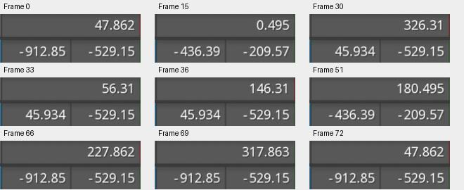

# Bài 41 — Quay đầu khi đi về trên Path

Ngày 07/09/2026, thực hành trực tiếp trong Spine 4.3.25 Trial. Đã tạo rig Path mới và animation `route-turn`: đi đến cuối đường, dừng để quay 180°, trở về, rồi quay tiếp về hướng ban đầu. Đã kiểm tra chín mốc tọa độ/góc và chạy playback. Đây là bài cơ chế điều khiển hướng; chưa phải animation nhân vật hoàn thiện.

## Trạng thái cũ và dựng lại

Project đang mở chỉ còn hai skeleton `mesh-refine` và `skeleton` của robot; `editor-start`/`route-trip` trong bài 10 không còn ở cây hiện tại. Bằng chứng bài 10 là lịch sử thực hành, không phải project có thể tiếp tục sửa ngay. Tạo skeleton thứ ba `path-turnaround` bằng New Skeleton; ẩn robot để làm bài riêng.

Cây mới:

```text
root
├── route (slot → Path)
└── follower
    └── facing
        └── heading (slot → Point)
```

Tạo Path dưới root, ba điểm chính trái thấp–giữa cao–phải thấp, kéo tay nắm ở đỉnh theo phương ngang. UI ghi 7 vertices, Length 1179,28; Constant speed bật, Closed tắt. Đây là đường mới, khác kích thước đường cũ.

Tạo follower dưới root, dài khoảng 175,016; thêm `follow-route` với Path `route`, Target `follower`, Position Percent, Rotate Tangent và các Mix 100. Thêm facing dài khoảng 126,823 dưới follower, Translate trong Parent = 0/0 và Rotate = 0. Point heading ở gốc facing, góc 0.

Theo [Spine User Guide — Path constraints](https://eu.esotericsoftware.com/spine-path-constraints), Tangent lấy hướng của đường tại vị trí xương. Bài này dùng xương con để cộng góc hướng nhìn; Position giảm không tự đảo tiếp tuyến.

## Thử tách vị trí và hướng

Ở Setup, Position = 50. Đọc facing trong World trước/sau khi đổi Rotate trong Parent 0→180:

| Parent Rotate | World Rotate | World X | World Y |
| --- | --- | --- | --- |
| 0° | 0,495° | −436,39 | −209,57 |
| 180° | 180,495° | −436,39 | −209,57 |

Tọa độ không đổi, góc đổi đúng 180°. Trả Parent Rotate = 0 và Position = 0 trước khi tạo animation.

[Ảnh hướng đi](../exercises/path-turnaround/evidence/middle-forward.jpg) · [Ảnh hướng về](../exercises/path-turnaround/evidence/middle-reverse.jpg).

## Key của route-turn

Trong Animate, tạo animation mới và đặt đúng hai loại key: Position của follow-route, Rotate của facing trong hệ Parent. Không key World Rotate để nhập 360°, vì World hiển thị góc theo vòng 0–360°.

| Frame | Position (%) | facing Rotate trong Parent |
| --- | --- | --- |
| 0 | 0 | 0° |
| 30 | 100 | 0° |
| 36 | 100 | 180° |
| 66 | 0 | 180° |
| 72 | 0 | 360° |

Khoảng 30–36 giữ nguyên cuối đường để quay; 66–72 giữ nguyên đầu đường để quay tiếp cùng chiều. Key đặt bằng nút của từng thuộc tính. Không sửa tay nắm Graph trong bài này; không suy ra vận tốc tức thời chỉ từ các mốc.

## Kiểm tra trong editor

Đọc World của facing sau khi chuyển qua từng frame:

| Frame | X | Y | Rotate |
| --- | --- | --- | --- |
| 0 | −912,85 | −529,15 | 47,862° |
| 15 | −436,39 | −209,57 | 0,495° |
| 30 | 45,934 | −529,15 | 326,31° |
| 33 | 45,934 | −529,15 | 56,31° |
| 36 | 45,934 | −529,15 | 146,31° |
| 51 | −436,39 | −209,57 | 180,495° |
| 66 | −912,85 | −529,15 | 227,862° |
| 69 | −912,85 | −529,15 | 317,863° |
| 72 | −912,85 | −529,15 | 47,862° |



Frame 15/51 cùng vị trí, hướng lệch 180°: chiều về đã quay đầu. Hai bộ 30/33/36 và 66/69/72 giữ tọa độ, hướng lần lượt thêm khoảng 90° tại giữa nhịp quay. Các góc World qua 360° được đọc theo modulo; không phải quay ngược tại mốc 0°.

Vùng ảnh đường/xương ở frame 0 và 72, crop `(210,200,610,375)`, trùng pixel RGB. Điều này kiểm tra pose nối vòng tại hai đầu, chưa chứng minh vận tốc qua điểm nối. Các ảnh gốc ở `exercises/path-turnaround/evidence/frameXX.jpg`.

Đã bật playback; [ảnh đang chạy](../exercises/path-turnaround/evidence/playing.jpg) ghi frame 10 và tọa độ/góc khác mốc đầu. Sau đó dừng và trả về frame 0. Dấu xương khá nhỏ và bảng tên che một phần đầu phải khi chọn; chưa dùng bài này để kết luận chất lượng trình bày của nhân vật có hình ảnh.

## Còn thiếu

Cơ chế quay đầu đã kiểm chứng ở các mốc trên. Còn đánh giá nhịp liên tục với vật có hình rõ, kiểm tra Graph/vận tốc ở sát mốc dừng, chuỗi nhiều xương/Spacing và Path deform. Project Trial chưa lưu/xuất; các ảnh và công thức dựng lại không thay thế file project mở lại được.
