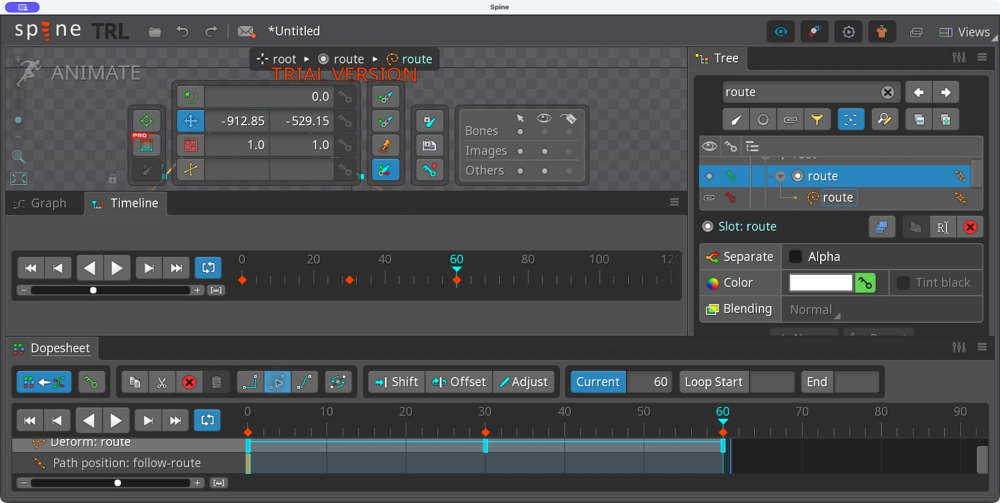
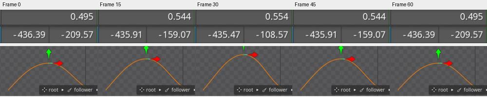

# Bài 42 — Đổi hình Path trong animation

Ngày 07/09/2026, Spine 4.3.25 Trial. Đã tạo `route-deform` trên skeleton `path-turnaround`, giữ Position 50% và nâng phần giữa đường bằng deform. Xương bám đường đổi vị trí theo hình đường; root không di chuyển. Đã đọc năm mẫu trước/sau đổi nội suy, kiểm tra hai đầu vòng và chạy playback.

## Câu hỏi kiểm tra

Position giữ nguyên có làm xương đứng yên không? Dự đoán: không, vì đó là phần trăm chiều dài đường hiện tại. Khi đường đổi hình, điểm tương ứng và góc tiếp tuyến có thể đổi theo.

[Spine User Guide — Paths](https://esotericsoftware.com/spine-paths) cho phép key vị trí đỉnh Path trong Animate. Có thể dùng weights để điều khiển bằng xương; deform phù hợp cho bài nhỏ này để tách riêng ảnh hưởng của hình đường. [Deform keys](https://esotericsoftware.com/spine-keys#Deform-keys) lưu các đỉnh cùng nhau và nội suy vị trí đỉnh theo đường thẳng; thao tác xoay các đỉnh không tạo ra quỹ đạo nội suy tròn.

## Dựng animation riêng

Tạo animation trống `route-deform`, không sao chép key quay đầu. `route-turn` của bài 41 vẫn còn.

1. Đặt key Position = 50% của `follow-route` ở frame 0. Không thêm key Position khác.
2. Chọn attachment Path `route`. Bấm nút key cạnh attachment trong Tree ở frame 0 và 60 để giữ hình gốc.
3. Sang frame 30, chọn nút giữa đường. Thử kéo chỉ chọn được điểm, nên dùng phím dịch lên. Nút giữa và hai tay nắm ngang cùng nâng lên; Length đổi từ 1179,28 sang 1304,1. Bấm nút key cạnh attachment để giữ deform.
4. Chuyển qua 0/30/60 để xác nhận hình đã được lưu thành key.
5. Trong Dopesheet, chọn ba key Deform: route và đổi sang Linear. Hàng Path position chỉ có một key 50% ở frame 0.

Các phím nâng đỉnh được nhập theo lượt, không dùng số lần nhấn làm bằng chứng duy nhất cho biên độ. Kết quả được đo lại bên dưới. Các thao tác này ở Animate, không sửa hình Setup.

## Lỗi nhập số đã gặp

Ô Position nhận thành 500% thay vì 50%. Follower chạy ra ngoài đường và có tọa độ khoảng X = 3970,8; Y = −3145,7. Khi thấy xương biến mất, kiểm tra lại thuộc tính trước khi sửa rig. Đã sửa key frame 0 về 50 và chuyển tới frame 60 để đọc lại [giá trị giữ nguyên](../exercises/path-turnaround/evidence/deform/position-fixed60.jpg).

Đây là lỗi nhập liệu thực tế, không phải lỗi được cố ý tạo. Path mở cho phép Position vượt ngoài đoạn 0–100%; đừng giả định thanh trượt sẽ giới hạn mọi giá trị gõ vào.

## Kết quả đo

Đọc World của `facing`, xương con đặt ở gốc follower và không có key riêng trong animation này:

| Frame | X | Y | Góc |
| --- | --- | --- | --- |
| 0 | −436,39 | −209,57 | 0,495° |
| 15 | −435,91 | −159,07 | 0,544° |
| 30 | −435,47 | −108,57 | 0,554° |
| 45 | −435,91 | −159,07 | 0,544° |
| 60 | −436,39 | −209,57 | 0,495° |

Y tại đỉnh nhịp tăng 101 đơn vị; frame 15/45 tăng 50,5 đơn vị so với hình gốc. X và góc cũng thay đổi một chút. Suy luận từ cách Position Percent hoạt động: khi độ dài/hình đường thay đổi, điểm 50% được tính lại, nên không nên coi nó là điểm giữa hình học cố định.

Trước khi chuyển sang Linear, Dopesheet cho thấy Bezier được chọn và Y tại frame 15/45 chỉ tăng 22,1 đơn vị. [Bảng trước chỉnh](../exercises/path-turnaround/evidence/deform/facing-values.jpg) giúp phân biệt hình của key với nhịp nội suy. Linear ở đây dùng để đo rõ cơ chế; đổi chiều tại 30 không phải mẫu chuyển động mềm để áp dụng nguyên xi lên nhân vật.

Root tại frame 0 và 30 đều có World Rotate = 0°, Translate = 0/0, Scale = 1/1. [Ảnh root ở đỉnh nhịp](../exercises/path-turnaround/evidence/deform/root30.jpg) xác nhận thay đổi đang xét không đến từ việc kéo cả skeleton.

## Kiểm tra giữ lại và giới hạn

Ảnh `linear00.jpg` và `linear60.jpg`, vùng `(220,175,580,320)`, trùng pixel RGB. Đã bật playback và [ghi trạng thái đang chạy](../exercises/path-turnaround/evidence/deform/playing.jpg). Sau đó dừng, trả về frame 0; root đang được chọn.

Đã chuyển về `route-turn` và chọn đúng frame 30: World của facing vẫn là X 45,934; Y −529,15; góc 326,31°, khớp bài 41. [Ảnh đối chiếu](../exercises/path-turnaround/evidence/deform/route-turn-unchanged30.jpg). Đây là kiểm tra một tư thế của bản cũ, không phải kiểm tra lại toàn bộ animation.

Bảng số liệu máy đọc được ở [review.json](../exercises/path-turnaround/evidence/deform/review.json); đó là số chép từ giao diện, không phải JSON export. Chỉ lấy năm mẫu mỗi kiểu nội suy, chưa quét toàn bộ frame hay đo vận tốc liên tục. Còn thực hành Path bằng weights, chuỗi nhiều xương/Spacing và ứng dụng lên hình nhân vật. Project Trial vẫn chưa lưu/xuất.
