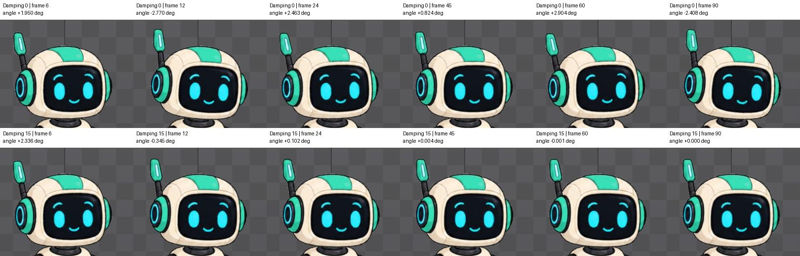

# Bài 43 — Physics trên đầu robot và giảm rung sau khi thân dừng

Ngày 07/09/2026, Spine 4.3.25 Trial. Bài thực hành trên rig robot dựng tay, skin mint.

## Kết quả

Đã tạo animation `head-settle`: thân hạ khoảng 12 đơn vị trong 6 frame, sau đó giữ tư thế đến frame 90. Đầu không có key xoay trong bài này; Physics tạo góc trễ rồi rung về tư thế nghỉ. Với Damping 0, đầu vẫn dao động rõ ở các mẫu muộn. Với Damping 15, các mẫu 45/60/90 đã gần 0°. Giữ Damping 15 làm cấu hình cuối.

Đây là động tác hạ thân rồi nghỉ, không phải vòng lặp. Không dùng nó để kết luận Physics nối vòng đã đạt.

## Dựng trong editor

1. Trong Setup, chọn xương `head`, đổi Length từ 0 thành 100. Không đổi góc, vị trí hay ảnh của đầu. Chọn New → Physics Constraint; constraint lấy tên `head`.
2. Giữ Rotation 100; Translate X/Y, Scale X và Shear X đều 0; Limit 5000. Đổi FPS từ 20 thành 60. Inertia 50, Strength 100, Mass 100, Wind/Gravity 0.
3. Trong Setup, đặt Mix 0. Vào Animate, tạo animation trống `head-settle`.
4. Chọn body, đặt Translate key ở 0/6/90. X hiển thị −0,5 ở cả ba mốc; Y lần lượt 2,5 / −9,5 / −9,5. Key đầu lấy tư thế có sẵn; khi focus ô Y, số có thêm chữ số thập phân (2,50005), nên bảng là giá trị hiển thị rút gọn, không phải dữ liệu xuất chính xác.
5. Chọn constraint `head` bằng biểu tượng Physics ở hàng xương. Tại frame 0, đặt Mix 100 và bấm chìa khóa để tạo key. Bật Deterministic khi đo.
6. Đo bản Damping 15 ban đầu; sau đó tạo key Damping 0 ở frame 0, đo lại. Cuối cùng thay key này thành 15 và kiểm tra khôi phục. Không tạo key xoay cho đầu.

[Chiều dài xương](../exercises/robot/evidence/head-physics/head-length100.png), [Setup constraint](../exercises/robot/evidence/head-physics/constraint-setup.png), [Mix mặc định](../exercises/robot/evidence/head-physics/setup-mix0.png), [key thân 6](../exercises/robot/evidence/head-physics/body-06.png), [key thân 90](../exercises/robot/evidence/head-physics/body-90.png).

Nguồn cơ chế: [Physics constraints — Spine User Guide](https://esotericsoftware.com/spine-physics-constraints). Length 0 không dùng được cho Physics Rotation. Damping giảm dao động; Deterministic tính lại từ đầu để việc tua tới cùng frame cho kết quả nhất quán. Các thuộc tính như Mix và Damping có thể đặt key, nên thay đổi tạm chưa đặt key không phải cấu hình được giữ xuyên animation.

## Đo tại cùng frame

Góc đọc từ trường Rotate của xương head khi constraint đang được chọn. Quy đổi góc gần 360° sang số âm để dễ so sánh với tư thế nghỉ 0°; ví dụ 357,230° là −2,770°.

| Frame | Damping 0 | Damping 15 |
| --- | ---: | ---: |
| 0 | 0° | 0° |
| 6 | +1,950° | +2,336° |
| 12 | −2,770° | −0,345° |
| 24 | +2,463° | +0,102° |
| 45 | +0,824° | +0,004° |
| 60 | +2,904° | −0,001° |
| 90 | −2,408° | 0° |

Tọa độ đầu tại các mẫu từ 6 đến 90 giữ X/Y = −0,5 / 70,5 theo số hiển thị. Tác động đang thử là góc đầu sau khi thân đã dừng. Damping 15 không có góc nhỏ hơn ở mọi frame: ngay frame 6 nó lớn hơn Damping 0. Phải nhìn chuỗi thời gian, không kết luận từ một ảnh.

Các mẫu này cho thấy khác biệt về rung kéo dài và giảm rung; chưa đủ để đo thời điểm tắt rung chính xác hoặc toàn bộ đường bao biên độ. Không tuyên bố frame 45 là mốc hết rung tuyệt đối.

## Thử Mix và kiểm tra khôi phục

Ở frame 6 với Damping 15, tạm đổi Mix từ 100 xuống 0, không đặt key: góc đầu từ 2,336° về 0°. Tua về 0 rồi trở lại 6: key Mix 100 áp dụng lại và góc 2,336° trở lại. [Mix 0](../exercises/robot/evidence/head-physics/mix0-06.png).

Vùng robot trong Outline trùng pixel ở các đối chiếu:

- Damping 15 frame 6 trước và sau thử Damping 0.
- Damping 15 frame 6 trước và sau thử Mix 0.
- Damping 15 frame 90 trước và sau khôi phục.
- Idle cũ frame 0 trước và sau thêm constraint có Setup Mix 0.

Đối chiếu idle chỉ xác nhận tư thế frame 0 đã kiểm tra, không thay cho kiểm tra mọi animation. [Báo cáo số đo](../exercises/robot/evidence/head-physics/review.json) là bản chép số từ giao diện, không phải export.

## Playback và giới hạn

Tắt Loop và Deterministic rồi phát. Đã ghi nhận playback ở frame 10; lần xem sau playhead đi tới 335 và góc đầu hiển thị 0°. Trong phiên này, tắt Loop vẫn cho playhead chạy vượt key cuối 90; đã bấm dừng rồi bật lại Deterministic để đo. Hai ảnh xác nhận mô phỏng chạy và trở về tư thế nghỉ, không phải đánh giá video liên tục.

Không thấy cổ hở rõ trong các tư thế đã xem. Việc chọn 15 phù hợp với kích thích nhỏ của bài này; chuyển động mạnh hơn hoặc thay Length/FPS cần đánh giá lại. Chưa thực hành Wind/Gravity, Physics nhiều tầng hoặc nối vòng trên nhân vật. Trial chưa lưu/xuất được project.
