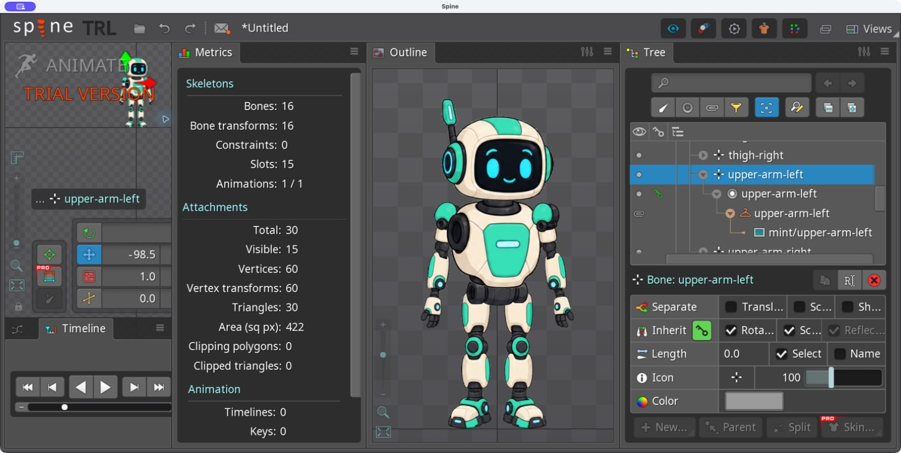

# Bài 44 — Nhập PSD nhiều lớp vào Spine

Ngày 07/09/2026, Spine 4.3.25 Trial.

## Kết quả

Đã nhập `robot-layers.psd` vào project đang mở, tạo skeleton riêng `robot-layers`. Spine ghi đủ 15 PNG trong thư mục `imported-images/mint`, tạo 16 xương gồm root, 15 slot và hiển thị đủ 15 ảnh. Tọa độ đầu và cánh tay đã được đối chiếu với lớp PSD. Cả 15 ảnh đầu ra khớp màu tại pixel có alpha khác 0, khớp toàn bộ alpha và đúng kích thước sau Trim/Padding.



Bộ xương được tạo tự động nằm ở tâm ảnh, chưa có quan hệ cha/con theo khớp. Đây là bài nhập tài nguyên, không phải rig hoàn thiện thay cho robot dựng tay.

## Chuẩn bị PSD

[File PSD](../exercises/robot/psd-import/robot-layers.psd) dùng 15 PNG mint đã có; không sinh thêm artwork. [Script đóng gói](../exercises/robot/psd-import/build_psd.py) dùng bố cục Setup trong `robot-editor-4.3.json` để đặt ảnh trên canvas 640 × 800. Do đó hình tham chiếu này khác bố cục robot dựng tay ở các bài gần đây.

Mỗi lớp mang tên dạng:

```text
head [bone:head] [slot:head] [skin:mint]
upper-arm-left [bone:upper-arm-left] [slot:upper-arm-left] [skin:mint]
```

Thêm lớp 2 × 2 pixel tên `origin [origin]`, tâm tại (320, 750). Lớp này làm dấu gốc, không dùng làm ảnh nhân vật. PSD có 16 lớp; 15 lớp là bộ phận robot.

[Ảnh bố cục trước nhập](../exercises/robot/psd-import/expected-layout.png), [thông tin từng lớp](../exercises/robot/psd-import/layer-manifest.json). PSD được ghi và mở lại bằng psd-tools 1.11.0 trước khi nhập; việc đó chỉ kiểm tra file đầu vào. Thành công trong Spine được kiểm tra riêng phía dưới.

## Thao tác trong Spine

1. Mở menu Spine → Import PSD, chọn file trên.
2. Scale 1, Padding 1, Trim whitespace bật. Đặt thư mục đầu ra riêng `exercises/robot/psd-import/imported-images`.
3. Bỏ chọn New project; tên skeleton mới là `robot-layers`. Giữ Overwrite/delete confirmation bật và Delete previously imported images tắt. Thư mục đầu ra chưa có ảnh trước lần nhập này.
4. Bấm Import. Sau khi nhập, cả skeleton mới lẫn robot cũ cùng hiển thị nên chồng lên nhau; ẩn skeleton robot cũ và Fit trong Outline để xem riêng bản nhập.
5. Mở cây root, chọn từng xương để đọc vị trí; mở slot cánh tay để xác nhận placeholder `upper-arm-left` chứa region `mint/upper-arm-left`.

[Thiết lập nhập](../exercises/robot/psd-import/evidence/import-options.png), [skeleton mới](../exercises/robot/psd-import/evidence/imported-skeleton.png), [cây xương](../exercises/robot/psd-import/evidence/imported-bones.png), [slot/placeholder/region](../exercises/robot/psd-import/evidence/slot-placeholder-region.png).

Nguồn: [Import PSD — Spine User Guide](https://esotericsoftware.com/spine-import-psd). Tên lớp có thể điều khiển việc tạo xương, slot và skin; tag origin đặt gốc tọa độ. Trim bỏ vùng trong suốt, Padding thêm viền ảnh. Khi dùng tag bone, cần kiểm tra vị trí xương thay vì mặc định rằng nó đã nằm ở khớp mong muốn.

## Kiểm chứng vị trí và ảnh

Công thức đối chiếu tâm ảnh sau cắt khoảng trống: X = tâm theo chiều ngang − 320; Y = 750 − tâm theo chiều dọc.

| Mẫu | Dự đoán từ PSD sau Trim | Số đọc trong editor |
| --- | --- | --- |
| head | X 1, Y 565,5 | X 1, Y 565,5 |
| upper-arm-left | X −98,5, Y 408,5 | X −98,5, Y 408,5 |

Cánh tay là trường hợp cần chú ý: tâm toàn bộ hình chữ nhật lớp là −102 / 407,5, nhưng vùng alpha sau cắt có tâm −98,5 / 408,5. Editor khớp tâm vùng sau cắt. Không dùng tâm hình chữ nhật trước Trim để kết luận Spine đặt lệch ảnh.

[Đầu](../exercises/robot/psd-import/evidence/head-center.png), [cánh tay](../exercises/robot/psd-import/evidence/arm-center.png).

[Script kiểm tra đầu ra](../exercises/robot/psd-import/verify_import.py) đọc các PNG **do Spine ghi ra**, so với dữ liệu pixel của PSD:

- Đủ 15 file, không có PNG của dấu origin.
- Kích thước từng file bằng khung alpha đã cắt cộng 2 pixel mỗi chiều, tương ứng viền 1 pixel mỗi bên.
- Alpha khớp toàn bộ; RGB khớp tại mọi pixel có alpha khác 0.

Kết quả: [import-checks.json](../exercises/robot/psd-import/import-checks.json), kiểm tra đã PASS. Ví dụ ảnh đầu 226 × 207 thành 228 × 209; cánh tay trái sau cắt 63 × 107 thành 65 × 109.

[Metrics](../exercises/robot/psd-import/evidence/metrics.png) xác nhận 16 xương, 15 slot, 0 constraint, 15 attachment đang hiển thị và 0 key. Cây xương cũng cho thấy các bộ phận cùng nằm dưới root.

## Phạm vi đã đạt

Đã thực hành nhập PSD mới, tag bone/slot/skin/origin, thư mục ảnh đầu ra, Trim/Padding và đối chiếu ảnh/tọa độ. Chưa thực hành nhập lại PSD để cập nhật rig đã sửa, nhóm lớp lồng nhau, layer effects hoặc các chế độ hòa trộn khác.

PNG được tạo qua Import PSD là tài nguyên nhập; kết quả này không thay cho việc lưu project và xuất animation từ editor. Mốc lưu/xuất trong kế hoạch vẫn chưa đạt với Trial.
