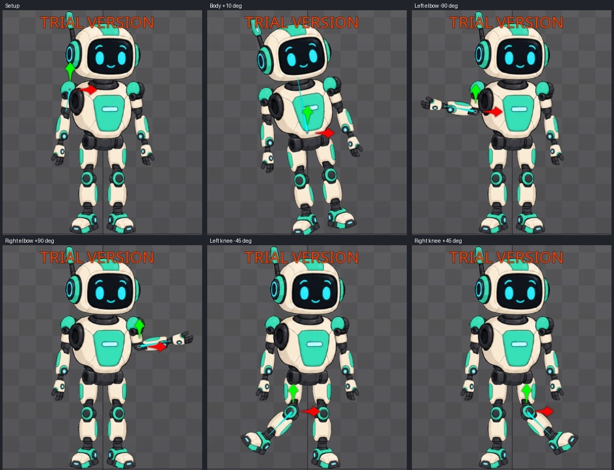

# Bài 45 — Từ PSD nhập vào đến rig có khớp

07/09/2026, Spine 4.3.25 Trial. Tiếp nối [bài 44](044-editor-import-psd.md), trên skeleton `robot-layers`.

## Kết quả

Đã đặt lại điểm xoay, hướng và chiều dài của 15 xương bộ phận ngay trong editor; nối chúng thành cây thân–đầu–tay–chân. Thử xoay thân 10°, gập từng khuỷu 90° và từng gối 45°. Bàn tay/bàn chân đi theo đúng nhánh; tại năm tư thế thử chưa thấy khớp tách rời rõ. Đã trả mọi góc thử về Setup ban đầu.



Đây là rig FK: tạo dáng bằng cách xoay từng xương. Chưa thêm IK hoặc animation cho bản PSD này; robot dựng tay của các bài trước là skeleton khác.

## Vấn đề cần sửa

Import PSD đã tạo xương ở tâm vùng ảnh sau Trim, tất cả nằm dưới root. Ví dụ cẳng tay trái ban đầu ở (−119,5; 323,5), còn khớp khuỷu cần đặt ở (−109,6; 368). Xoay xương tại tâm ảnh sẽ làm phần cẳng tay quay quanh chỗ không phải khuỷu; bàn tay cũng chưa đi theo vì đang là nhánh độc lập.

## Thao tác có thể dựng lại

1. Chuyển Setup, chọn xương bằng tên trong Tree. Kiểm tra tên xương và skeleton đang hiển thị trước khi sửa.
2. Chọn World axes, bật Images compensation. Nhập X/Y, góc và Length theo [bảng rig](../exercises/robot/psd-import/rig-plan.json). Sau mỗi xương, đọc lại số và kiểm tra ảnh vẫn nằm nguyên chỗ. Ảnh bằng chứng từng xương ở `rig-evidence/*-pivot.png`.
3. Tắt Images compensation sau khi đặt xong các điểm xoay.
4. Chọn xương con, bấm Parent rồi chọn xương cha. Kiểm tra đường dẫn xương trên viewport sau thao tác. Các ảnh `*-parent.png` ghi lại quan hệ đã tạo.
5. Thử lần lượt các góc ở bảng dưới; mỗi lần trả về góc gốc trước khi thử xương khác. Không bật compensation khi thử chuyển động.

Nguồn thao tác: [Tools — Spine User Guide](https://esotericsoftware.com/spine-tools). Images compensation bù biến đổi của ảnh khi chỉnh xương, giúp đổi điểm xoay mà giữ bố cục. World axes cho phép nhập vị trí/góc theo cùng hệ tọa độ trước khi thiết lập cha–con.

Cây đã dựng:

```text
root → body
         ├─ head
         ├─ upper-arm-left  → forearm-left  → hand-left
         ├─ upper-arm-right → forearm-right → hand-right
         └─ pelvis
              ├─ thigh-left  → shin-left  → foot-left
              └─ thigh-right → shin-right → foot-right
```

Bảng rig là số liệu được chuẩn bị rồi áp dụng và đọc lại trong UI, không phải dữ liệu xuất từ editor. Tọa độ dựa trên bố cục nguồn PSD, làm tròn đến 0,1 đơn vị. Chiều dài cẳng chân được đặt 101 vì gối Y = 174 và cổ chân Y = 73; không dùng chiều dài 107 từ rig nguồn có mục tiêu IK riêng.

## Các phép thử đã thực hiện

Tất cả góc dưới đây là World trong Setup; phép thử thay đổi từng xương một.

| Xương | Góc gốc → góc thử | Quan sát |
| --- | --- | --- |
| body | 90 → 100 | Đầu, hai tay, hông và hai chân cùng nghiêng |
| forearm-left | 260 → 170 | Cẳng tay và bàn tay trái cùng quay quanh khuỷu |
| forearm-right | 280 → 10 | Cẳng tay và bàn tay phải cùng quay quanh khuỷu |
| shin-left | 270 → 225 | Cẳng chân và bàn chân trái đi theo gối |
| shin-right | 270 → 315 | Cẳng chân và bàn chân phải đi theo gối |

[Ảnh sau khôi phục](../exercises/robot/psd-import/rig-evidence/final.png) và [kết quả so ảnh](../exercises/robot/psd-import/rig-outline-check.json): vùng toàn robot trong Outline, tọa độ ảnh chụp (700,145)–(980,730), trùng từng pixel với bài 44 trước chỉnh rig. Vùng này bao gồm anten và hai bàn chân, loại con trỏ ở mép phải. Phép so này chứng minh bố cục chuẩn được giữ; không chứng minh chất lượng ở mọi góc hoặc khi phát animation.

## Lỗi nhập số đã xử lý

Khi thử đặt Length, chọn bằng ba lần bấm chỉ chọn phần sau dấu thập phân, khiến 96 thành 0,96. Đã sửa bằng cách đặt con trỏ trong ô, kéo chọn toàn bộ số từ phải sang trái, nhập lại và đọc kết quả 96,0. Sau đó dùng cùng cách cho các chiều dài khác; vai trái cũng được kiểm tra lại là 67,0.

## Còn thiếu

Chưa thử toàn bộ biên độ của vai, hông, cổ tay và cổ chân; chưa có animation hay kiểm tra chuyển động liên tục cho bản PSD. Rig đang có trong project mở nhưng Trial chưa lưu được project. Ảnh, bảng thông số và hướng dẫn dựng lại không thay cho project mở lại được. Bài này hoàn thành bước dựng rig cơ bản sau nhập PSD, chưa hoàn thành toàn bộ kế hoạch.
