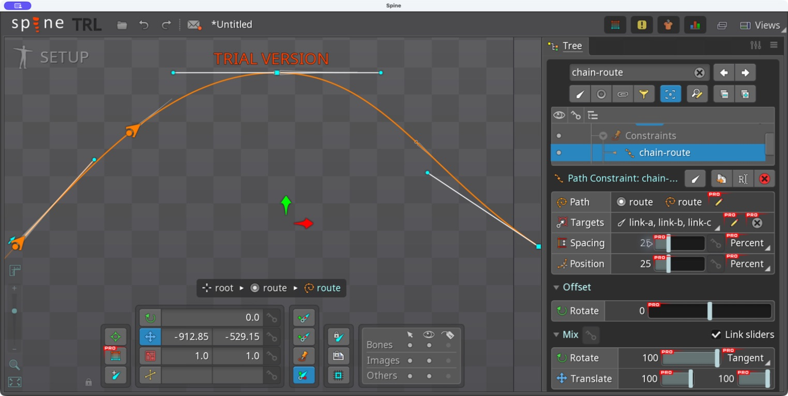
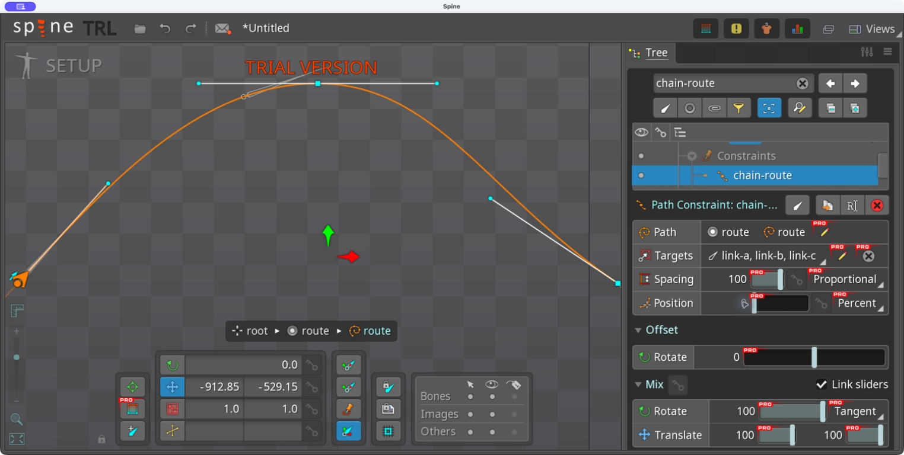

# Bài 46 — Khoảng cách nhiều xương trên Path

07/09/2026, Spine 4.3.25 Trial. Thực hành trên skeleton `path-turnaround` của bài 41–42.

Đã tạo constraint `chain-route` với ba xương dài 100, 150 và 80; thử đủ Fixed, Length, Percent và Proportional trong Setup. Cùng điểm xuất phát, Fixed 100 và Length 0 đặt hai xương đầu trùng nhau nhưng xương thứ ba khác vị trí. Percent 25 chia đều theo chiều dài đường, còn Proportional 100 trải các gốc xương từ đầu tới cuối trong cấu hình Tangent đang thử.

## Dựng lại trong editor

1. Hiện skeleton `path-turnaround`, chuyển Setup. Tạo ba xương `link-a`, `link-b`, `link-c`, cùng là con trực tiếp của root, Length lần lượt 100/150/80. Không cần gắn ảnh.
2. Chọn ba xương theo thứ tự a/b/c, New → Path Constraint, chọn đường `route`, đặt tên `chain-route`. Đọc lại thứ tự Targets.
3. Đặt Rotate mode Tangent, Rotate Mix 100, Translate X/Y Mix 100, Rotate Offset 0. Position dùng Percent.
4. Lần lượt nhập bốn bộ thông số trong bảng. Sau mỗi bộ, chọn từng xương, bật World axes và đọc X/Y/góc/Scale. Không chỉ nhìn hình đường để kết luận.

Theo [Spine User Guide](https://esotericsoftware.com/spine-path-constraints): Fixed dùng khoảng cách cố định; Length cộng Spacing vào chiều dài xương trước; Percent dùng phần trăm chiều dài toàn đường; Proportional phân bố theo tỉ lệ chiều dài xương và trải toàn đường ở 100. Tangent xoay theo tiếp tuyến nên đầu nhọn xương không nhất thiết nằm trên đường.

## Số đo trực tiếp

Tọa độ World dưới đây là số đã làm tròn trên giao diện, không phải dữ liệu export. Cả ba xương vẫn có Scale X/Y = 1 trong các mẫu.

| Spacing | Position (%) | Gốc a (X; Y) | Gốc b (X; Y) | Gốc c (X; Y) |
|---|---:|---|---|---|
| Fixed 100 | 25 | −704,08; −320,28 | −621,72; −263,33 | −530,12; −223,60 |
| Length 0 | 25 | −704,08; −320,28 | −621,72; −263,33 | −481,24; −212,95 |
| Percent 25 | 25 | −704,08; −320,28 | −436,39; −209,57 | −178,56; −336,86 |
| Proportional 100 | 0 | −912,85; −529,15 | −552,08; −230,77 | 45,934; −529,15 |

[Bảng đầy đủ và góc](../exercises/path-turnaround/spacing-readback.json). Mỗi cấu hình có ảnh thông số và ảnh riêng từng xương trong [thư mục bằng chứng](../exercises/path-turnaround/spacing-evidence).

- Fixed 100 so với Length 0: a/b trùng cả tọa độ lẫn góc vì xương a dài 100. Gốc c dịch thêm trên đường khi tính chiều dài b = 150. Đây là khác biệt quan sát được khi chỉ đổi cách tính Spacing.
- Percent 25, Position 25: a giữ nguyên, b lên gần đỉnh đường, c sang sườn phải. Góc lần lượt 38,817° / 0,495° / 317,207°.
- Proportional 100, Position 0: a ở đầu đường, c ở cuối; b nằm phía trước đỉnh. Cấu hình này dùng hai khoảng giữa ba gốc xương, nên không suy diễn ba khoảng đều nhau hoặc lấy tổng 100+150+80 để đo vị trí gốc c.

## Lỗi thao tác và giới hạn

Nhập số bằng kéo chọn từ vùng trống của ô Position có lần không đổi giá trị. Cách thành công trong bài: bấm ba lần ngay phần chữ số, nhập số nguyên, Enter, đọc lại trường và tọa độ xương. Không coi gõ phím là bằng chứng đã đổi thông số.

Bài này chỉ kiểm tra Spacing trong Setup với Tangent. Chưa thử Chain/Chain Scale, Path weights, đường đóng hoặc key Spacing. Constraint `follow-route` và các animation cũ không được chỉnh trong bài; chưa chạy lại chúng sau khi thêm ba xương. Trạng thái cuối là Proportional 100, Position 0. Thao tác nằm trong project Trial đang mở; ảnh và bảng ghi được lưu riêng, chưa có file project đã lưu/xuất.
