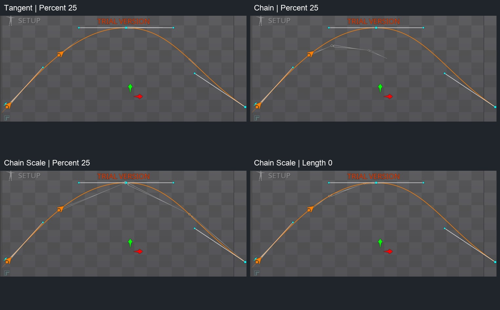

# Bài 47 — Chain và Chain Scale trên Path

07/09/2026, Spine 4.3.25 Trial. Tiếp nối ba xương của [bài 46](046-editor-path-spacing.md).

Đã thử Tangent → Chain → Chain Scale với cùng Spacing Percent 25, Position Percent 25. Chain giữ chiều dài và nối các đoạn nhưng các khớp lệch khỏi đường. Chain Scale giữ các gốc xương ở những điểm lấy mẫu trên đường, kéo dài xương để đầu đoạn chạm đoạn tiếp theo. Đổi Spacing sang Length 0 làm mức giãn giảm về gần 1 trong mẫu này.

## Cấu hình và cách làm lại

Skeleton `path-turnaround`; constraint `chain-route`; Targets theo thứ tự `link-a`, `link-b`, `link-c`. Cả ba cùng là con trực tiếp của root, Length 100/150/80, không shear. Thực hành trong Setup, Rotate Offset 0, Rotate/Translate Mix đều 100.

1. Đặt Spacing Percent 25 và Position Percent 25. Chọn Tangent ở menu bên phải Rotate Mix, quan sát ba xương rời nhau.
2. Đổi riêng menu đó sang Chain. Chọn từng xương và đọc World X/Y, góc, Scale. Các gốc b/c dịch khỏi điểm lấy mẫu ban đầu; hình các đoạn nối nhau.
3. Đổi sang Chain Scale. Đọc lại ba xương: gốc b/c trở về vị trí Tangent, Scale X tăng rõ; Scale Y vẫn 1.
4. Giữ Chain Scale, đổi Spacing sang Length và nhập 0. Đọc lại cả ba xương; Scale X gần 1. Position vẫn 25%.

Theo [Spine User Guide](https://esotericsoftware.com/spine-path-constraints), Tangent hướng theo tiếp tuyến; Chain nối đoạn và giữ chiều dài; Chain Scale chỉnh chiều dài để đầu đoạn đến điểm tiếp theo trên Path. Với Chain Scale, các xương nên cùng cha hoặc xương đầu là cha của những xương còn lại. Chain với Rotate Offset khác 0 không áp dụng phần dịch chuyển nối đoạn. Bài này chỉ thử Offset 0.

## Bằng chứng đo được

Tất cả giá trị đọc trực tiếp từ giao diện World. Scale Y = 1 ở chín mẫu mới. Tạo lại bảng tính và ảnh ghép bằng `python3 scripts/report_path_chain.py` (cần Pillow). Script dùng số đọc tay, không điều khiển Spine. Tọa độ/góc đầy đủ và phép tính chỗ nối ở [chain-readback.json](../exercises/path-turnaround/chain-readback.json).

| Cấu hình | Scale X a / b / c | Gốc b (X; Y) | Gốc c (X; Y) |
|---|---|---|---|
| Tangent, Percent 25 — bài 46 | 1 / 1 / 1 | −436,39; −209,57 | −178,56; −336,86 |
| Chain, Percent 25 | 1 / 1 / 1 | −611,67; −282,06 | −462,86; −300,89 |
| Chain Scale, Percent 25 | 2,8968 / 1,917 / 3,695 | −436,39; −209,57 | −178,56; −336,86 |
| Chain Scale, Length 0 | 1,0013 / 0,995 / 1,009 | −621,72; −263,33 | −481,24; −212,95 |

Gốc a giữ (−704,08; −320,28) ở cả bốn cấu hình. Với Percent 25, Chain và Chain Scale cùng góc a = 22,47°, nhưng khác chiều dài và vị trí các đoạn sau.

Để kiểm tra nối đoạn, tính đầu nhọn từ tọa độ World + Length × Scale X × hướng góc, rồi so với gốc xương kế tiếp. Sai khác tối đa từ số hiển thị là 0,0057 đơn vị ở Chain và 0,0106 ở Chain Scale Percent. Đầu đoạn c của Chain Scale Percent cách điểm cuối Path đã đo ở bài 46 khoảng 0,0109. Đây là tính toán từ số đã làm tròn, không phải phép đo sai số solver chính xác. Hình editor cũng cho thấy các đoạn tiếp xúc.

Với Length 0, sai khác chỗ nối tính từ số hiển thị tối đa 0,0126; Scale X nằm trong 0,995–1,009. Vì vậy nếu muốn chuỗi ít thay đổi kích thước ở đường này, Length 0 phù hợp hơn Percent 25. Không suy rộng thành Scale luôn bằng hoặc nhỏ hơn 1: mẫu a/c thực tế lớn hơn 1 một chút.

## Phần còn thiếu

Đã kiểm chứng thao tác ba chế độ và ảnh hưởng của Spacing trên xương trần ở một vị trí. Chưa gắn mesh thành dây, chưa kiểm tra toàn hành trình, đường đóng, Offset khác 0 hoặc Mix trung gian. Cần kiểm tra các trường hợp đó trước khi dùng làm rig dây hoàn chỉnh.

Trạng thái cuối: Chain Scale, Length 0, Position Percent 25 trong Setup; chọn link-c. Không chỉnh constraint `follow-route` hoặc animation cũ. Ảnh gốc nằm trong `chain-evidence`; ảnh so sánh chỉ cắt/ghép ảnh chụp. Project vẫn nằm trong phiên Trial chưa lưu/xuất.
