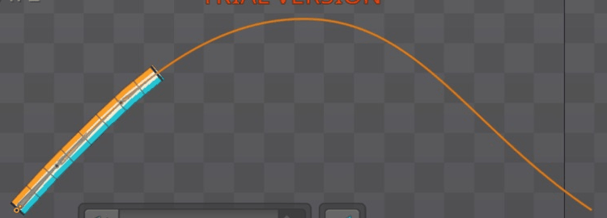
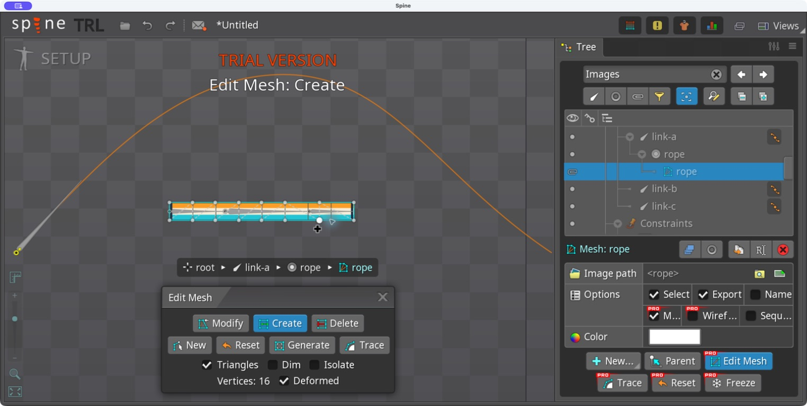

# Bài 48 — Mesh dây chạy theo Path

07/09/2026, Spine 4.3.25 Trial. Tiếp nối chuỗi xương ở [bài 47](047-editor-path-chain.md).

Đã tạo mesh dây 16 đỉnh trong editor, bind vào ba xương và tạo `rope-travel` đi–về trong 60 frame. Đã xem 31 tư thế cách nhau hai frame và bật playback có Loop. Ảnh dây ở frame 0/60 trùng pixel trong vùng kiểm tra. Dải không rách/tách đoạn ở các mẫu; đường viền gần đỉnh còn hơi gấp, chưa coi đây là dây mềm hoàn thiện.

GIF gồm 30 ảnh lấy mẫu, dựng lại thời lượng hai giây; không phải file xuất từ Spine hoặc video quay playback liên tục. [Bảng 31 tư thế](../exercises/path-turnaround/rope-evidence/poses.jpg) và [kết quả kiểm tra](../exercises/path-turnaround/rope-evidence/review.json).

## Chuẩn bị ảnh và tư thế bind

Ảnh `images/rope.png` là bản thu đổi kích thước 330×32 từ `exercises/mesh-lab/strip.png`, dùng Pillow/Lanczos. Đây là dải kiểm tra màu và ô lưới có sẵn của bài mesh, không phải ảnh dây vật liệu thật. Các đường kẻ giúp nhìn thấy ảnh bị kéo hoặc gấp.

Trong Setup, tạm đưa Rotate/Translate Mix của `chain-route` về 0. Căn ba xương thành một hàng nối đầu–đuôi, cùng là con trực tiếp của root:

| Xương | World X | World Y | Rotate | Length | Scale |
|---|---:|---:|---:|---:|---|
| link-a | −637,91 | −454,97 | 0 | 100 | 1/1 |
| link-b | −537,91 | −454,97 | 0 | 150 | 1/1 |
| link-c | −387,91 | −454,97 | 0 | 80 | 1/1 |

Bài này đã thay vị trí Setup của b/c so với bài 46–47 khi Mix = 0. Vị trí ép theo Path ở Mix = 100 do constraint quyết định.

Chọn Images của skeleton `path-turnaround`, nhập đường dẫn tuyệt đối đến `exercises/path-turnaround/images/`. Chọn file rope → Parent → link-a, tạo slot rope. Ảnh ban đầu nằm giữa gốc a; đặt World X của attachment = −472,91, Y = −454,97 để mép trái ở gốc a và mép phải ở đầu c.

## Tạo mesh và bind

Bật Mesh → Edit Mesh. Thêm các cặp đỉnh dọc mép trên/dưới, giữ hình chữ nhật. Kết quả thực tế là **16 đỉnh, tám cột**, không phải 18 đỉnh dự kiến: hai lượt bấm gần phía phải đã dịch đỉnh có sẵn thay vì tạo cột mới. Đọc số Vertices và xem hình lưới trước khi tiếp tục. Khoảng cột phía phải chưa đều.

Mở Views → Weights; Bind lần lượt link-a/b/c, thoát Bind. Bấm Auto, chờ hộp tính toán đóng. Đóng bảng bằng menu góc phải → Close; phím tắt thử trong lúc ô tìm kiếm giữ focus không đóng bảng.

Theo [Weights — Spine User Guide](https://esotericsoftware.com/spine-weights), bind lưu vị trí đỉnh tương đối với các xương; trọng số xác định ảnh hưởng khi xương đổi tư thế. Bind lần đầu tự tính weights; Auto có thể tính lại. Nên dùng một animation quét biên độ để đánh giá biến dạng.

Bật lại các Mix = 100, giữ Chain Scale, Length 0. Thử Position Percent = 0/25/50/70 trong Setup. Ảnh đã uốn và đi từ sườn trái qua đỉnh sang sườn phải. Không bấm Update bindings sau khi bật lại Path: tư thế thẳng đã dùng làm mốc bind.

## Animation kiểm tra

Trong Animate, tạo riêng `rope-travel`. Chỉ thêm key Position cho `chain-route`:

| Frame | Position (%) |
|---:|---:|
| 0 | 0 |
| 30 | 70 |
| 60 | 0 |

Mỗi lần nhập số, bấm biểu tượng key bên cạnh Position và đổi frame để kiểm tra đã giữ giá trị. Graph ban đầu là Linear; đổi đoạn 0→30 và 30→60 sang Bezier. Tay nắm ở các đầu đoạn nằm ngang trong ảnh Graph. Trước đổi Bezier đã đọc frame 15 = 35%; sau đổi có mẫu playback frame 39 hiển thị 55,093% trên lượt về, phù hợp việc giảm tốc ở đầu đoạn.

Lần phát đầu Loop đang tắt, con trỏ chạy quá frame 60 và dải đứng yên ở điểm cuối. Đã bật Loop, phát lại; hai ảnh playback sau đó ghi frame 9 rồi frame 24 thay vì tiếp tục vượt cuối animation. Đã dừng và đưa về frame 0.

## Đánh giá và bằng chứng

- 31 ảnh gốc nằm trong `rope-evidence/poses/`, mỗi ảnh còn giữ số frame hiện trên Timeline. Ảnh ghép dùng cùng vùng cắt (165,120)–(915,390).
- Frame 0 và 60 trong vùng cắt không có pixel khác nhau. Điều này kiểm tra tư thế nối vòng, không tự chứng minh vận tốc liên tục.
- Qua bảng ảnh, dải đổi độ cong theo vị trí, hai mép không đứt hoặc lộn rõ. Gần đỉnh có các đoạn biên khá thẳng nối bằng góc; cần tinh chỉnh số đỉnh/trọng số hoặc số xương để mềm hơn.
- Chưa đo riêng độ rộng dải, chưa kiểm tra mọi frame lẻ, đường cong gắt hơn hoặc trường hợp dải đi quá cuối Path. Chưa thử cố ý sai weights rồi sửa riêng trên mesh này.

Tạo lại GIF, bảng ảnh và so sánh đầu/cuối bằng `python3 scripts/report_path_rope.py` (Pillow). Script chỉ xử lý ảnh đã chụp; toàn bộ mesh, bind và animation được tạo trong editor.

Trạng thái cuối: Animate, `rope-travel`, frame 0, Loop bật, playback dừng. Setup của `chain-route` là Position 70%, Length 0, Chain Scale, các Mix 100; animation ghi đè Position. Constraint `follow-route` và key của những animation cũ không được sửa trong bài. Chưa chạy lại toàn bộ project; Trial vẫn chưa lưu/xuất được kết quả này.
