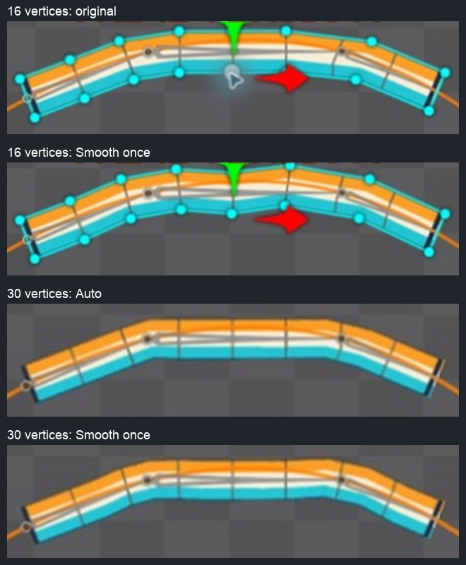

# Bài 49 — Thêm đỉnh chưa đủ để dây mềm hơn

Thực hành trong Spine Trial 4.3, skeleton `path-turnaround`, animation `rope-travel`. Kết quả: đã thử 30 đỉnh và Auto weights, nhưng chưa cải thiện rõ hình dáng. Hai lượt Smooth thử riêng trên lưới 16 và 30 đỉnh đều đã hoàn tác. Bản thử 30 đỉnh với Auto hiện còn trong editor, dừng frame 0.

## So sánh

Hai hàng đầu có đánh dấu đỉnh; hai hàng dưới đã bỏ chọn. Camera khác nhau giữa nhóm 16 và 30 đỉnh nên đây là so sánh hình dáng, không dùng để đo độ lệch pixel giữa hai nhóm.

- Lưới 16 đỉnh ban đầu: còn gấp gần chỗ chuyển giữa các xương.
- Smooth một lần trên 16 đỉnh: xuất hiện gợn ở phần giữa, đã Undo.
- Tăng lên 30 đỉnh và Auto: giữa dây phẳng hơn, hai chỗ chuyển vẫn rõ. Chưa coi là nâng chất lượng.
- Smooth một lần trên 30 đỉnh: thay đổi nhỏ và thêm gợn; đã Undo.

## Cách dựng lại phép thử

1. Tại Setup, chọn `chain-route`, đặt ba Mix về 0 để ba xương và dây trở lại tư thế thẳng. Giữ chiều dài xương 100/150/80, vị trí như bài 48.
2. Chọn attachment mesh `rope`, phóng đủ lớn rồi mở Edit Mesh/Create.
3. Thêm một đỉnh ở giữa mỗi đoạn trên cả hai mép: 7 cặp, tổng tăng từ 16 lên 30. Đọc lại số Vertices trong [ảnh Edit Mesh](../exercises/path-turnaround/rope-refine/mesh30-flat.png).
4. Đóng Edit Mesh. Mở Weights, giữ ba xương link-a/b/c, nhấn Auto khi dây còn thẳng. [Ảnh sau Auto](../exercises/path-turnaround/rope-refine/auto30-flat.png).
5. Trả ba Mix về 100, vào Animate/rope-travel. Kiểm tra frame 15 trước; sau đó lấy mẫu 0–60, bước 2.
6. Thử Smooth riêng một lần, chụp ảnh rồi Undo. Không cộng dồn các lượt thử không kiểm soát.

## Kiểm tra và giới hạn

Đã xem [31 tư thế](../exercises/path-turnaround/rope-refine/poses.jpg) của bản 30 đỉnh/Auto: dải liên tục trong các mẫu, nhưng đoạn gần đỉnh vẫn gấp. Vùng ảnh frame 0 và 60 trùng pixel theo [review.json](../exercises/path-turnaround/rope-refine/review.json). Điều này chỉ kiểm tra tư thế ở hai đầu và các frame được lấy mẫu, không xác nhận vận tốc liên tục hoặc mọi frame.

[GIF lấy mẫu](../exercises/path-turnaround/rope-refine/rope-travel.gif) được ghép từ ảnh editor, không phải file xuất Spine. Có thể dựng lại bảng ảnh/GIF bằng `python3 scripts/report_path_rope_refine.py`.

Chưa đọc toàn bộ giá trị weights từng đỉnh nên chưa kết luận nguyên nhân số học chính xác. Kết quả cho thấy trong phép thử này, thêm đỉnh rồi dùng Auto/Smooth không tự tạo ra độ cong mong muốn. Bước tiếp theo: chỉnh có kiểm soát vùng chuyển weights tại hai khớp, kiểm tra cả mép trên và dưới ở frame 15 cùng các tư thế lệch đỉnh. Nếu vẫn cần độ cong chi tiết hơn thì thử thêm xương trong một biến thể riêng.

Chưa hoàn tất tinh chỉnh dây, Path weights, key Spacing hoặc mốc lưu/xuất của kế hoạch. Trial hiện chỉ giữ thay đổi trong phiên đang mở; các ảnh và hướng dẫn ở đây là bằng chứng và cách dựng lại.
