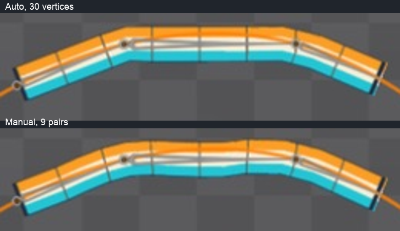

# Bài 50 — Chỉnh trọng số theo từng cặp đỉnh

Đã chỉnh 18 đỉnh ở hai vùng nối trên mesh `rope` 30 đỉnh, trong Spine Trial. Hai chỗ nối bớt góc cạnh ở frame 15, nhưng giữa dây có võng nhẹ; chưa đạt đường cong đều. Bản chỉnh đang ở `rope-travel`, frame 0, playback dừng.

## Kết quả để xem

Ảnh trên là Auto từ bài 49, ảnh dưới là bản chỉnh tay; cùng vùng ảnh và tư thế. Đã xem [31 mẫu](../exercises/path-turnaround/rope-manual/poses.jpg), dây liên tục trong các mẫu. Vùng ảnh đầu/cuối trùng pixel theo [review](../exercises/path-turnaround/rope-manual/review.json). Có [GIF lấy mẫu](../exercises/path-turnaround/rope-manual/rope-travel.gif), không phải file xuất Spine hay quay màn hình liên tục.

## Thao tác đã kiểm chứng

Mở bảng Weights chưa đủ để chọn đỉnh và đọc trọng số: cần công cụ Weights, phím **G**. Chế độ Direct cho phép chọn đỉnh rồi chỉnh ảnh hưởng của xương đã chọn; Spine phân phối lại các ảnh hưởng khác để tổng bằng 100%. [Tài liệu Weights chính thức](https://esotericsoftware.com/spine-weights), [phím công cụ](https://en.esotericsoftware.com/spine-tools).

1. Về Setup, đặt ba Mix của `chain-route` về 0 để dây thẳng; không sửa vị trí gốc hay chiều dài xương.
2. Chọn attachment `rope`, nhấn G, mở Weights. Giữ Direct và bật Pies để thấy phần ảnh hưởng bằng màu.
3. Tại cột 4 (đếm từ 0), đỉnh trên trước chỉnh chỉ có link-b **0,28005%**; [ảnh đọc giá trị](../exercises/path-turnaround/rope-manual/pair272-before.png). Ảnh này chỉ xác nhận đỉnh trên được chọn, không phải cả cặp.
4. Chọn từng đỉnh riêng. Đặt xương trước về 100 bằng kéo thanh trượt đến hết; sau đó chọn xương kế tiếp và tăng ảnh hưởng đến mức thử. Lặp lại cho đỉnh bên kia mép, đọc lại số.
5. Trả ba Mix về 100, trở về Animate và kiểm tra cùng animation. Không dùng Auto/Smooth sau khi đã chỉnh các giá trị này.

Lần thử nhập số vào ô Weight có hiện chữ mới nhưng biểu đồ và giá trị trong danh sách không đổi tương ứng. Vì vậy bản này dùng thanh trượt, ghi **giá trị đọc lại** thay vì nhận số định nhập là thành công. Box select cũng chỉ chọn được một đỉnh trong lần thử; đã chuyển sang chọn từng đỉnh để kiểm soát rõ.

## Giá trị đã đọc lại

Cột tính từ trái sang phải, bắt đầu 0; có 15 cột. Mỗi giá trị trong bảng được đọc ở cả đỉnh trên và dưới.

| Vùng | Cột | Xương kế tiếp | Weight (%) trên = dưới |
|---|---|---|---|
| a–b | 3 | link-b | 9,41 |
| a–b | 4 | link-b | 25,11 |
| a–b | 5 | link-b | 51,82 |
| a–b | 6 | link-b | 79,39 |
| a–b | 7 | link-b | 95,50 |
| b–c | 10 | link-c | 15,78 |
| b–c | 11 | link-c | 40,37 |
| b–c | 12 | link-c | 79,39 |
| b–c | 13 | link-c | 95,50 |

[18 bản ghi kèm tên ảnh gốc](../exercises/path-turnaround/rope-manual/weights-readback.json). Trước mỗi giá trị đã đặt xương trước về 100 để bắt đầu từ một ảnh hưởng; [ảnh xác nhận 100](../exercises/path-turnaround/rope-manual/reset-a100.png). Bảng trên là số trên giao diện, không phải độ chính xác đầy đủ của dữ liệu bên trong. Các cột không liệt kê giữ Auto trước đó.

## Điều rút ra và việc tiếp theo

Phân bố ảnh hưởng rộng hơn làm dịu chỗ nối nhưng có thể tạo võng/gợn mới. Đặt hai mép cùng trọng số giúp kiểm soát phép thử, chưa đủ để bảo đảm bề rộng hoặc độ cong hoàn hảo. Không suy ra rằng mọi cách chỉnh tay đều kém hoặc ba xương tuyệt đối không thể cho kết quả tốt hơn.

Bước tiếp theo có ích hơn là dựng một biến thể nhiều xương ngắn hơn và so sánh cùng hành trình. Điều đó kiểm tra riêng ảnh hưởng của số đoạn xương, thay vì tiếp tục tăng đỉnh hay thử Smooth không có tiêu chí. Giữ bản ba xương này làm mẫu đối chiếu. Path weights, key Spacing và mốc lưu/xuất vẫn chưa hoàn tất.

Dựng lại các ảnh/GIF và bảng số đã chép bằng `python3 scripts/report_path_rope_manual.py`. Script chỉ xử lý ảnh và ghi báo cáo, không tạo hay chỉnh rig thay editor. Trial chưa lưu được project; ảnh cùng hướng dẫn này không thay thế file project.
