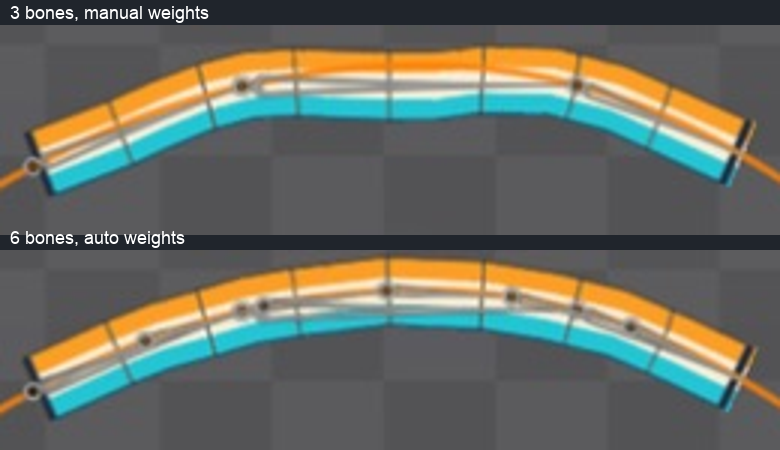

# Bài 51 — Dây với sáu xương ngắn

Đã tạo biến thể `rope-six` trong Spine Trial và so sánh với dây ba xương của bài 50. Ở frame 15, đường cong đều hơn và bớt võng giữa; mép vẫn có các góc nhỏ. Giữ biến thể này để thực hành tiếp, chưa coi dây đã hoàn thiện.

Ảnh trên dùng ba xương và trọng số chỉnh tay; ảnh dưới dùng sáu xương và Auto weights. Đây là so sánh hai cấu hình hoàn chỉnh: số xương, chiều dài từng đoạn và trọng số đều khác. Không dùng kết quả này để khẳng định riêng số xương là nguyên nhân duy nhất.

## Cách dựng đã thực hiện

1. Tạo xương dài 330, cùng điểm đầu của chuỗi cũ: X −637,91; Y −454,97; góc 0.
2. Dùng Split, Bones 6, Percent 100, tắt Nested. Có sáu xương `short1`–`short6`, mỗi xương dài 55, cùng cha root. Split có thể chia đều và giữ cùng cha khi tắt Nested. [Tài liệu Bones](https://eu.esotericsoftware.com/spine-bones).
3. Chọn cả sáu theo thứ tự rồi tạo Path constraint `six-route`, trỏ tới `route`. Chọn Chain Scale, Spacing Length 0.
4. Đặt Mix của hai constraint về 0 trong Setup để bind ở tư thế thẳng. Duplicate mesh `rope` thành attachment thường `rope-six` trong cùng slot; giữ ảnh nguồn `rope`. Bỏ ba binding cũ trên bản sao, bind sáu xương mới rồi Auto. Không dùng linked mesh cho phép thử này.
5. Trả Mix về 100. Trong animation `rope-travel`, đặt Position Percent của `six-route` tại frame 0/30/60 thành 0/70/0.
6. Kiểm tra giá trị giữa key trên cả hai constraint. Không sửa đường cong khi các số đã khớp. Khi cần tách đường trong Graph, dấu tròn ở hàng thuộc tính điều khiển đường nào được hiện. [Tài liệu Graph](https://en.esotericsoftware.com/spine-graph).

Các ảnh thao tác gốc nằm trong [thư mục bằng chứng](../exercises/path-turnaround/rope-six/). Khi nhập số, cần kiểm tra toàn bộ chữ đã được chọn và đọc lại giá trị sau Enter; các lần chọn chữ không đủ đã làm nhập sai tọa độ tạm thời, được sửa trước khi Split.

## Kiểm tra chuyển động

| Frame | Position chuỗi cũ (%) | Position chuỗi mới (%) |
|---|---:|---:|
| 7 | 9,893 | 9,893 |
| 23 | 60,107 | 60,107 |
| 53 | 9,893 | 9,893 |

Ảnh đọc lại có tên `old-frame7-read`, `six-frame7-read`, `old-frame23-read`, `six-frame23-read`, `old-frame53-confirmed`, `six-frame53-read`. Không dùng `old-frame53-read` làm bằng chứng chuỗi cũ: ảnh đó vẫn đang chọn chuỗi mới.

Đã xem [31 tư thế](../exercises/path-turnaround/rope-six/poses.jpg), từ 0 tới 60 cách hai frame. Dải dây không có lỗ hoặc khớp rời rõ trong các mẫu; đoạn gần đỉnh cong đều hơn bản trước nhưng vẫn thấy phân đoạn. Vùng ảnh đầu/cuối trùng pixel theo [báo cáo](../exercises/path-turnaround/rope-six/review.json). Điều này chỉ kiểm tra vùng ảnh lấy mẫu, không chứng minh mọi frame hoặc vận tốc nối vòng hoàn hảo.

Có [GIF hai giây ghép từ ảnh editor](../exercises/path-turnaround/rope-six/rope-travel.gif), không phải xuất từ Spine hay quay playback liên tục. Script hỗ trợ: `python3 scripts/report_path_rope_six.py`.

Đã bật lại attachment nguồn trong Setup rồi xem frame 15: hình võng của bản ba xương vẫn còn, xem [ảnh kiểm tra nguồn](../exercises/path-turnaround/rope-six/source-recheck-frame15.png). Phép so ảnh với bài 50 không trùng pixel; chưa kiểm tra lại toàn bộ số trọng số nguồn. Sau đó bật lại `rope-six`, về Animate frame 0 và dừng.

## Bước tiếp theo

Giữ cấu hình sáu xương cho các bài Path tiếp theo. Thực hành key Spacing để phân biệt đổi khoảng cách với đổi Position, rồi Path weights. Không tiếp tục tăng đỉnh hoặc số xương chỉ để tạo thêm biến thể. Chất lượng robot và quy trình lưu/xuất vẫn thuộc mục tiêu toàn khóa; Trial hiện chưa lưu được project, nên các ảnh và hướng dẫn không thay thế file project.
