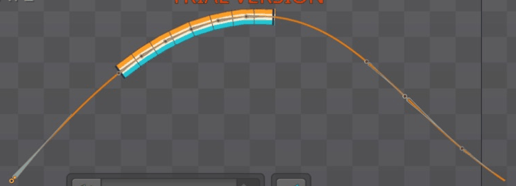

# Bài 52 — Đặt key Spacing cho dây co giãn

Đã tạo animation riêng `rope-spacing` trên chuỗi sáu xương, giữ Position 25% và đặt bốn key Spacing. Dây co rồi giãn trong khi tọa độ xương đầu giữ nguyên ở bốn mốc đã đo. Bài `rope-travel` vẫn cho cùng hình dây ở frame 15.

## Thao tác và dự đoán

Trong nhóm Animations chọn New → Animation, đặt tên `rope-spacing`. Chọn `six-route`, giữ Chain Scale, Mix 100 và Spacing Length. Đặt một key Position 25% ở frame 0; đặt Spacing 0/−20/+20/0 ở frame 0/20/40/60 bằng nút chìa khóa cạnh Spacing.

Length cộng giá trị Spacing vào chiều dài xương trước; Chain Scale giãn xương để đầu mút chạm điểm kế tiếp trên đường. Với xương dài 55, dự đoán khoảng cách theo đường sẽ lần lượt xấp xỉ 55, 35 và 75 đơn vị. Không coi đó là chiều dài dây đo bằng pixel. [Tài liệu Path constraints](https://uk.esotericsoftware.com/spine-path-constraints).

Đã sửa một lỗi nhập: tại frame 40, chọn phần số nhưng bỏ sót dấu âm khiến giá trị vẫn là −20. Xóa phần đã chọn và dấu còn lại, nhập 20, đọc lại rồi cập nhật key. Ảnh đúng là [key40-corrected](../exercises/path-turnaround/rope-spacing/key40-corrected.png), không phải `key40.png`.

## Giá trị đọc từ editor

| Frame | Spacing | X short1 | Y short1 | Góc short1 | Scale X short1 |
|---|---:|---:|---:|---:|---:|
| 0 | 0 | −704,08 | −320,28 | 36,702° | 1,0024 |
| 20 | −20 | −704,08 | −320,28 | 37,517° | 0,6378 |
| 40 | 20 | −704,08 | −320,28 | 35,842° | 1,3630 |
| 60 | 0 | −704,08 | −320,28 | 36,702° | 1,0024 |

Ảnh gốc: [0](../exercises/path-turnaround/rope-spacing/short1-00.png), [20](../exercises/path-turnaround/rope-spacing/short1-20.png), [40](../exercises/path-turnaround/rope-spacing/short1-40.png), [60](../exercises/path-turnaround/rope-spacing/short1-60.png). Số được chép theo độ chính xác hiển thị. Chiều dài 55 nhân Scale X cho khoảng 55,132 / 35,079 / 74,965; phù hợp dự đoán co/giãn. Góc đổi vì xương hướng tới điểm kế tiếp mới, dù gốc xương không dịch chuyển.

Các mẫu giữa key frame 10/30/50 có Spacing −10/0/+10 và Position đều 25%. Chưa kiểm tra hệ số đường cong trong Graph; không suy ra loại nội suy chỉ từ ba trung điểm.

## Kiểm tra hình và phạm vi kết luận

Đã xem [31 mẫu cách hai frame](../exercises/path-turnaround/rope-spacing/poses.jpg). Dây liền trong các mẫu, độ dài thay đổi rõ; mép vẫn có góc nhỏ. Ảnh frame 0/60 trùng trong vùng kiểm tra theo [review](../exercises/path-turnaround/rope-spacing/review.json). GIF là ảnh editor ghép thành hai giây, không phải video playback hoặc file xuất Spine. Chưa đánh giá toàn bộ frame lẻ hay độ êm của vận tốc nối vòng.

Đã bật lại `rope-travel` bằng dấu tròn cạnh animation, xem [frame 15](../exercises/path-turnaround/rope-spacing/travel-recheck15-actual.png). Vùng dây `(400,130,660,195)` trùng pixel ảnh bài 51. Chọn tên animation chỉ chọn hàng; nhấp đúp mở đổi tên, không bật animation. Hai ảnh kiểm tra trước có tên `travel-recheck15` và `travel-recheck15-confirmed` vẫn là bài Spacing, không dùng làm bằng chứng bài cũ.

Editor hiện dừng ở `rope-spacing`, frame 0. Script tạo lại ảnh tổng hợp/GIF: `python3 scripts/report_path_rope_spacing.py`. Trial chưa lưu được project.

Bước tiếp theo là gán trọng số cho chính Path để xương điều khiển hình đường. Sau đó trở lại đánh giá chất lượng robot theo kế hoạch; không dùng số lượng bài constraint thay cho tiêu chí hoàn thiện nhân vật.
