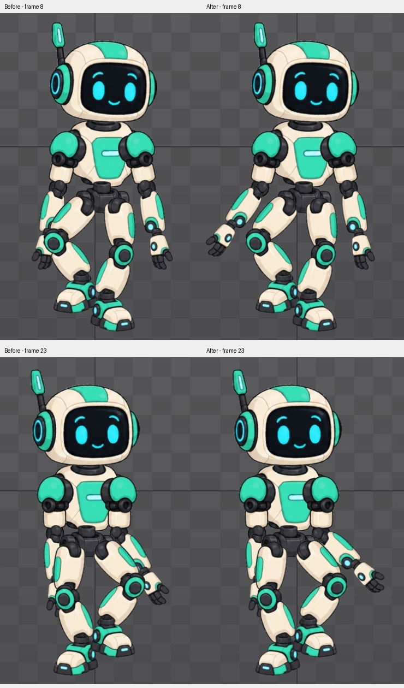

# Bài 55 — tách bàn tay khỏi đầu gối

Đã sao chép `walk-in-place` thành `walk-clearance` và sửa góc hai khuỷu trong Animate. Hai tư thế nhấc chân đọc rõ hơn, trong khi bản gốc vẫn giữ được để đối chiếu.

## Thay đổi trong editor

Chọn `forearm-left`, chuyển hệ trục Parent. Ghi Rotate = 0° tại frame 0/15/30 và −25° tại frame 8. Đã thử +35° (đưa tay vào trong) và −55° (vung ngang quá nhiều), rồi chọn −25°. Đây là lựa chọn theo hình thể của rig này, không phải góc áp dụng chung cho nhân vật khác.

Chọn `forearm-right`, sửa key Rotate ở frame 23 từ −35° thành −50°. Các key 0° ở 0/15/30 được giữ từ bản sao. Không chỉnh Setup, chân, vai hoặc thứ tự vẽ. [Key trái](../exercises/robot/evidence/walk-clearance/left-key08.png) và [key phải](../exercises/robot/evidence/walk-clearance/right-key23.png).

## Kiểm tra kết quả

Đã xem đủ [frame 0–15](../exercises/robot/evidence/walk-clearance/contact-1.jpg) và [16–30](../exercises/robot/evidence/walk-clearance/contact-2.jpg) trong ảnh Outline. Bàn tay tách khỏi gối rõ hơn tại hai đỉnh bước; không thấy khớp khuỷu/cổ tay rời rõ. Hai chân vẫn chồng trong phần giữa vòng, chưa được sửa.

Vùng ảnh `(1040,145)–(1410,744)` của frame 0 và 30 trùng pixel. Kích hoạt lại `walk-in-place`, chụp frame 8 và 23: hai vùng ảnh đều trùng bản bài 54. Đây là kiểm tra hai tư thế của bản gốc, không phải kiểm chứng mọi key hoặc event đã sao chép.

[GIF xem chuyển động](../exercises/robot/evidence/walk-clearance/walk-review.gif) ghép 30 ảnh editor thành vòng một giây; không phải export hay ghi hình playback trực tiếp. [Script](../scripts/report_walk_clearance.py), [kết quả đầu/cuối](../exercises/robot/evidence/walk-clearance/review.json), [ảnh bản gốc frame 8](../exercises/robot/evidence/walk-clearance/original-recheck-8.png), [frame 23](../exercises/robot/evidence/walk-clearance/original-recheck-23.png).

Editor kết thúc ở `walk-clearance`, frame 0, dừng, Loop bật. Tiếp theo đánh giá nhịp toàn thân và khoảng cách chân; kiểm tra lại event trên bản sao trước khi coi bộ walk hoàn tất. Lưu/xuất/mở lại project vẫn chưa thực hiện được với Trial.
