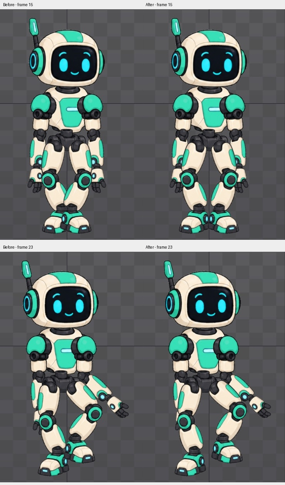

# Bài 56 — mở khoảng cách hai chân trong dáng đi

Đã tạo `walk-wide` từ `walk-clearance`, dịch các key X của target trái −20 và target phải +20. Chân bớt chồng ở giữa vòng; tâm hai bàn chân tại frame 15 cách nhau 76 đơn vị, trước là 36.

## Thao tác và lỗi đã sửa

Trong Animate, chọn target `leg-ik-left`/`leg-ik-right`, dùng hệ trục Parent và sửa từng key Translate X. Key trái ở frame 0/3/8/13/30 lần lượt là −68,5/−74,5/−54,5/−34,5/−68,5; phải ở 0/18/23/28/30 là 67,5/31,5/51,5/71,5/67,5. Giữ Y và các key tay của bản sao.

Lần thử `walk-stance` có vị trí key đúng nhưng quỹ đạo giữa key bị đổi. Graph đang dùng **Revaluing → Scale**: sửa từng giá trị khiến đường cong bị điều chỉnh, nhất là khi hai key tạm thời bằng nhau. Đã chuyển **Revaluing → None**, sao chép lại từ `walk-clearance` thành `walk-wide` rồi nhập lại. Một số lần nhập số âm mất dấu; đã sửa và đọc lại toàn bộ kết quả. Các ảnh thử không phải bằng chứng cuối; dùng nhóm `wide-foot-left-*` và `wide-foot-right-*`.

Đây là kết quả thực nghiệm trong Spine 4.3.23 Trial. [Tài liệu Graph](https://us.esotericsoftware.com/spine-graph) giải thích đường cong chung; tên/chế độ Revaluing ở đây được xác nhận bằng [giao diện thực tế](../exercises/robot/evidence/walk-stance/revaluing-none.png).

## Kiểm tra

Đã đọc 62 mẫu tọa độ World: hai bàn chân tại đủ frame 0–30. Sau bù dịch ngang ±20, X lệch tối đa 0,001 đơn vị so với bài 40 theo số làm tròn trong giao diện; Y giữ nguyên và mọi góc bàn chân đều 0°. Các đoạn chân trụ vẫn đi ngang −2 đơn vị/frame, phù hợp bản đi tại chỗ. Không suy ra quỹ đạo giữa các frame nguyên giống tuyệt đối.

Đã xem [16 pose đầu](../exercises/robot/evidence/walk-stance/contact-1.jpg) và [15 pose sau](../exercises/robot/evidence/walk-stance/contact-2.jpg): khoảng tách chân tốt hơn, chưa thấy khớp rời rõ. Mép trong bàn chân vẫn sát nhau ở giữa vòng. Vùng ảnh Outline đầu/cuối trùng pixel.

[GIF một vòng](../exercises/robot/evidence/walk-stance/walk-review.gif) ghép 30 ảnh thành một giây, không phải export hay video playback. [Số liệu chân](../exercises/robot/evidence/walk-stance/foot-review.json), [kiểm tra ảnh](../exercises/robot/evidence/walk-stance/review.json), [script dựng bảng ảnh](../scripts/report_walk_stance.py).

Editor kết thúc ở `walk-wide`, frame 0, dừng và Loop bật. Tiếp theo kiểm tra event đã sao chép và nhịp playback toàn thân. Chưa lưu/xuất/mở lại được project bằng Trial.

## Bổ sung — kiểm tra event và playback trên bản cuối

Đã chọn trực tiếp hai key trong Dopesheet của `skeleton: walk-wide`. Frame 13 có String `left`, frame 28 có `right`; Integer/Float đều 0. Audio path `footstep.wav`, Volume 100, Balance 0 trên cả hai. Hai frame này trùng thời điểm chân tương ứng trở lại Y = −391,5 trong bảng đo bài 56.

Bằng chứng: [key trái](../exercises/robot/evidence/walk-wide-events/event13.png), [key phải](../exercises/robot/evidence/walk-wide-events/event28.png), [audio trái](../exercises/robot/evidence/walk-wide-events/audio13.png), [audio phải](../exercises/robot/evidence/walk-wide-events/audio28.png).

Đã mở Playback: Timeline FPS 30, Speed 100%, Interpolated bật; chạy tiến với Loop rồi dừng. Hai ảnh lúc chạy cho thấy pose thay đổi, nút phát bật; ảnh thứ hai có nhãn `footstep` xuất hiện. [Thiết lập](../exercises/robot/evidence/walk-wide-events/playback-settings.png), [đang chạy 1](../exercises/robot/evidence/walk-wide-events/playing-1.png), [đang chạy 2](../exercises/robot/evidence/walk-wide-events/playing-2.png). Đây là kiểm chứng hoạt động playback/event bằng ảnh trạng thái, chưa phải bản ghi liên tục đủ để đánh giá mọi nhịp hay bằng chứng nghe âm thanh. Không chỉnh key trong lượt này. Trả về frame 0, dừng, Loop bật.
