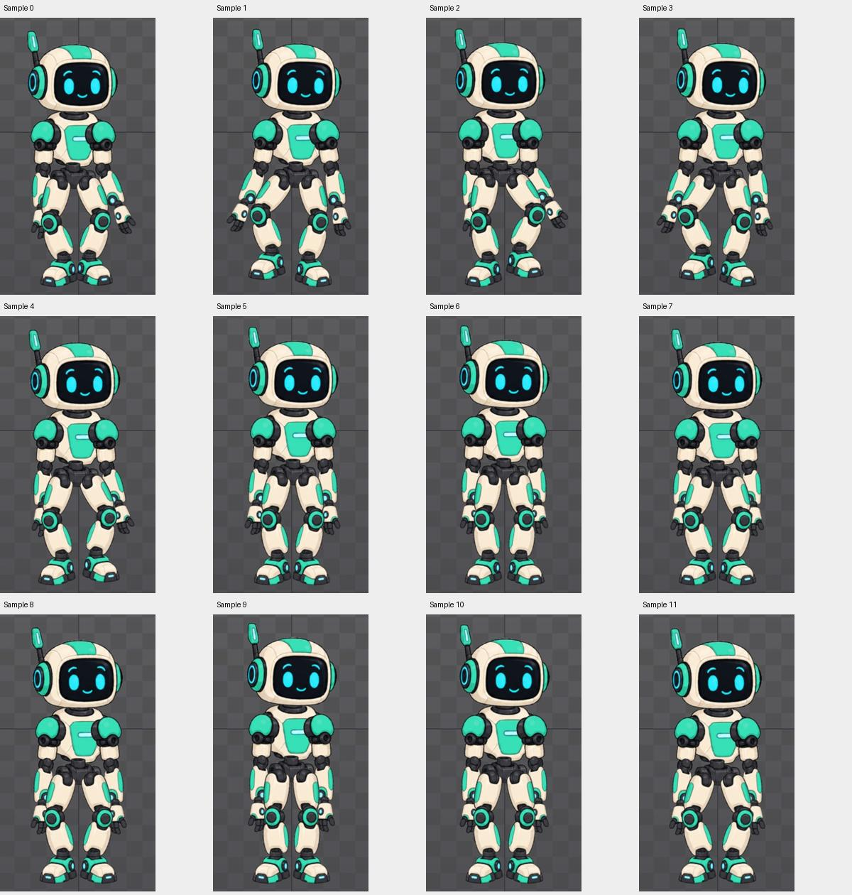

# Bài 57 — chuyển giữa đứng và đi trong Preview

Đã thử `idle-handbuilt` ↔ `walk-wide` trên track 0 với Mix 0, 5 và 0,25 giây. Không chỉnh key animation. Mix là thời gian hòa trộn khi đổi animation; Mix 0 chuyển ngay, theo [tài liệu Preview](https://esotericsoftware.com/spine-preview#Mix).

## Chuẩn bị đúng trạng thái

Preview còn giữ walk cũ ở track 0 và lớp tay ở track 1, Speed 0. Nhấn lại lớp tay để bỏ nó khi Mix 0,25 chưa làm tư thế tay trở về ngay: thời gian đang dừng. Đã cho chạy Speed 100 để phần chuyển ra hoàn tất, rồi dùng idle trên track 0. Điều này giúp tránh nhầm ảnh hưởng lớp tay cũ với lỗi chuyển giữa đứng và đi.

Trong Preview, Fit để thấy cả robot. Chọn track 0; các dòng Speed/Mix dịch xuống khi Alpha của track 1 không còn hiện. Chỉ nhập số sau khi xác nhận đúng ô.

## Các phép thử

- **Mix 0:** chọn idle rồi walk-wide; ảnh sau đổi đã có tư thế walk. Hai ảnh rời không đo được độ giật tại đúng thời điểm đổi.
- **Mix 5 giây:** kéo dài để nhìn cơ chế. Cho walk chạy ổn định, đổi về idle, chụp 12 mẫu cách nhau khoảng nửa giây. Những mẫu đầu vẫn có bước đi; biên độ tay/chân giảm, các mẫu cuối trở về nhịp đứng. Số liệu thời gian là đồng hồ sau khi lệnh click trả về, không phải thời gian animation chính xác.
- **Mix 0,25 giây:** trả về mức ngắn, thử idle → walk → idle ở Speed 100, Repeat bật. Đã thấy hai trạng thái đích; ảnh chụp chưa đủ dày để khẳng định mức 0,25 là tối ưu hoặc không có trượt chân trong khoảng chuyển.

Ảnh [idle Mix 0](../exercises/robot/evidence/preview-transition/idle-mix0.png), [walk Mix 0](../exercises/robot/evidence/preview-transition/walk-mix0.png), [walk Mix 0,25](../exercises/robot/evidence/preview-transition/walk-mix025.png), [idle Mix 0,25](../exercises/robot/evidence/preview-transition/idle-mix025.png). [Mốc lấy mẫu](../exercises/robot/evidence/preview-transition/sampling.json); nhóm `mix5-*` chỉ lấy đoạn đầu chiều đi, nhóm `reverse5-*` bao trùm chiều về.

## Kết luận và phần còn thiếu

Đã thực hành đổi animation trên cùng track, tách thời gian hòa trộn khỏi Alpha của lớp trên, và xử lý phần chuyển ra bị giữ khi Speed 0. Kết thúc: Preview ở idle, Speed 0, Mix 0,25; track 1 đã bỏ lớp tay. Animation chính vẫn walk-wide frame 0.

Còn đánh giá chuyển tiếp ở nhiều pha đặt chân, Hold Previous và Additive. Việc có chuyển tiếp trong Preview chưa chứng minh dữ liệu tự làm đã xuất hoặc chạy trong game; giới hạn lưu/xuất Trial vẫn còn.
