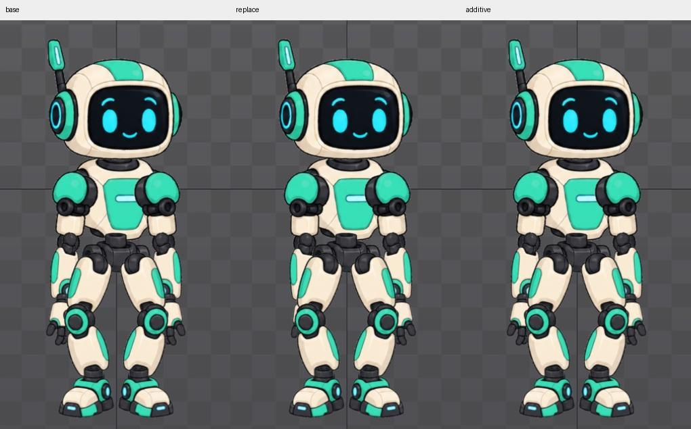

# Bài 58 — Additive và lớp thay thế

Đã so sánh `wave-arm-only` trên nền `idle-handbuilt` đứng yên trong Preview. Ở tư thế đầu của lớp tay, cách thay thế đổi dáng tay; Additive giữ nguyên hình nền. Đây là phép thử tĩnh tại một tư thế, chưa phải kiểm tra toàn vòng vẫy.

Theo [tài liệu Preview](https://esotericsoftware.com/spine-preview#Additive), Additive cộng độ lệch của animation vào tư thế các track dưới; cách thông thường áp tư thế của lớp trên theo Alpha. Tùy chọn áp dụng cho animation được phát tiếp theo, không đổi animation đang chạy. Tooltip thực tế đã xác nhận [nút Additive](../exercises/robot/evidence/preview-additive/additive-tooltip.png).

## Phép thử có đối chứng

1. Giữ idle trên track 0 ở một thời điểm, Speed 0. Track 1 rỗng, Alpha 100. Đặt Mix 0 để việc thêm/bỏ lớp hoàn tất ngay, tránh ảnh hưởng chuyển tiếp đang dừng như bài 57.
2. Chụp nền. Tắt Additive, chọn `wave-arm-only` trên track 1. Speed 0 giữ lớp ở tư thế đầu; tay trái đổi dáng.
3. Bật Additive nhưng chưa phát lại: vùng nhân vật vẫn trùng ảnh bước 2. Đây là lỗi thao tác dễ khiến tưởng nút không hoạt động.
4. Nhấn lại tên lớp để bỏ, rồi chọn lần nữa. Với Additive bật, vùng nhân vật trùng nền ở tư thế đang thử. Kết quả phù hợp với lớp tay có độ lệch bằng không ở đầu nhịp; bài này không đọc lại từng giá trị xương để chứng minh số học.
5. Bỏ lớp, tắt Additive, thêm lại theo cách thay thế. Kết quả trùng lần thay thế đầu; bỏ lớp lần nữa thì trở lại nền.

## Bằng chứng

So sánh vùng Preview `(380,140)–(720,745)`:

| Cặp ảnh | Kết quả |
| --- | --- |
| Nền / Additive | Trùng pixel |
| Thay thế / chỉ bật nút | Trùng pixel |
| Nền / bỏ lớp | Trùng pixel |
| Thay thế lần đầu / lặp lại | Trùng pixel |
| Thay thế / Additive | Khác trong vùng tay trái; hộp sai khác tương đối `(60,211)–(156,485)` |

[Số liệu](../exercises/robot/evidence/preview-additive/comparison.json), [nền](../exercises/robot/evidence/preview-additive/base.png), [thay thế](../exercises/robot/evidence/preview-additive/replace.png), [chỉ bật nút](../exercises/robot/evidence/preview-additive/toggle-only.png), [Additive sau phát lại](../exercises/robot/evidence/preview-additive/additive.png), [lặp lại](../exercises/robot/evidence/preview-additive/replace-repeated.png).

Không chỉnh key hoặc rig. Kết thúc track 1 rỗng, Additive tắt, Mix 0,25, Speed 0; nền idle giữ nguyên. Còn thử độ lệch khác không và Hold Previous; chưa kết luận nên dùng Additive cho toàn bộ lớp vẫy này.
