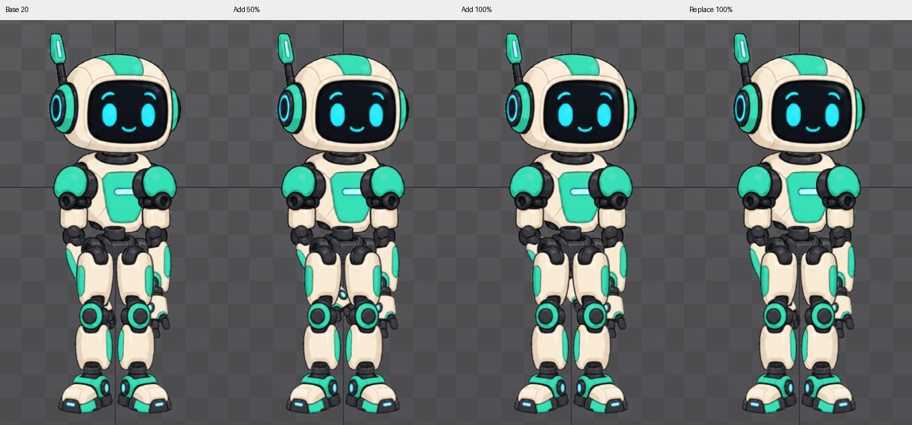

# Bài 59 — kiểm chứng phép cộng góc của Additive

Đã tạo `arm-offset20` từ animation trống trong editor, chỉ ghi Rotate của `forearm-left` tại frame 0. Hệ trục Parent, góc ban đầu 0°, key mới 20°. Chuyển frame 30 rồi về 0 xác nhận key giữ nguyên. [Key 20°](../exercises/robot/evidence/additive-offset20/key20.png).

## Bố trí phép thử

Lần đầu dùng nền idle không tạo khác biệt rõ giữa Additive và thay thế tại khuỷu tay. Đã đổi sang nền cố định để kiểm tra có đối chứng: cùng `arm-offset20` trên track 0 và track 1. Speed 0, Mix 0, nền không đổi thời điểm; bật Additive trước khi phát lớp trên.

| Cấu hình lớp trên | Dự đoán | Đối chứng thực tế |
| --- | --- | --- |
| Additive, Alpha 0 | 20° | Trùng ảnh nền |
| Additive, Alpha 50 | 20° + 10° = 30° | Trùng ảnh key 30° đặt trực tiếp |
| Additive, Alpha 100 | 20° + 20° = 40° | Trùng ảnh key 40° đặt trực tiếp |
| Thay thế, Alpha 100 | 20° | Trùng ảnh nền |

Công thức ở đây áp dụng cho phép thử xoay một xương có góc Setup 0°. Không suy rộng phép cộng góc này sang mọi loại transform hay constraint. Cơ chế cộng độ lệch vào track dưới được mô tả trong [tài liệu Preview](https://esotericsoftware.com/spine-preview#Additive).

## Kiểm chứng độc lập với cách phối

Sau khi chụp kết quả phối, bỏ track 1. Tạm sửa key của lớp nền trực tiếp thành 40°, rồi 30°, mở lại Preview để chụp từng tư thế. Các cặp với Additive 100% và 50% lần lượt trùng pixel trong vùng nhân vật `(380,140)–(720,745)`.

Sau đó trả key về 20°, đọc lại và chụp Preview: vùng nhân vật trùng nền 20° trước thử. Đây là đối chiếu ảnh của các cấu hình khác nhau, không phải suy ra góc bằng mắt. Phần cẳng tay/bàn tay bị đùi che ở góc này, nhưng vùng ảnh có thể thấy vẫn đủ phân biệt ba mức góc.

[Key tham chiếu 40°](../exercises/robot/evidence/additive-offset20/reference-key40.png), [key tham chiếu 30°](../exercises/robot/evidence/additive-offset20/reference-key30.png), [key 20° đã khôi phục](../exercises/robot/evidence/additive-offset20/restored-key20.png), [kết quả năm cặp ảnh](../exercises/robot/evidence/additive-offset20/comparison.json).

Nhóm ảnh `controlled-*` là phép thử chính. Các ảnh `base`, `replace100`, `add100` trước đó thuộc lần thử trên idle, không dùng làm chuẩn góc 20/30/40.

## Trạng thái cuối

`arm-offset20` giữ một key 20° ở frame 0. Preview dùng lớp này trên track 0, track 1 rỗng, Additive tắt; Speed 0, Mix 0,25 trên cả hai track, Alpha track 1 là 100. Không sửa bộ idle/walk/wave. Tiếp theo Hold Previous và đối chiếu hành vi khi đổi lớp trên.
