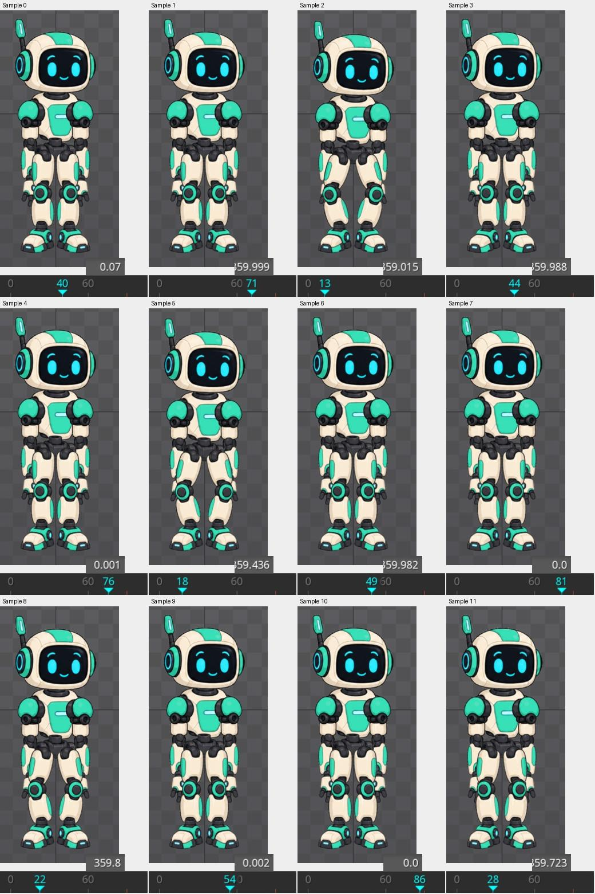

# Bài 64 — vòng hạ thân có Physics đầu

Đã tạo `head-loop`: thân hạ trong 6 frame, trở về ở frame 30, rồi nghỉ đến 90. Sau khi chép nguyên key vị trí đầu sang các mốc trở về, ảnh toàn thân frame 0 và 90 trùng pixel. Đã chạy thêm nhiều vòng với mô phỏng liên tục.

## Dựng vòng

Sao chép `head-settle` thành `head-loop`. Giữ nguyên Physics đầu: Rotation, Mix 100; Damping 15; Wind/Gravity 0. Không lấy bản head-forces có key đầu 45°.

| Frame | Body Translate Y hiển thị | Hành vi |
|---|---:|---|
| 0 | 2,5 | Tư thế đầu |
| 6 | −9,5 | Hạ 12 đơn vị |
| 30 | 2,5 | Trở về |
| 90 | 2,5 | Giữ nghỉ, kết thúc vòng |

X giữ −0,5 theo UI. Ban đầu nhập Y 2,50005 tại 30/90 và đặt key; sau đó thay bằng bản chép nguyên key 0 để giữ độ chính xác ban đầu. Trong Dopesheet, chọn key **Translate của body** ở 0 → Copy, đặt playhead đến 90 → Paste; làm tương tự ở 30. Chỉ chép dòng Translate, không chép toàn animation.

[Key sau sao chép](../exercises/robot/evidence/head-loop/copied-keys.png).

## Kiểm tra Physics và sai khác đầu–cuối

Bật Deterministic để tính tư thế từ đầu khi tua. Sau sửa key, đã tua về 0 rồi đo lại; không lấy tư thế vừa hiển thị ngay sau khi sửa làm kết quả cuối.

Ở lượt đo trước khi chép nguyên key, Rotate đầu hiển thị: frame 0 = 0°, 6 = 2,336°, 30 = 359,56° (−0,44°), 45 = 359,99° (−0,01°), 60 = 0,004°, 89/90 = 0°. Đầu giảm rung trong đoạn nghỉ. Đây là các mẫu, không phải đo mọi frame hoặc chứng minh vận tốc đã bằng 0 tuyệt đối.

Tuy góc đầu đã về 0°, đối chiếu ảnh ban đầu còn sai khác ở chân: tối đa 15/255 mỗi kênh trong vùng so sánh. Sau chép nguyên key đầu sang 30/90, [frame 0](../exercises/robot/evidence/head-loop/copied-0.png) và [frame 90](../exercises/robot/evidence/head-loop/copied-90.png) trùng pixel toàn vùng `(700,130)–(960,690)`, gồm robot trong Outline. [Kết quả so sánh](../exercises/robot/evidence/head-loop/comparison.json).

Điều rút ra: các số UI cùng hiển thị 2,5 chưa đủ chứng minh hai key giống hệt nhau. Chép key gốc giải quyết sai khác trong phép thử này; chưa xác định riêng phần nào của phép tính IK khuếch đại sai khác.

## Chạy nhiều vòng

Tắt Deterministic, giữ Simulate và Loop bật, phát từ 0. Lấy 12 ảnh cách nhau khoảng một giây. Playhead lần lượt hiện 40, 71, 13, 44, 76, 18, 49, 81, 22, 54, 86, 28: có bốn lần đi qua điểm nối. Các mẫu muộn trong vòng cho góc đầu gần 0°; các mẫu khi thân đang trở về vẫn có độ trễ nhỏ.

[Mốc chụp](../exercises/robot/evidence/head-loop/sampling.json). Những ảnh này xác nhận vòng chạy liên tiếp và các tư thế lấy mẫu; chưa phải video liên tục đủ dày để kết luận không có giật ở mọi thời điểm sát điểm nối.

Theo [tài liệu Physics](https://esotericsoftware.com/spine-physics-constraints), Deterministic tính lại từ đầu và có thể gây nhảy khi lặp; khi tắt, mô phỏng tiếp tục theo trạng thái đang có. Vì vậy kiểm tra ảnh đầu/cuối và kiểm tra chạy nhiều vòng là hai việc khác nhau.

## Trạng thái cuối

Dừng playback, bật lại Deterministic và đưa về frame 0. Bản head-loop có đoạn nghỉ cuối; bài head-settle gốc và head-forces vẫn riêng. Trial chưa lưu/xuất project. Bước tiếp theo là kiểm tra điểm nối với nhịp lấy mẫu dày hơn hoặc bản ghi liên tục, rồi tiếp tục các mục PSD/Physics nhiều tầng còn thiếu.

## Bổ sung: lấy mẫu dày sát điểm nối

Đặt Playback 10%, Timeline 30 FPS và Interpolated; tua đến 84 với Deterministic bật để có tư thế khởi đầu, sau đó tắt Deterministic và phát. Lấy 30 mẫu với khoảng chờ 100 ms giữa các lần chụp (cộng thời gian chụp thực tế). Đã xem toàn bộ hai [bảng ảnh 0–14](../exercises/robot/evidence/head-loop/seam/contact-0.jpg) và [15–29](../exercises/robot/evidence/head-loop/seam/contact-1.jpg).

Các mẫu 0–10 bao phủ playhead hiển thị 85–90: góc đầu 0° và toàn vùng robot trùng pixel giữa các mẫu. Sau điểm nối, mẫu 11 hiển thị frame 0 nhưng góc 0,13° vì playback đang nội suy giữa frame; các mẫu tiếp theo tăng dần 0,412°, 0,656°, 0,886° rồi tới khoảng 2,041° gần frame 6, sau đó giảm. Không thấy bước nhảy hình rõ trong chuỗi lấy mẫu này. Không coi số frame làm tròn là thời điểm nguyên chính xác.

[Kết quả đối chiếu đoạn nghỉ](../exercises/robot/evidence/head-loop/seam/comparison.json), [mốc chụp](../exercises/robot/evidence/head-loop/seam/sampling.json). Đây là kiểm tra chậm quanh một điểm nối; chưa phải cam kết mọi tốc độ, mọi bước thời gian runtime đều cho ảnh giống hệt. Đã trả Speed 100%, bật Deterministic, dừng frame 0. Không sửa key trong phần bổ sung.
