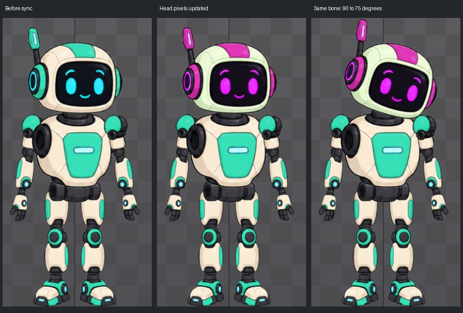

# Bài 66 — Cập nhật ảnh PSD mà giữ khớp đã chỉnh

Đã đổi màu đầu trong PSD, đồng bộ vào rig `robot-layers` và thử xoay đầu. Ảnh mới cập nhật đúng; khớp đầu giữ World X/Y = 0/474, Rotate 90°, Length 100. Xoay xuống 75° làm ảnh mới nghiêng theo khớp. Đã trả góc 90°, nguồn PSD gốc và màu gốc.

## Thao tác và đối chứng

1. Dùng `recolor/build_variant.py` tạo bản PSD riêng từ nguồn bài 44. Hoán đổi kênh đỏ/xanh lá của lớp head; giữ alpha, kích thước, vị trí, tên và tag của cả 16 lớp. Đây là phép thử màu có kiểm soát, không phải thiết kế skin hoàn chỉnh.
2. Trong Spine chọn Images → bánh răng PSD → chọn `robot-layers-head-recolor.psd` → OK → biểu tượng đồng bộ cạnh PSD. Giữ Delete previously imported images tắt; danh sách ghi đè gồm 15 PNG đã có bản sao lưu.
3. Quan sát đầu chuyển tím, thân vẫn xanh. Kiểm tra các PNG Spine vừa tạo: chỉ head thay pixel; head khớp chính xác phép đổi kênh trên ảnh đầu gốc; 14 ảnh khác khớp RGBA với bản sao lưu. Alpha của cả 15 ảnh giữ nguyên.
4. Chọn xương head, đọc lại tọa độ/góc/chiều dài. Thử World Rotate 90 → 75 → 90, quan sát ảnh mới xoay quanh cổ.
5. Trả PSD Settings về `robot-layers.psd`, đồng bộ lại. Vùng toàn robot trong Outline trùng pixel trước thử; cả 15 PNG khôi phục khớp RGBA gốc.

## Bằng chứng

Thư mục `exercises/robot/psd-import/recolor/` có nguồn thử, script dựng lại, `variant.json`, `import-checks.json`, `checks.json` và ảnh chụp trong `evidence/`. Vùng so sánh toàn robot là [700,150,990,713]. Vùng thân từ y=350 trở xuống trùng pixel trước/sau đổi màu; toàn robot trùng pixel sau khôi phục. Đã xem ảnh trong editor và bảng so sánh trên.

## Điều rút ra

Bài 65 dịch vị trí lớp nhưng ảnh trên rig không dời; bài này thay nội dung pixel và ảnh trên rig cập nhật ngay. Vì vậy, cần phân biệt **ảnh nguồn** với **vị trí ảnh đã gắn vào xương**. Khi chỉ sửa màu mà giữ tên, kích thước và alpha, quy trình vừa thử không cần dựng lại khớp.

Kết luận chỉ áp dụng cấu hình đã kiểm tra. Chưa thử đổi kích thước, đường viền alpha, nhóm PSD lồng nhau hoặc ảnh mesh có trọng số. Không suy ra mọi thay đổi PSD đều giữ rig an toàn. Tiếp theo trở lại Physics nhiều tầng để khép phần constraint còn thiếu, rồi rà tiêu chí sản phẩm toàn thân và lưu/xuất.
