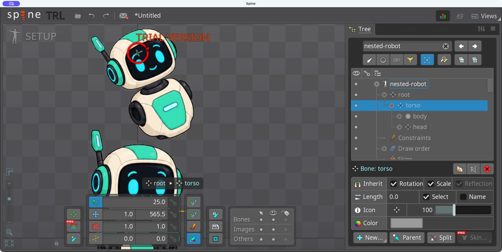

# Bài 71 — Nhóm PSD lồng nhau tạo cây xương

Ngày 08/09/2026, Spine 4.3.25 Trial.

## Kết quả

Đã nhập PSD hai bộ phận vào skeleton riêng `nested-robot`. Cây trong editor là `root → torso → head`; slot body thuộc torso. Xoay torso 25° làm cả thân và đầu nghiêng; trả torso về 0° rồi xoay head 335° (−25°) chỉ làm đầu nghiêng. Đã khôi phục cả hai về 0°.



## File đầu vào và cách nhập

[Script](../exercises/robot/psd-import/nested/build_nested.py) lấy nguyên pixel và vị trí body/head từ PSD bài 44, tạo [PSD nhóm lồng](../exercises/robot/psd-import/nested/nested-robot.psd). Không sinh artwork hoặc dữ liệu rig bằng script.

```text
torso group [bone:torso]
  body [slot:body]
  head group [bone:head]
    head [slot:head]
origin [origin]
```

Script in cấu trúc theo thứ tự lưu của psd-tools; thứ tự xét lớp hiển thị trong Spine không nên suy ra chỉ từ bản in này.

Import PSD: Scale 1, Padding 1, Trim bật, New project tắt, tên skeleton `nested-robot`. Đầu ra là thư mục mới `nested/imported-images`; Delete previously imported images tắt. [Thiết lập](../exercises/robot/psd-import/nested/evidence/import-options.png).

Phím chọn toàn bộ không thay thế nội dung như dự định trong hộp nhập này, khiến tên mới nối vào tên cũ. Đã dùng ba lần nhấp để chọn toàn bộ và nhập lại cả tên lẫn đường dẫn trước khi Import. Import thành công, không xuất hiện yêu cầu ghi đè.

## Quan hệ đúng, điểm xoay vẫn cần chỉnh

Torso và head đều có vị trí đang hiển thị X 1 / Y 565,5, tức tâm ảnh đầu. Breadcrumb khi chọn head là `root → torso → head`. Xương tự sinh có Length 0; chưa đặt tại cổ hay tâm thân theo mục đích chuyển động.

Theo [Import PSD — Spine User Guide](https://us.esotericsoftware.com/spine-import-psd), tag bone hỗ trợ nhóm lồng nhau và tạo vị trí xương theo lớp hiển thị đầu tiên. Vì vậy, nhóm PSD giúp tạo quan hệ xương nhưng vẫn cần kiểm tra vị trí khớp sau nhập.

| Thử trong Setup | Quan sát |
| --- | --- |
| Torso 25°, head giữ góc ban đầu | Cả hai ảnh nghiêng cùng nhau |
| Torso 0°, head 335° | Đầu nghiêng, thân giữ tư thế |
| Trả head về 0° | Hai ảnh trở lại tư thế nhập |

[Đầu trước thử](../exercises/robot/psd-import/nested/evidence/head-baseline.png), [xoay đầu riêng](../exercises/robot/psd-import/nested/evidence/head-minus25.png), [khôi phục](../exercises/robot/psd-import/nested/evidence/restored.png). Robot toàn thân nhìn phía dưới là skeleton cũ cùng đang hiển thị, không phải phần bổ sung của PSD hai ảnh.

Kiểm tra file PNG đầu ra: body 205 × 206 và head 228 × 209; toàn bộ byte RGBA đều bằng hai PNG tương ứng của lần nhập bài 44. Không có PNG origin. Kiểm tra này xác nhận ảnh, còn quan hệ xương được xác nhận bằng cây và phép xoay trong editor.

## Phạm vi và bước tiếp

Đã kiểm chứng nhập mới với nhóm bone lồng nhau. Chưa thử đổi cấu trúc nhóm rồi đồng bộ vào rig đã chỉnh. Skeleton mới vẫn ở Setup, head được chọn, cả hai góc 0°. Chưa tạo animation cho bản này. Bước tiếp hợp lý là đặt lại điểm xoay thân/cổ bằng Compensation, giữ nguyên ảnh và quan hệ vừa nhập, rồi thử lại góc xoay.
