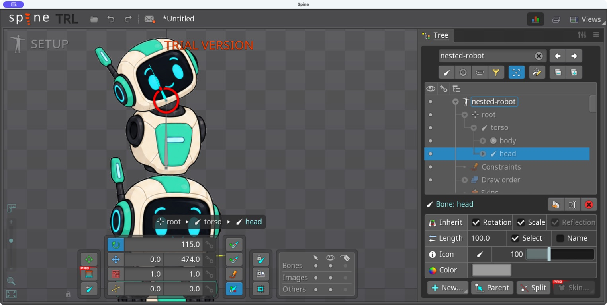

# Bài 72 — Đặt lại khớp trên cây nhập từ PSD

08/09/2026, Spine 4.3.25 Trial, skeleton `nested-robot` của bài 71.

Đã chuyển điểm xoay thân từ tâm ảnh đầu xuống gốc thân, chuyển điểm xoay đầu xuống cổ và giữ cây `root → torso → head`. Bố cục ảnh không thay đổi rõ khi quan sát trong viewport; chưa so pixel toàn ảnh vì hình xương và công cụ hiển thị đã thay đổi.

## Thông số đã nhập và đọc lại

Tọa độ World lấy từ bảng bố cục PSD đã dùng ở bài 45:

| Xương | X | Y | Rotation | Length |
| --- | --- | --- | --- | --- |
| torso | 0 | 304 | 90° | 170 |
| head | 0 | 474 | 90° | 100 |

[Thân sau chỉnh](../exercises/robot/psd-import/nested/evidence/torso-pivot-corrected.png), [đầu sau chỉnh](../exercises/robot/psd-import/nested/evidence/head-pivot-corrected.png).

## Giữ ảnh và xương con

Chỉnh head với Images compensation bật. Khi chỉnh torso, bật thêm Bones compensation để cổ giữ vị trí đang có. Sau đó tắt cả hai trước khi xoay thử. Đây là khác biệt thực hành so với bài 45, nơi các xương được đặt trước rồi mới nối cha–con.

[Tài liệu Tools của Spine](https://esotericsoftware.com/spine-tools#Compensation) giải thích Images compensation bù biến đổi attachment, còn Bones compensation bù biến đổi xương con. Cần tắt chúng khi muốn ảnh và xương con chuyển động theo xương cha bình thường.

Đã gặp và sửa hai lỗi nhập: chọn nhầm trục làm tọa độ chuyển sang 0/0; ba lần nhấp chỉ thay phần nguyên khiến Y thành 474,5. Chưa thay tọa độ khi trục sai. Đã trở về World; cách nhập ổn định cuối cùng là nhấp cuối số, Backspace xóa hết số cũ, gõ giá trị mới, Enter và đọc lại. Kéo chọn khi ô chưa vào chế độ sửa không nhập được số; không tính các lần đó là chỉnh thành công.

## Kiểm tra sau sửa

| Phép thử, dùng góc World | Quan sát |
| --- | --- |
| Head 90 → 65° | Đầu nghiêng quanh cổ, thân đứng nguyên |
| Head 90 → 115° | Nghiêng chiều ngược lại, phần cổ vẫn chồng ảnh |
| Torso 90 → 105°, head đã trả 90° trước thử | Thân và đầu nghiêng cùng nhau quanh gốc thân |

[Cổ chiều còn lại](../exercises/robot/psd-import/nested/evidence/neck-minus25.png), [xoay thân](../exercises/robot/psd-import/nested/evidence/torso-plus15.png). Chưa thấy khoảng hở rõ ở cổ trong hai góc thử; không suy rộng thành đạt mọi biên độ.

Đã trả torso và head về góc World 90°, giữ điểm xoay mới, tắt cả hai compensation. [Ảnh cuối](../exercises/robot/psd-import/nested/evidence/rig-final.png) đọc lại head 0/474, 90°, Length 100; đang Setup. Không tạo key animation. Robot toàn thân bên dưới là skeleton khác cùng hiển thị.

Bản nhập đã sẵn sàng cho thử đồng bộ PSD sau sửa rig. Chưa kiểm chứng đổi cấu trúc nhóm rồi sync; đây là câu hỏi khác với việc nhập mới và đặt lại khớp vừa hoàn tất.
